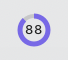
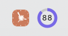
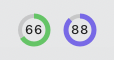
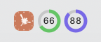
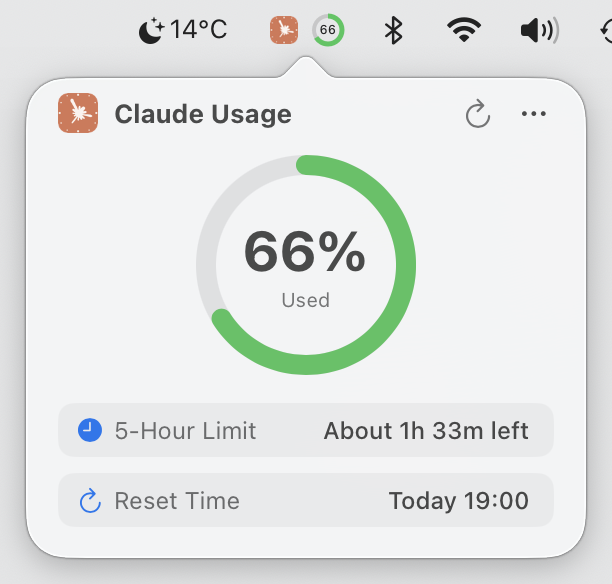
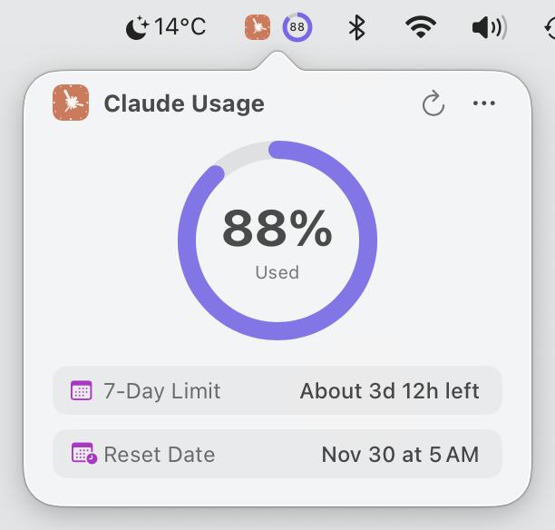
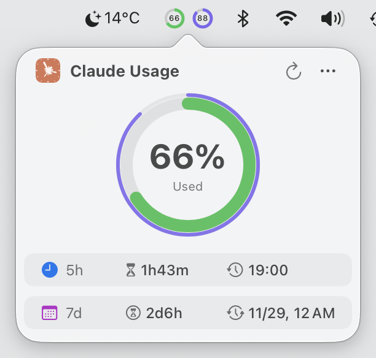

# Usage4Claude

[English](README.md) | [日本語](docs/README.ja.md) | [简体中文](docs/README.zh-CN.md) | [繁體中文](docs/README.zh-TW.md)

<div align="center">


[](https://www.apple.com/macos/)
[](https://swift.org)
[](https://developer.apple.com/xcode/swiftui/)
[](LICENSE)
[](https://github.com/f-is-h/Usage4Claude/releases)
[](https://github.com/f-is-h/Usage4Claude/releases)

**An elegant macOS menu bar app for real-time monitoring of your Claude AI usage.**

✨ **Monitors all Claude platforms: Web • Claude Code • Desktop • Mobile App** ✨

[Features](#-features) • [Installation](#-installation) • [User Guide](#-user-guide) • [FAQ](#-faq) • [Support](#-support)

</div>

---

## ✨ Features

### 🎯 Core Features

- **📊 Real-time Monitoring** - Display Claude subscription's usage quota (5-hour/7-day) in menu bar
- **🎯 Dual Limit Support** - Show 5-hour and 7-day limits simultaneously with dual-ring icon
- **🎨 Smart Colors** - Automatic color changes based on usage (5-hour: green/orange/red; 7-day: cyan/blue-purple/deep purple)
- **⏰ Precise Timing** - Quota reset time displayed with minute precision
- **🔄 Smart Refresh System** - Intelligent 4-level adaptive refresh or fixed intervals (1/3/5/10 min)
- **⚡ Manual Refresh** - Click refresh button to update data instantly (10-second debounce protection)
- **💻 Native Experience** - Pure native macOS app, lightweight and elegant

### 🌐 Cross-Platform Support

Works seamlessly with all Claude products:
- 🌐 **Claude.ai** (Web interface)
- 💻 **Claude Code** (CLI tool for developers)
- 🖥️ **Desktop App** (macOS/Windows)
- 📱 **Mobile App** (iOS/Android)

All platforms share the same usage quota, monitored in one place!

### 🎨 Personalization

- **🕓 Multiple Display Modes**
  - Percentage Only - Clean and intuitive, view at a glance
  - Icon Only - Subtle and elegant, detailed info on click
  - Icon + Percentage - Complete information, quick visual identification

- **🌍 Multilingual Support**
  - English
  - 日本語
  - 简体中文
  - 繁体中文
  - More languages coming soon...

### 🔧 Convenient Features

- **⚙️ Visual Settings** - No code modification needed, GUI configuration for all options
- **🆕 Smart Update Alerts** - Menu bar badge and rainbow animation notify new versions
- **🚀 Launch at Login** - Optional automatic startup when system boots
- **⌨️ Keyboard Shortcuts** - Common operations support shortcuts (⌘R, ⌘,, ⌘Q)
- **👋 Friendly Onboarding** - Detailed setup wizard on first launch
- **… Menu Display** - Multiple menu access methods, detail view and right-click
- **🛠️ Debug Mode** - Developer options: fake data testing, simulated updates, instant refresh

### 🔒 Security & Privacy

- 🏠 **Local Storage Only** - All data stored locally only, never collect or upload any personal information
- 🔐 **Keychain Protection** - Sensitive information secured in Keychain, no plain text keys
- 📖 **Open Source Transparency** - Code fully public, anyone can audit
- 🛡️ **Sandbox Protection** - App Sandbox enabled for enhanced security

---

## 📸 Screenshots

### Menu Bar Display

| Icon Only | 5-Hour | 7-Day | 5-Hour+Icon | 7-Day+Icon | 5-Hour+7-Day | 5+7+Icon |
|:---:|:---:|:---:|:---:|:---:|:---:|:---:|
|  |  |  |  |  |  |  |

**5-Hour Limit Mode - Ring Color Indicators**:

🟢 **Green** (0-69%) - Safe usage
🟠 **Orange** (70-89%) - Monitor usage
🔴 **Red** (90-100%) - Approaching limit

**7-Day Limit Mode - Ring Color Indicators**:

🔵 **Cyan** (0-69%) - Safe usage
🟣 **Blue-Purple** (70-89%) - Monitor usage
🟪 **Deep Purple** (90-100%) - Approaching limit

**Dual Limit Mode - Dual Ring Display**:

When both 5-hour and 7-day limits exist, menu bar shows dual rings:

- **Inner Ring (5-hour limit)**: 🟢 Green → 🟠 Orange → 🔴 Red
- **Outer Ring (7-day limit)**: 🔵 Cyan → 🟣 Blue-Purple → 🟪 Deep Purple

### Detail Window

<table border="0">
<tr>
<td align="center">

<br/>
<sub><i>5-Hour Limit Mode</i></sub>
</td>
<td align="center">

<br/>
<sub><i>7-Day Limit Mode</i></sub>
</td>
<td align="center">

<br/>
<sub><i>Dual Limit Mode</i></sub>
</td>
</tr>
</table>

### Settings

**General** - Launch at login, customize display, refresh, and language options  
**Authentication** - Configure Claude account authentication  
**About** - Version info and related links

### Welcome Screen

**Set Up Authentication** - Go directly to authentication settings to complete setup  
**Set Up Later** - Close welcome screen, configure later in settings

---

## 💾 Installation

### Option 1: Download Pre-built (Recommended)

1. Go to [Releases page](https://github.com/f-is-h/Usage4Claude/releases)
2. Download the latest `.dmg` file
3. Double-click to open, drag app to Applications folder
4. Right-click the app and select "Open" on first launch (allow unsigned app)
5. Allow Keychain access for authentication info (Need to allow again after version updates. Authorization prompt appears twice: Organization ID, Session Key)

### Option 2: Build from Source

#### Requirements
- macOS 13.0 or later
- Xcode 15.0 or later
- Git

#### Build Steps

```bash
# Clone repository
git clone https://github.com/f-is-h/Usage4Claude.git
cd Usage4Claude

# Open in Xcode
open Usage4Claude.xcodeproj

# Press Cmd + R to run in Xcode
```

---

## 📖 User Guide

### Initial Setup

1. **Launch App**  
   Welcome screen will appear on first run

2. **Configure Authentication**  
   Click "Go to Authentication Settings" button

3. **Get Required Info**  
   - Click "Open Claude Usage Page in Browser"
   - Open browser developer tools (press F12 or Cmd + Option + I)
   - Switch to "Network" tab
   - Refresh the page
   - Find request named `usage`
   - View Headers and find:
     - `sessionKey=sk-ant-...` value in `Cookie`
     - Organization ID in URL (format: `xxxxxxxx-xxxx-xxxx-xxxx-xxxxxxxxxxxx`)

4. **Enter Information**  
   - Paste Organization ID into "Organization ID" field
   - Paste Session Key into "Session Key" field
   - Monitoring will start automatically after configuration

### Daily Usage

- **Default Display** - Menu bar shows usage percentage
- **View Details** - Click menu bar icon or percentage
- **Manual Refresh** - Click refresh button in detail window or use shortcut ⌘R
- **Show Menu** - Click "…" icon in detail window or right-click menu bar icon
- **Keyboard Shortcuts**
  - ⌘R - Manual refresh data
  - ⌘, - Open General Settings
  - ⌘⇧A - Open Authentication Settings
  - ⌘Q - Quit app
- **Update Alerts** - When new version available, menu bar icon shows badge and menu items display rainbow text
- **Check Updates** - Menu → Check for Updates

### Refresh Mode

**Smart Frequency (Recommended)**
- Automatically adjusts refresh rate based on usage patterns
- Active mode (1 min) - Fast refresh when actively using Claude
- Idle modes (3/5/10 min) - Progressively slower refresh when idle
- Significantly reduces API calls during idle periods (up to 10x)
- Instantly returns to 1-minute refresh when usage detected

**Fixed Frequency**
- **1 minute** - Recommended for consistent monitoring
- **3 minutes** - Balanced monitoring
- **5 minutes** - Low frequency monitoring
- **10 minutes** - Minimal API calls

---

## ❓ FAQ

<details>
<summary><b>Q: What if the app shows "Session Expired"?</b></summary>

A: Session Keys expire periodically (usually weeks to months), need to re-obtain:
1. Open Settings → Authentication
2. Follow configuration guide to get new Session Key
3. Paste new Session Key

</details>

<details>
<summary><b>Q: How to enable auto-launch on startup?</b></summary>

A: Two methods:

**Method 1: Using built-in option (Recommended)**
1. Open Settings → General
2. Check "Launch at Login" option

**Method 2: Via System Settings**
1. Open System Settings → General → Login Items
2. Click "+" to add Usage4Claude

</details>

<details>
<summary><b>Q: How much system resources does it use?</b></summary>

A: Very lightweight:
- CPU Usage: < 0.1% (idle)
- Memory: ~20MB
- Network: Only 1 request per minute

</details>

<details>
<summary><b>Q: Which macOS versions are supported?</b></summary>

A: Requires macOS 13.0 (Ventura) or later. Supports both Intel and Apple Silicon (M1/M2/M3) chips.

</details>

<details>
<summary><b>Q: Why does it need Keychain permission?</b></summary>

A: 
- Keychain is macOS's system-level password manager
- Your Session Key and Organization ID are encrypted in Keychain
- This is Apple's recommended secure storage method
- Only this app can access the information, other apps cannot view it

</details>

<details>
<summary><b>Q: Is my data safe? How is privacy protected?</b></summary>

**Completely safe!** 

**Data Storage:**
- All data stored **only** on your local Mac
- No collection, no tracking, no statistics of any information
- No network requests except Claude API calls
- No third-party services used

**Authentication Security:**
- Session Key encrypted via macOS Keychain (system-level encryption)
- Keychain uses AES-256 encryption + hardware protection (T2 / Secure Enclave)
- Only this app can access your credentials, other apps cannot read them
- You can revoke access anytime via "Keychain Access" app

**Code Transparency:**
- 100% open source
- No obfuscation or hidden features
- Community can audit and verify

**Additional Protection:**
- App Sandbox enabled (limits system access)
- No access to your files, contacts, or other apps
- Minimal permissions (only network + Keychain)

You can verify all of this by reviewing the source code on GitHub!

</details>

<details>
<summary><b>Q: Does it work with Claude Code / Desktop App / Mobile App?</b></summary>

A: **Yes, it works with all Claude platforms!** 

Since all Claude products (Web, Claude Code, Desktop App, Mobile App) share the same 5-hour usage quota, Usage4Claude monitors your combined usage across all platforms.

Whether you're:
- Coding in terminal with `claude code`
- Chatting on claude.ai
- Using the desktop app
- Using mobile apps

You'll see your real-time total usage in the menu bar. No platform-specific configuration needed!

</details>

---

## 🛠 Tech Stack

Built with modern macOS native technologies:

- **Language**: Swift 5.0+
- **UI Framework**: SwiftUI + AppKit hybrid
- **Architecture**: MVVM
- **Networking**: URLSession
- **Reactive**: Combine Framework
- **Localization**: Built-in i18n support
- **Platform**: macOS 13.0+

---

## 🗺 Roadmap

### ✅ Completed
- [x] Basic monitoring features
- [x] Menu bar real-time display
- [x] Circular progress indicator
- [x] Smart color alerts
- [x] Real-time countdown
- [x] Multiple menu bar display modes
- [x] Visual settings interface
- [x] Multilingual support
- [x] First-launch onboarding
- [x] Update checking with visual alerts
- [x] Keychain authentication storage
- [x] Shell auto-package DMG
- [x] GitHub Actions auto-release
- [x] Settings interface display optimization
- [x] Launch at login option
- [x] Keyboard shortcuts support
- [x] Manual refresh feature
- [x] Three-dot menu dark mode adaptation
- [x] Dual limit mode support (5-hour + 7-day)
- [x] Dual-ring menu bar icon
- [x] Unified color scheme management
- [x] Debug mode (fake data, simulated updates)

### Short-term Plans
1. **Developer Experience**
    - 🚧 GitHub Actions check online version

2. **Display Optimization**
    - 🚧 Settings interface dark mode adaptation

### Mid-term Plans
3. **Display Optimization**
    - Detail window Focus state

5. **Feature Addition**
    - More 7-day usage modes support (OAuth・Opus)
    - Usage notifications
    - More language localizations

### Long-term Vision
5. **Auto Setup**

- Browser extension for auto-authentication
- Automatic credential configuration

6. **More Display Methods**
   - Desktop widgets
   - Browser extension icon usage display

7. **Data Analysis**
   - Usage history records
   - Trend charts

8. **Multi-platform Support**
   - iOS / iPadOS version
   - Apple Watch version
   - Windows version

---

## 🤝 Contributing

All contributions are welcome! Whether it's new features, bug fixes, or documentation improvements.

For detailed contribution guidelines, please see [CONTRIBUTING.md](CONTRIBUTING.md).

### How to Contribute

1. Fork this repository
2. Create your feature branch (`git checkout -b feature/AmazingFeature`)
3. Commit your changes (`git commit -m 'Add some AmazingFeature'`)
4. Push to the branch (`git push origin feature/AmazingFeature`)
5. Open a Pull Request

### Contributors

Thanks to all who have contributed to this project!

<!-- ALL-CONTRIBUTORS-LIST:START -->
<!-- Contributor list will be auto-generated here -->
<!-- ALL-CONTRIBUTORS-LIST:END -->

---

## 📝 Changelog

For detailed version history and updates, please see [CHANGELOG.md](CHANGELOG.md).

---

## 💖 Support

If this project helps you, please support in the following ways:

### ⭐ Star the Project
Giving a star is the biggest encouragement!

### ☕ Buy Me a Coffee

<!-- GitHub Sponsors -->
<!-- <a href="https://github.com/sponsors/f-is-h">
  
</a> -->

<!-- Ko-fi -->
<a href="https://ko-fi.com/1attle">
  
</a>

<!-- Buy Me A Coffee -->
<!-- <a href="https://buymeacoffee.com/fish_">
  
</a> -->

### 📢 Share the Project
If you like this project, please share it with more people!

---

## 📄 License

This project is licensed under the MIT License - see [LICENSE](LICENSE) file for details

```
MIT License

Copyright (c) 2025 f-is-h

You are free to use, copy, modify, merge, publish, distribute, sublicense, 
and/or sell copies of the Software.
```

---

## 🙏 Acknowledgments

- Thanks to [Claude AI](https://claude.ai) - Most code written by AI
- Thanks to all contributors and users for their support
- Icon design inspired by Claude AI official branding

---

## 📞 Contact

- **Issues**: [Submit issues or suggestions](https://github.com/f-is-h/Usage4Claude/issues)
- **Discussions**: [Join discussions](https://github.com/f-is-h/Usage4Claude/discussions)
- **GitHub**: [@f-is-h](https://github.com/f-is-h)

---

## ⚖️ Disclaimer

This project is an independent third-party tool with no official affiliation with Anthropic or Claude AI. Please comply with Claude AI's Terms of Service when using this software.

---

<div align="center">

**If this project helps you, please give it a ⭐ Star!**

Made with ❤️ by [f-is-h](https://github.com/f-is-h)

[⬆ Back to Top](#usage4claude)

</div>
