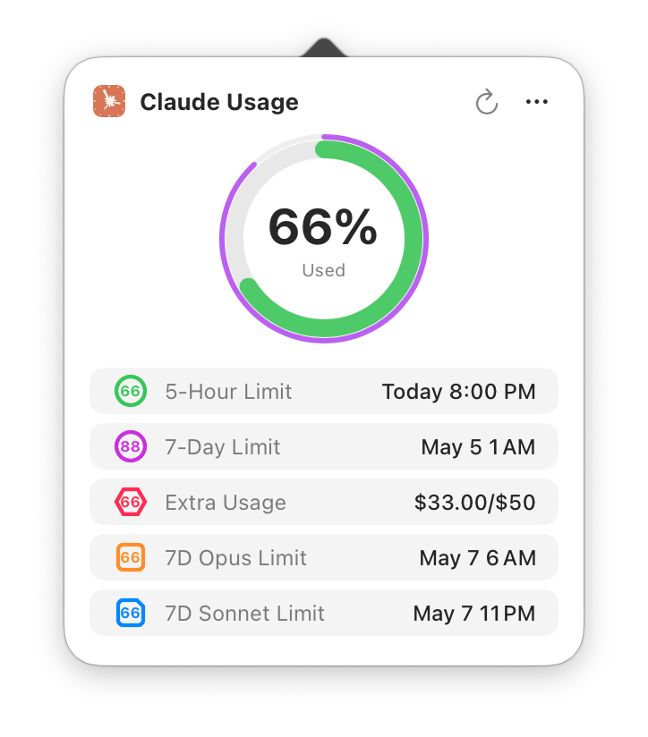
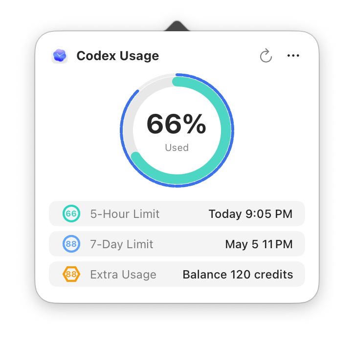
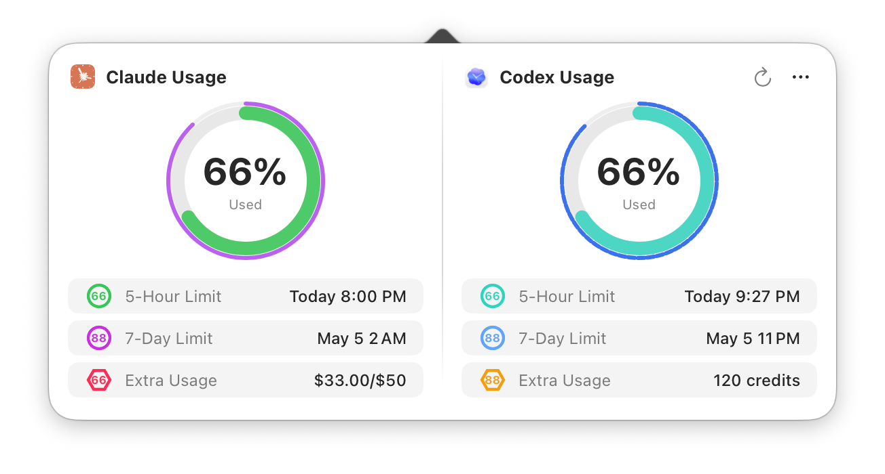

# Usage4Claude

[English](../README.md) | [日本語](README.ja.md) | [简体中文](README.zh-CN.md) | [繁體中文](README.zh-TW.md) | [한국어](README.ko.md) | [Français](README.fr.md) | [Deutsch](README.de.md)

<div align="center">


[](https://www.apple.com/macos/)
[](https://swift.org)
[](https://developer.apple.com/xcode/swiftui/)
[](../LICENSE)
[](https://github.com/f-is-h/Usage4Claude/releases)
[](https://github.com/f-is-h/Usage4Claude/releases)

**Behalte deine Claude- (und Codex-) Abonnementnutzung elegant in der Menüleiste im Blick.**

✨ **Überwacht alle Claude-Plattformen: Web • Claude Code • Desktop • Mobile App • Cowork** ✨

[Funktionen](#-funktionen) • [Installation](#-installation) • [Anleitung](#-anleitung) • [FAQ](#-faq) • [Unterstützung](#-unterstützung)

</div>

---

## ✨ Funktionen

### 🎯 Kernfunktionen

- **📊 Echtzeit-Überwachung** – Zeigt das Nutzungskontingent deines Claude-Abonnements (Free/Pro/Team/Max) live in der Menüleiste an, optional auch die Codex-Nutzung
- **🎯 Mehrere Limits** – Claude unterstützt bis zu 5 Limits (5 Stunden / 7 Tage / Zusätzliche Nutzung / 7 Tage Opus / 7 Tage Sonnet), Codex unterstützt 5-Stunden-, 7-Tage- und Zusätzliche-Nutzung/Credits
- **🎨 Intelligenter Anzeigemodus** – Erkennt und zeigt automatisch alle Limit-Typen mit vorhandenen Daten an
- **⚙️ Benutzerdefinierte Anzeige** – Wähle manuell aus, welche Limit-Typen angezeigt werden, in beliebiger Kombination
- **🎨 Intelligente Farben** – Warnt durch automatischen Farbwechsel je nach Auslastung; jeder Limit-Typ hat sein eigenes Farbschema
- **🔔 Nutzungsbenachrichtigungen** – Sendet eine Warnung bei 90 % Auslastung und eine Benachrichtigung beim Zurücksetzen des Kontingents
- **👥 Verwaltung mehrerer Accounts** – Unterstützt mehrere Claude-Accounts / mehrere Organisationen pro Account sowie eine eigenständige Codex-Account-Verwaltung mit schnellem Wechsel
- **🧩 Codex-Unterstützung** – Optionale Codex-Nutzungsüberwachung; Codex kann allein oder in einer zweispaltigen Ansicht neben Claude verwendet werden (in den Einstellungen einen Codex-Account hinzufügen, um es zu aktivieren)
- **🌐 Integrierte Browser-Anmeldung** – Bei Claude wird der Session Key automatisch ausgelesen; bei Codex erfolgt die Anmeldung über den integrierten Browser bei ChatGPT
- **🎨 Erscheinungsbild** – Unterstützt die Modi System / Hell / Dunkel
- **🕐 Zeitformat** – Unterstützt Systemstandard / 12-Stunden / 24-Stunden
- **⏰ Genaue Zeitangabe** – Minutengenaue Anzeige der Reset-Zeit des Kontingents
- **🔄 Intelligentes Aktualisierungssystem** – Intelligente 4-stufige adaptive Aktualisierung oder festes Intervall (1/3/5/10 Minuten)
- **⚡ Manuelle Aktualisierung** – Klick auf die Schaltfläche aktualisiert die Daten sofort (10 Sekunden Entprellschutz)
- **💻 Native Erfahrung** – Reine native macOS-App, leichtgewichtig und elegant

### 🌐 Plattformübergreifende Unterstützung

Nahtlose Unterstützung für alle Claude-Produkte:
- 🌐 **Claude.ai** (Web-Oberfläche)
- 💻 **Claude Code** (Entwickler-CLI)
- 🖥️ **Desktop App** (macOS/Windows)
- 📱 **Mobile App** (iOS/Android)
- 🤝 **Cowork** (KI-Agent)

Alle Plattformen teilen sich dasselbe Nutzungskontingent – überwache es an einem Ort!

### 🧩 Codex-Unterstützung

- Die Codex-Nutzung kann eigenständig oder zusammen mit Claude angezeigt werden
- Unterstützt Informationen zu Codex 5-Stunden-, 7-Tage- und Zusätzlicher Nutzung/Credits
- Codex-Accounts werden über die Anmeldung bei ChatGPT im integrierten Browser hinzugefügt
- Claude-only-Nutzer brauchen keine zusätzliche Konfiguration; ohne hinzugefügten Codex-Account bleibt die Oberfläche wie gewohnt

### 🎨 Personalisierung

- **🕓 Mehrere Anzeigemodi**
  - Nur Prozent – schlicht und direkt, ohne Klick ablesbar
  - Nur Symbol – dezent und elegant, Details erscheinen nach dem Klick
  - Symbol + Prozent – vollständige Information, schnell zu erfassen

- **🌍 Mehrsprachigkeit**
  - English
  - 日本語
  - 简体中文
  - 繁体中文
  - 한국어
  - Français
  - Deutsch
  - Weitere Sprachen in Arbeit …

### 🔧 Praktische Funktionen

- **⚙️ Grafische Einstellungen** – Alle Optionen grafisch konfigurieren, ohne Code zu ändern
- **🆕 Intelligente Update-Hinweise** – Menüleisten-Badge und Regenbogen-Animation weisen auf neue Versionen hin
- **🚀 Start beim Login** – Optional automatisch beim Systemstart ausführen
- **⌨️ Tastenkürzel** – Häufige Aktionen per Tastenkürzel (⌘R | ⌘, | ⌘Q)
- **👋 Freundliche Einführung** – Beim ersten Start führt ein ausführlicher Assistent durch die Konfiguration
- **… Menüanzeige** – Mehrere Wege, das Menü zu öffnen: Detailfenster und Rechtsklick
- **🔔 Nutzungsbenachrichtigungen** – Claude-Warnungen und Reset-Benachrichtigungen, in den Einstellungen ein-/ausschaltbar
- **🛠️ Debug-Modus** – Entwickleroptionen: Claude/Codex-Testdaten, simuliertes Update, sofortige Aktualisierung

### 🔒 Sicherheit & Datenschutz

- 🏠 **Nur lokale Speicherung** – Alle Daten werden ausschließlich lokal gespeichert; es werden niemals persönliche Informationen erhoben oder hochgeladen
- 🔐 **Schlüsselbund-Schutz** – Der Claude Session Key und die Codex-Authentifizierungs-Token werden ausschließlich im Schlüsselbund gespeichert, nie als Klartext
- 📖 **Open Source & transparent** – Der Code ist vollständig einsehbar und für jeden überprüfbar
- 🛡️ **Sandbox-Schutz** – App Sandbox aktiviert für zusätzliche Sicherheit

---

## 📸 Screenshots

### Anzeige in der Menüleiste

- Im Folgenden die Menüleisten-Symbole und Limit-Anzeigen für Claude und Codex
- Doppelte Kennzeichnung durch Form und Farbe, damit auch im einfarbigen Theme alles gut erkennbar bleibt

| Symbol | 5 Std. | 7 Tage | Zusätzlich | 7 Tage Opus | 7 Tage Sonnet | Einfarbig (adaptiv) |
|:---:|:---:|:---:|:---:|:---:|:---:|-----|
|  |  |  |  |  |  | </br>  |
|  |  |  |  | — | — | </br>  |

**Farbkennzeichnung**:

Aktuelles Farbschema für Claude:

- **5-Stunden-Limit (inkl. Detailfenster)**:  →  → 
- **7-Tage-Limit (inkl. Detailfenster)**:  →  → 
- **Zusätzliche Nutzung**:  →  → 
- **7-Tage-Opus-Limit**:  →  → 
- **7-Tage-Sonnet-Limit**:  →  → 

Aktuelles Farbschema für Codex:

- **Codex 5-Stunden-Limit**:  →  → 
- **Codex 7-Tage-Limit**:  →  → 
- **Codex Zusätzliche Nutzung / Credits**:  →  → 

### Detailfenster

<table border="0">
<tr>
<td align="top" valign="top">

<br/>
<sub><i>Claude-Einzelmodus</i></sub>
</td>
<td align="center" valign="top">

<br/>
<sub><i>Codex-Einzelmodus</i></sub>
</td>
</tr>
<tr>
<td align="center" valign="top" colspan="2">

<br/>
<sub><i>Claude- + Codex-Kombimodus</i></sub>
</td>
</tr>
<tr>
<td align="center" valign="top" colspan="2">

<br/>
<sub><i>Animation für den Wechsel der Restzeit</i></sub>
</td>
</tr>
</table>


### Einstellungen

**Allgemeine Einstellungen** – Anzeigeoptionen, Menüleisten-Theme, Benachrichtigungen, Erscheinungsbild (System/Hell/Dunkel), Aktualisierungsmodus, Zeitformat, Sprachoptionen, Start beim Login
**Anmeldedaten** – Verwaltung von Claude/Codex-Accounts (hinzufügen/löschen/wechseln/Alias bearbeiten), integrierte Browser-Anmeldung, manuelle Eingabe für Claude, Verbindungsdiagnose
**Über** – Versionsinformationen und relevante Links

### Willkommensbildschirm

**Anmeldedaten konfigurieren** – Für Claude gibt es die integrierte Browser-Anmeldung mit einem Klick (empfohlen) oder die manuelle Eingabe des Session Key; die Organisations-ID wird automatisch abgerufen und mehrere Organisationen unter demselben Session Key werden automatisch angelegt. Codex lässt sich in den Einstellungen über die ChatGPT-Anmeldung im integrierten Browser hinzufügen
**Anzeigeoptionen konfigurieren** – Auswahl von Menüleisten-Theme, angezeigtem Inhalt und Anzeigemodus (Intelligent/Benutzerdefiniert) mit Live-Vorschau
**Später einrichten** – Das Willkommensfenster schließen und die Konfiguration später in den Einstellungen vornehmen

---

## 💾 Installation

### Option 1: Vorkompilierte Version herunterladen (empfohlen)

1. Zur [Releases-Seite](https://github.com/f-is-h/Usage4Claude/releases) gehen
2. Die neueste `.dmg`-Datei herunterladen
3. Doppelklicken und die App in den Ordner „Programme" ziehen
4. Beim ersten Start mit Rechtsklick auf die App „Öffnen" wählen (das Ausführen einer nicht signierten App muss erlaubt werden)
5. Die Nutzung des Schlüsselbunds zum Speichern der Anmeldedaten muss erlaubt werden (nach einem Update ggf. erneut; das Autorisierungsfenster zeigt den Namen des jeweiligen Authentifizierungs-Tokens)

### Option 2: Aus dem Quellcode bauen

#### Voraussetzungen
- macOS 13.0 oder neuer
- Xcode 15.0 oder neuer
- Git

#### Build-Schritte

```bash
# Repository klonen
git clone https://github.com/f-is-h/Usage4Claude.git
cd Usage4Claude

# In Xcode öffnen
open Usage4Claude.xcodeproj

# In Xcode mit Cmd + R ausführen
```

---

## 📖 Anleitung

### Erste Konfiguration

1. **App starten**
   Beim ersten Start erscheint der Willkommensbildschirm

2. **Anmeldedaten konfigurieren**
   - **Claude – Option 1: Browser-Anmeldung (empfohlen)**
     - Auf die Schaltfläche „Browser-Anmeldung" klicken
     - Im integrierten Browser beim Claude-Account anmelden
     - Nach erfolgreicher Anmeldung wird der Session Key automatisch ausgelesen und die Konfiguration abgeschlossen
   - **Claude – Option 2: Manuelle Eingabe**
     - Im Browser die Claude-Nutzungsseite aufrufen
     - Die Entwicklerwerkzeuge öffnen (F12 oder Cmd + Option + I)
     - Zum Tab „Netzwerk" wechseln und die Seite neu laden
     - Die `usage`-Anfrage suchen und aus dem Cookie `sessionKey=sk-ant-...` auslesen
     - In das Eingabefeld einfügen
   - **Codex-Account (optional)**
     - Einstellungen → Anmeldedaten öffnen
     - Bei Codex auf „Browser-Anmeldung" klicken
     - Im integrierten Browser beim ChatGPT-Account anmelden
     - Nach erfolgreicher Anmeldung werden die Anmeldedaten automatisch gespeichert
     - Für Codex wird die manuelle Eingabe des Session Key derzeit nicht unterstützt

### Alltägliche Nutzung

- **Standardanzeige** – Das Menüleisten-Symbol zeigt den Nutzungsprozentsatz an
- **Details ansehen** – Ein Klick auf das Menüleisten-Symbol öffnet die Details; ist nur Claude/Codex konfiguriert, wird eine Claude/Codex-Spalte angezeigt, bei beiden eine zweispaltige Ansicht
- **Manuelle Aktualisierung** – Im Detailfenster auf die Schaltfläche klicken oder das Tastenkürzel ⌘R verwenden (beim Öffnen des Hauptfensters werden die Daten ebenfalls automatisch aktualisiert); in der zweispaltigen Ansicht lassen sich Claude und Codex auch einzeln aktualisieren
- **Account wechseln** – Im Detailfenster auf das „…"-Menü oder mit Rechtsklick auf das Menüleisten-Symbol den gewünschten Claude-/Codex-Account auswählen
- **Tastenkürzel**
  - ⌘R – Daten manuell aktualisieren
  - ⌘, – Allgemeine Einstellungen öffnen
  - ⌘⇧A – Anmeldeeinstellungen öffnen
  - ⌘Q – App beenden
- **Update-Hinweis** – Bei einer neuen Version zeigt das Menüleisten-Symbol ein Badge und der Menüpunkt einen Regenbogen-Text
- **Auf Updates prüfen** – Menü → Auf Updates prüfen

### Aktualisierungsmodus

**Intelligente Frequenz (empfohlen)**
- Passt das Aktualisierungsintervall automatisch an die Nutzung an
- Aktiver Modus (1 Minute) – schnelle Aktualisierung, während Claude oder Codex genutzt wird
- Ruhemodus (3/5/10 Minuten) – verlangsamt die Aktualisierung bei Inaktivität schrittweise
- Reduziert die API-Aufrufe im Ruhezustand deutlich (bis zu 10-fach)
- Kehrt bei erkannter Nutzungsänderung sofort zur 1-Minuten-Aktualisierung zurück
- Nach dem Aufwachen aus dem Ruhezustand wird automatisch neu geladen, um veraltete Daten zu vermeiden

**Feste Frequenz**
- **1 Minute** – empfohlen für laufende Überwachung
- **3 Minuten** – ausgewogene Überwachung
- **5 Minuten** – seltene Überwachung
- **10 Minuten** – minimale API-Aufrufe

---

## ❓ FAQ

<details>
<summary><b>F: Was tun, wenn die App „Sitzung abgelaufen" anzeigt?</b></summary>

A: Der Claude Session Key bzw. die Codex-Authentifizierungs-Token laufen regelmäßig ab (meist nach einigen Wochen bis Monaten) und müssen erneuert werden:
1. Einstellungen → Anmeldedaten öffnen
2. Bei Claude-Accounts auf „Browser-Anmeldung" klicken (empfohlen) oder den Session Key manuell neu beschaffen
3. Bei Codex-Accounts auf „Browser-Anmeldung" klicken und sich im integrierten Browser erneut bei ChatGPT anmelden
4. Danach funktioniert alles wieder normal

</details>

<details>
<summary><b>F: Wie starte ich die App automatisch beim Login?</b></summary>

A: Es gibt zwei Wege:

**Option 1: App-interne Einstellung (empfohlen)**
1. Einstellungen → Allgemeine Einstellungen öffnen
2. Die Option „Beim Login starten" aktivieren

**Option 2: Über die Systemeinstellungen**
1. „Systemeinstellungen" → „Allgemein" → „Anmeldeobjekte" öffnen
2. Auf „+" klicken und Usage4Claude hinzufügen

</details>

<details>
<summary><b>F: Wie viele Systemressourcen verbraucht die App?</b></summary>

A: Sehr wenig:
- CPU-Auslastung: < 0,1 % (im Leerlauf)
- Speicherverbrauch: ca. 20 MB
- Netzwerkanfragen: standardmäßig nach intelligenter Frequenz; bei konfiguriertem Claude und Codex werden die jeweiligen Dienste getrennt angefragt

</details>

<details>
<summary><b>F: Welche macOS-Versionen werden unterstützt?</b></summary>

A: Erforderlich ist macOS 13.0 (Ventura) oder neuer. Unterstützt werden Intel- und Apple-Silicon-Chips (M1/M2/M3/M4/M5).

</details>

<details>
<summary><b>F: Warum wird eine Schlüsselbund-Berechtigung benötigt?</b></summary>

A:
- Der Schlüsselbund ist der systemweite Passwortmanager von macOS
- Der Claude Session Key und die Codex-Authentifizierungs-Token werden verschlüsselt im Schlüsselbund gespeichert
- Die Claude Organisations-ID wird in der lokalen Konfiguration gespeichert (ein nicht sensibler Bezeichner)
- Dies ist die von Apple empfohlene, sicherste Art, sensible Informationen zu speichern
- Nur diese App kann auf diese Informationen zugreifen, andere Apps haben keine Berechtigung

</details>

<details>
<summary><b>F: Sind meine Daten sicher? Wie wird der Datenschutz gewahrt?</b></summary>

**Absolut sicher!**

**Datenspeicherung:**
- Alle Daten werden **ausschließlich** lokal auf deinem Mac gespeichert
- Es werden keinerlei Informationen erhoben, verfolgt oder ausgewertet
- Außer den Aufrufen der Nutzungs-Endpunkte von Claude und Codex gibt es keine weiteren Netzwerkanfragen
- Es werden keine Drittanbieterdienste verwendet

**Sicherheit der Anmeldedaten:**
- Der Claude Session Key und die Codex-Authentifizierungs-Token werden über den macOS-Schlüsselbund verschlüsselt (systemweite Verschlüsselung)
- Der Schlüsselbund nutzt AES-256-Verschlüsselung + Hardwareschutz (T2 / Secure Enclave)
- Nur diese App kann auf deine Anmeldedaten zugreifen, andere Apps können sie nicht lesen
- Du kannst die Berechtigung jederzeit über die App „Schlüsselbundverwaltung" widerrufen

**Transparenz des Codes:**
- 100 % Open Source
- Keine Verschleierung oder versteckten Funktionen
- Von der Community überprüf- und verifizierbar

**Zusätzlicher Schutz:**
- App Sandbox aktiviert (beschränkt den Systemzugriff)
- Kein Zugriff auf deine Dateien, Kontakte oder andere Apps
- Minimale Berechtigungen (nur Netzwerk + Schlüsselbund)

Du kannst all das überprüfen, indem du den Quellcode auf GitHub ansiehst!

</details>

<details>
<summary><b>F: Werden Claude Code / Desktop App / Mobile App unterstützt?</b></summary>

A: **Ja, alle Claude-Plattformen werden unterstützt!**

Da alle Claude-Produkte (Web, Claude Code, Desktop App, Mobile App, Cowork) sich dasselbe Nutzungskontingent teilen, überwacht Usage4Claude deine Gesamtnutzung über alle Plattformen hinweg.

Ganz gleich, ob du:
- im Terminal mit `claude code` programmierst
- auf claude.ai chattest
- die Desktop-App nutzt
- die Mobile-App nutzt
- mit Cowork zusammenarbeitest

Du siehst die gesamte Nutzung in Echtzeit in der Menüleiste. Keine plattformspezifische Konfiguration nötig!

</details>

<details>
<summary><b>F: Wie wird die Codex-Unterstützung aktiviert? Kann ich nur Codex verwenden?</b></summary>

A: Ja. Einstellungen → Anmeldedaten öffnen, bei Codex auf „Browser-Anmeldung" klicken und sich im integrierten Browser bei ChatGPT anmelden – fertig.

- Nur Codex konfiguriert: Menüleiste und Detailfenster zeigen die Codex-Nutzung
- Claude und Codex konfiguriert: Das Detailfenster zeigt beide nebeneinander in einer zweispaltigen Ansicht
- Codex unterstützt derzeit nur die Browser-Anmeldung, nicht die manuelle Eingabe des Session Key

</details>

<details>
<summary><b>F: Was tun, wenn das Symbol nicht in der Menüleiste zu sehen ist?</b></summary>

A: macOS selbst oder Drittanbietersoftware (wie Bartender, Hidden Bar usw.) blendet Menüleisten-Symbole mitunter automatisch aus.

**Lösung:**
1. Die **Command-Taste (⌘)** gedrückt halten
2. Das Symbol in der Menüleiste mit der Maus ziehen
3. Das Usage4Claude-Symbol in den sichtbaren Bereich rechts in der Menüleiste ziehen
4. Die Maustaste loslassen

**Tipp:**
- macOS Sonoma (14.0+) verschiebt selten genutzte Symbole automatisch ins „Kontrollzentrum"
- Du kannst die Anzeige der Menüleisten-Symbole unter „Systemeinstellungen" → „Kontrollzentrum" anpassen

</details>

<details>
<summary><b>F: Wie verwalte ich mehrere Accounts?</b></summary>

A: Usage4Claude unterstützt mehrere Claude-Accounts, mehrere Organisationen pro Claude-Account sowie eine eigenständige Codex-Account-Verwaltung:
- **Account hinzufügen** – Unter Einstellungen → Anmeldedaten per Claude-Browser-Anmeldung, manueller Claude-Eingabe oder Codex-Browser-Anmeldung
- **Account wechseln** – Im Detailfenster auf das „…"-Menü oder mit Rechtsklick auf das Menüleisten-Symbol den gewünschten Claude-/Codex-Account auswählen
- **Alias bearbeiten** – Für jeden Account einen gut erkennbaren Alias festlegen
- **Account löschen** – Nicht mehr benötigte Accounts per Wischgeste oder im Bearbeitungsmodus entfernen

</details>

<details>
<summary><b>F: Wie aktiviere ich Nutzungsbenachrichtigungen?</b></summary>

A: Unter Einstellungen → Allgemeine Einstellungen lassen sich die Claude-Nutzungsbenachrichtigungen ein- und ausschalten:
- **Nutzungswarnung** – Sendet eine Systembenachrichtigung, wenn die Claude-Nutzung 90 % erreicht
- **Reset-Benachrichtigung** – Sendet eine Benachrichtigung, wenn das Claude-Kontingent zurückgesetzt wird
- Beim ersten Aktivieren muss die macOS-Benachrichtigungsberechtigung erteilt werden

</details>

---

## 🛠 Technologie-Stack

Dieses Projekt basiert auf einem modernen, nativen macOS-Technologie-Stack:

- **Sprache**: Swift 5.0+
- **UI-Framework**: SwiftUI + AppKit (hybrid)
- **Architektur**: MVVM
- **Netzwerk**: URLSession
- **Reaktiv**: Combine Framework
- **Lokalisierung**: Integrierte i18n-Unterstützung
- **Plattform**: macOS 13.0+

---

## 🗺 Roadmap

### ✅ Abgeschlossen
- [x] Grundlegende Überwachung
- [x] Echtzeitanzeige in der Menüleiste
- [x] Kreisförmige Fortschrittsanzeige
- [x] Intelligente Farbwarnungen
- [x] Echtzeit-Countdown
- [x] Mehrere Anzeigemodi in der Menüleiste
- [x] Grafische Einstellungen
- [x] Mehrsprachigkeit
- [x] Einführung beim ersten Start
- [x] Update-Prüfung mit visuellem Hinweis
- [x] Speicherung der Anmeldedaten im Schlüsselbund
- [x] Automatisches DMG-Packaging per Shell
- [x] Automatische Veröffentlichung über GitHub Actions
- [x] Optimierte Anzeige der Einstellungen
- [x] Start beim Login
- [x] Tastenkürzel
- [x] Manuelle Aktualisierung
- [x] Dark-Mode-Anpassung des Drei-Punkte-Menüs
- [x] Unterstützung für zwei Limits (5 Stunden + 7 Tage)
- [x] Menüleisten-Symbol mit zwei Ringen
- [x] Einheitliche Verwaltung des Farbschemas
- [x] Debug-Modus (Testdaten, simuliertes Update)
- [x] Entfernen des Fokus-Status im Detailfenster
- [x] Unterstützung mehrerer Limit-Typen (5 Typen)
- [x] Intelligenter/benutzerdefinierter Anzeigemodus
- [x] Automatischer Abruf der Organisations-ID
- [x] Optimierter Willkommensablauf
- [x] Symbolanzeige im einfarbigen Theme
- [x] Koreanische Unterstützung
- [x] Prüfung der Online-Version über GitHub Actions
- [x] Erscheinungsbild (System/Hell/Dunkel)
- [x] Automatischer Abruf der Anmeldedaten über den integrierten Browser
- [x] Automatische Konfiguration der Anmeldedaten
- [x] Nutzungsbenachrichtigungen
- [x] Verwaltung mehrerer Accounts
- [x] Einheitliche Zeitformat-Einstellung
- [x] Dark-Mode-Anpassung der Einstellungen
- [x] Codex-Nutzungsüberwachung
- [x] Codex-Einzelmodus
- [x] Zweispaltiges Detailfenster für Claude + Codex
- [x] Codex-Account-Verwaltung und Browser-Anmeldung
- [x] Französische Lokalisierung
- [x] Automatische Aktualisierung nach dem Aufwachen aus dem Ruhezustand

### Mittelfristige Planung
1. **Neue Funktionen**
    - Weitere Sprachlokalisierungen

### Langfristige Vision
3. **Weitere Anzeigeformen**
   - Desktop-Widget
   - Nutzungsanzeige über ein Browser-Plugin-Symbol

4. **Datenanalyse**
   - Verlauf der Nutzung
   - Trenddiagramme

5. **Plattformübergreifende Unterstützung**
   - iOS / iPadOS-Version
   - Apple-Watch-Version
   - Windows-Version

---

## 🤝 Mitwirken

Beiträge jeder Art sind willkommen! Ob neue Funktionen, Fehlerbehebungen oder Verbesserungen der Dokumentation.

Ausführliche Hinweise findest du in den [CONTRIBUTING.md](../CONTRIBUTING.md).

### So trägst du bei

1. Das Repository forken
2. Deinen Feature-Branch erstellen (`git checkout -b feature/AmazingFeature`)
3. Deine Änderungen committen (`git commit -m 'Add some AmazingFeature'`)
4. Den Branch pushen (`git push origin feature/AmazingFeature`)
5. Einen Pull Request öffnen

### Mitwirkende

Danke an alle, die zu diesem Projekt beigetragen haben!

<!-- ALL-CONTRIBUTORS-LIST:START -->
<!-- Hier wird die Liste der Mitwirkenden automatisch generiert -->
<!-- ALL-CONTRIBUTORS-LIST:END -->

---

## 📝 Changelog

Die ausführliche Versionshistorie und Änderungen findest du in der [CHANGELOG.md](../CHANGELOG.md).

---

## 💖 Unterstützung

Wenn dir dieses Projekt hilft, kannst du es gerne auf folgende Weise unterstützen:

### ⭐ Projekt mit einem Stern versehen
Ein Stern für das Projekt ist die schönste Ermutigung für mich!

### ☕ Spendier mir einen Kaffee

<!-- GitHub Sponsors -->
<a href="https://github.com/sponsors/f-is-h?frequency=one-time">
  
</a>

<!-- Ko-fi -->
<a href="https://ko-fi.com/1attle">
  
</a>

<!-- Buy Me A Coffee -->
<!-- <a href="https://buymeacoffee.com/fish_">
  
</a> -->

### 📢 Projekt teilen
Wenn dir dieses Projekt gefällt, teile es mit allen, die es gebrauchen könnten!

---

## 📄 Lizenz

Dieses Projekt steht unter der MIT-Lizenz – siehe die Datei [LICENSE](../LICENSE) für Details

```
MIT License

Copyright (c) 2025 f-is-h

Es ist gestattet, diese Software frei zu verwenden, zu kopieren, zu ändern,
zusammenzuführen, zu veröffentlichen, zu verbreiten, unterzulizenzieren
und/oder Kopien davon zu verkaufen.
```

---

## 🙏 Danksagung

- Dank an Claude/Codex – der Großteil des Codes wurde von KI geschrieben
- Dank an alle Mitwirkenden und Nutzer für ihre Unterstützung
- Die Gestaltung der Symbole ist von den offiziellen Marken von Claude/Codex inspiriert

---

## 📞 Kontakt

- **Issues**: [Problem oder Vorschlag melden](https://github.com/f-is-h/Usage4Claude/issues)
- **Discussions**: [An der Diskussion teilnehmen](https://github.com/f-is-h/Usage4Claude/discussions)
- **GitHub**: [@f-is-h](https://github.com/f-is-h)

---

## ⚖️ Haftungsausschluss

Dieses Projekt ist ein eigenständiges Drittanbieter-Tool und steht in keiner offiziellen Verbindung zu Anthropic, Claude AI, OpenAI oder Codex. Bitte halte dich bei der Nutzung dieser Software an die jeweiligen Nutzungsbedingungen.

---

<div align="center">

**Wenn dir dieses Projekt hilft, gib ihm bitte einen ⭐ Stern!**

Made with ❤️ by [f-is-h](https://github.com/f-is-h)

[⬆ Zurück nach oben](#usage4claude)

</div>
