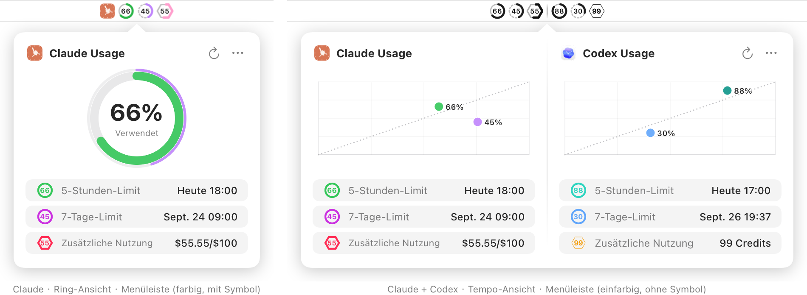
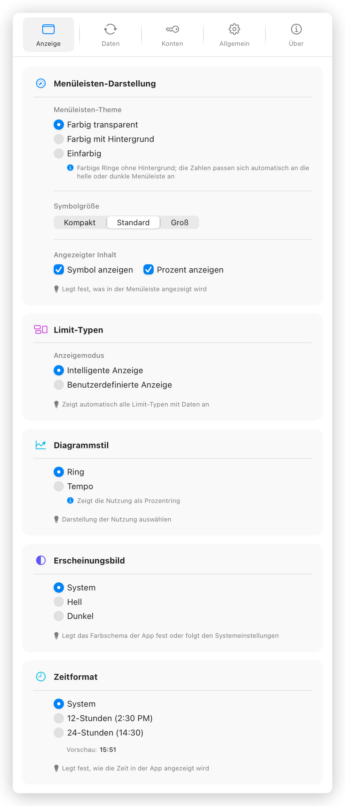

# Usage4Claude

[English](../README.md) | [日本語](README.ja.md) | [简体中文](README.zh-CN.md) | [繁體中文](README.zh-TW.md) | [한국어](README.ko.md) | [Français](README.fr.md) | [Deutsch](README.de.md)

<div align="center">

<picture>
  <source media="(prefers-color-scheme: dark)" srcset="images/hero.de.dark@2x.png">
  
</picture>

[](https://www.apple.com/macos/)
[](https://swift.org)
[](https://developer.apple.com/xcode/swiftui/)
[](../LICENSE)
[](https://github.com/f-is-h/Usage4Claude/releases)
[](https://github.com/f-is-h/Usage4Claude/releases)
[](https://github.com/sponsors/f-is-h?frequency=one-time&metadata_project=usage4claude&metadata_source=readme&metadata_placement=header&metadata_lang=de)

**Die Nutzung der Claude- und Codex-Abos in der Menüleiste verfolgen.**

[Funktionen](#-funktionen) · [Installation](#-installation) · [Verwendung](#-verwendung) · [Datenschutz und Sicherheit](#-datenschutz-und-sicherheit) · [Häufige Fragen](#-häufige-fragen) · [Mitwirken](#-mitwirken)

</div>

---

## ✨ Funktionen

### Umfang

Claude und Codex lassen sich einzeln oder gemeinsam einrichten. Alle Zugänge eines Dienstes teilen sich dasselbe Kontingent, und die Menüleiste zeigt stets dessen Gesamtnutzung.

| Dienst | Zugänge | Limits |
|---|---|---|
| **Claude** | claude.ai, Claude Code, Desktop-App, Mobile-App, Cowork | 5 Stunden, 7 Tage, zusätzliche Nutzung sowie die wöchentliche Nutzung je Modell (Opus, Sonnet, Fable usw., je nachdem, was das Konto liefert) |
| **Codex** | Codex CLI, IDE-Erweiterung, Codex Web | 5 Stunden, 7 Tage, Credits-Guthaben |

Mit einem Dienst ist die Oberfläche einspaltig. Mit beiden teilt sich das Detailfenster in zwei Spalten, und die Menüleiste zeigt beide Symbole nebeneinander.

Unterstützt werden die Claude-Tarife Pro, Max, Team und Enterprise. Kostenlose Konten haben kein Nutzungs-Dashboard und lassen sich nicht auslesen. Bei Team und Enterprise muss ein Administrator das Mitglieder-Dashboard aktivieren.

### Zwei Diagrammstile

**Ring** zeigt den genutzten Anteil jedes Limits, darunter die Reset-Zeiten.

**Tempo** trägt jedes Limit gegen die verstrichene Zeit auf, eine Diagonale steht für gleichmäßigen Verbrauch. Oberhalb der Diagonale wird schneller verbraucht, als die Zeit vergeht; unterhalb bleibt Spielraum. Wöchentliche Limits können nur Wochentage zählen.

Umschalten unter Einstellungen → Anzeige → Diagrammstil. Ein Klick auf die Limitliste wechselt zwischen „genutzter Anteil und Reset-Zeitpunkt“ und „verfügbarer Anteil und Restzeit“.

<div align="center">

</div>

### Menüleistensymbole

Jeder Limit-Typ hat eine eigene Form und Farbe, und die Farbe ändert sich mit steigender Nutzung.

| | Symbol | 5 Stunden | 7 Tage | Zusätzliche Nutzung | Modell 1 wöchentlich<br>(z. B. Fable) | Modell 2 wöchentlich<br>(z. B. Opus, Sonnet) | Einfarbig |
|---|:---:|:---:|:---:|:---:|:---:|:---:|:---:|
| **Claude** |  |  |  |  |  |  | <br> |
| **Codex** |  |  |  |  | | | <br> |

Die wöchentliche Nutzung je Modell verwendet die Stile Modell 1 und Modell 2 in der Reihenfolge, in der die API die Modelle liefert; die Modellnamen stammen aus dem Konto. Die Menüleiste zeigt höchstens die ersten beiden Modelle, das Detailfenster listet alle Modelle und wechselt dabei zwischen beiden Stilen.

Claude-Farben:

- **5 Stunden**:  →  → 
- **7 Tage**:  →  → 
- **Zusätzliche Nutzung**:  →  → 
- **Modell 1 wöchentlich** (z. B. Fable):  →  → 
- **Modell 2 wöchentlich** (z. B. Opus, Sonnet):  →  → 

Codex-Farben:

- **5 Stunden**:  →  → 
- **7 Tage**:  →  → 
- **Credits**:  →  → 

Im einfarbigen Theme bleiben die Limits an ihrer Form unterscheidbar, und die Symbole passen sich automatisch hell oder dunkel an die Menüleiste an. Ob die Menüleiste hell oder dunkel ist, hängt vom Hintergrundbild ab, nicht vom hellen oder dunklen Erscheinungsbild des Systems.

| Option | Werte |
|---|---|
| Angezeigter Inhalt | Nur Prozent, Nur Symbol, Symbol und Prozent |
| Symbolgröße | Kompakt, Standard, Groß |
| Theme | Farbig transparent, Farbig mit Hintergrund, Einfarbig |

Standardmäßig zeigt die Menüleiste alle Limits mit Daten. Einzeln auswählen lassen sie sich nach dem Wechsel zu Benutzerdefinierte Anzeige unter Einstellungen → Anzeige → Limit-Typen.

### Benachrichtigungen

Erreicht die Nutzung einen Schwellenwert, folgt eine Systembenachrichtigung, ebenso beim Zurücksetzen eines Kontingents. Die Schwellenwerte werden je Kategorie festgelegt, von 50 % bis 100 % in 5-%-Schritten.

| Kategorie | Stufen | Standard |
|---|---|---|
| 5 Stunden | 1 | 90 % |
| Wöchentlich (einschließlich wöchentlicher Nutzung je Modell) | 2 | 75 %, 90 % |
| Zusätzliche Nutzung / Credits | 2 | 75 %, 90 % |

### Aktualisierung

**Der intelligente Modus** richtet sich nach der Nutzung: einmal pro Minute, solange sie sich ändert, bei ausbleibenden Änderungen schrittweise alle 3, 5 und 10 Minuten, und sofort wieder jede Minute, sobald sich etwas ändert. Im Leerlauf fällt etwa ein Zehntel der Anfragen an.

**Der feste Modus** aktualisiert alle 1, 3, 5 oder 10 Minuten.

Bei Ratenbegrenzung zieht sich die App automatisch zurück. Schlägt eine Aktualisierung fehl, bleiben die vorherigen Daten sichtbar, nur neben dem Titel erscheint ein Hinweis. Beim Aufwachen aus dem Ruhezustand und beim Öffnen des Detailfensters wird automatisch aktualisiert; ein Klick auf Ring oder Diagramm aktualisiert manuell, mit 10 Sekunden Entprellung.

### Konten

Claude unterstützt mehrere Konten und mehrere Organisationen innerhalb eines Kontos; Codex-Konten werden getrennt verwaltet. Jedes Konto kann einen Alias erhalten. Gewechselt wird über das Menü „…“ im Detailfenster oder das Rechtsklickmenü des Menüleistensymbols.

Die Anmeldung läuft über den Systembrowser, daher funktionieren Google, Microsoft, Unternehmens-SSO und Passkeys. Claude akzeptiert zusätzlich einen manuell eingegebenen Session Key.

### Codex-Reset-Ankündigung (Beta)

Kündigt OpenAI einen bevorstehenden globalen Reset an, erscheint neben dem Titel der Codex-Spalte ein Badge; sonst wird nichts angezeigt. Die Daten stammen vom Community-Projekt [codex-reset.com](https://codex-reset.com) eines Drittanbieters, nicht von einer offiziellen API, und lassen sich in den Einstellungen abschalten.

### Sprachen

English, 日本語, 简体中文, 繁體中文, 한국어, Français ([@mtreize](https://github.com/mtreize)), Deutsch ([@schaitl](https://github.com/schaitl)). Standardmäßig gilt die Systemsprache. Neue Übersetzungen sind willkommen, siehe [Mitwirken](#-mitwirken).

---

## 💾 Installation

### Download

1. Die neueste `.dmg` unter [Releases](https://github.com/f-is-h/Usage4Claude/releases) herunterladen und die App in den Ordner „Programme“ ziehen
2. Gatekeeper blockiert den ersten Start; wie er sich zulassen lässt, steht im ersten Eintrag der [häufigen Fragen](#-häufige-fragen)
3. Beim ersten Lesen der Zugangsdaten den Schlüsselbundzugriff mit „Immer erlauben“ bestätigen

Voraussetzung ist macOS 13 (Ventura) oder neuer, auf Intel oder Apple Silicon.

Updates installiert [Sparkle](https://sparkle-project.org) direkt in der App; jedes Update wird vor der Installation per EdDSA-Signatur geprüft. Eine Installation über Homebrew wird derzeit nicht angeboten.

### Aus dem Quellcode bauen

Voraussetzung ist Xcode 26 oder neuer.

```bash
git clone https://github.com/f-is-h/Usage4Claude.git
cd Usage4Claude
open Usage4Claude.xcodeproj
```

In Xcode mit ⌘R starten. Die App ist in Swift und SwiftUI geschrieben, Menüleiste und Fensterverwaltung nutzen AppKit.

---

## 📖 Verwendung

### Anmeldung

Beim ersten Start öffnet sich ein Einrichtungsfenster, in dem sich Claude und Codex anmelden lassen. Die Einrichtung kann übersprungen werden; Konten lassen sich später unter Einstellungen → Konten hinzufügen.

**Browser-Anmeldung**: Nach einem Klick auf die Anmeldeschaltfläche öffnet der Systembrowser die Autorisierungsseite, danach kehrt die App automatisch zurück. Die Rückmeldung wird über einen temporären lokalen Port empfangen. Blockiert eine Firewall lokale Verbindungen, bleibt der Browser auf einer `localhost`-Adresse stehen; diese Adresse in das Anmeldefenster einfügen, um abzuschließen.

**Session Key manuell eingeben** (nur Claude):

1. Die Nutzungsseite von claude.ai im Browser öffnen
2. Die Entwicklerwerkzeuge öffnen (⌥⌘I), zum Tab „Netzwerk“ wechseln und die Seite neu laden
3. Die Anfrage `usage` suchen und den vollständigen Wert `sessionKey=sk-ant-...` aus dem Cookie-Header der Anfrage kopieren
4. In das Eingabefeld einfügen. Die Organisations-ID wird automatisch ermittelt, und alle Organisationen unter dem Session Key werden hinzugefügt

### Im Alltag

Ein Linksklick auf das Menüleistensymbol öffnet das Detailfenster, ein Rechtsklick das Menü. Dort finden sich der Kontowechsel, die Einstellungen, „Auf Updates prüfen“ sowie Links zu den Statusseiten von Claude und Codex.

Ist eine neue Version verfügbar, trägt das Menüleistensymbol ein Badge, und „Auf Updates prüfen“ ist im Menü markiert.

### Einstellungen

<div align="center">
<picture>
  <source media="(prefers-color-scheme: dark)" srcset="images/settings.display.de.dark@2x.png">
  
</picture>
</div>

| Tab | Inhalt |
|---|---|
| **Anzeige** | Menüleistendarstellung, Limit-Typen, Diagrammstil, Erscheinungsbild, Zeitformat |
| **Daten** | Aktualisierungsmodus, Benachrichtigungsschwellen, Codex-Reset-Ankündigung |
| **Konten** | Claude- und Codex-Konten, Browser-Anmeldung, manuelle Session-Key-Eingabe, Verbindungsdiagnose |
| **Allgemein** | Oberflächensprache, beim Login starten, Standardeinstellungen wiederherstellen |
| **Über** | Versionsinformationen und Links |

---

## 🔒 Datenschutz und Sicherheit

- Kein Server; die Daten bleiben auf dem Mac, ohne Statistiken oder Telemetrie
- Netzwerkanfragen gibt es nur in drei Fällen: die Anmelde- und Nutzungs-APIs von Claude und Codex, die Update-Prüfung von Sparkle auf GitHub und codex-reset.com bei aktivierter Codex-Reset-Ankündigung
- Session Keys und Tokens liegen im Schlüsselbund, nie im Klartext; API-Antworten werden nicht in den Festplatten-Cache geschrieben
- Die App Sandbox ist aktiv. Über den Netzwerkzugriff hinaus öffnet sie nur den lokalen Port für die Anmelderückmeldung und die Systemdienste, die Sparkle zum Installieren von Updates braucht
- Diagnoseberichte werden vor dem Export bereinigt; Tokens und andere sensible Felder werden ersetzt
- Der Quellcode ist vollständig öffentlich und kann geprüft werden

---

## ❓ Häufige Fragen

<details>
<summary><b>Die App lässt sich nicht öffnen: „Entwickler kann nicht überprüft werden“</b></summary>

Die App ist nicht von Apple notarisiert, daher muss der erste Start manuell zugelassen werden:

- **macOS 15 und neuer**: Die App doppelklicken und im Dialog auf „Fertig“ klicken. Anschließend Systemeinstellungen → Datenschutz & Sicherheit öffnen und unten auf der Seite auf „Dennoch öffnen“ klicken
- **macOS 14 und älter**: Die App bei gedrückter Control-Taste anklicken, „Öffnen“ wählen und im Dialog bestätigen

Das ist nur einmal nötig. Danach startet die App normal per Doppelklick, auch nach Updates aus der App heraus.

</details>

<details>
<summary><b>Nach einem Update wird erneut nach dem Schlüsselbundzugriff gefragt</b></summary>

Der Schlüsselbund erkennt eine App an ihrer Signatur. Diese App nutzt ein selbstsigniertes Zertifikat, daher fragt das System nach manchen Updates erneut. „Immer erlauben“ wählen. Die Zugangsdaten im Schlüsselbund kann nur diese App lesen.

</details>

<details>
<summary><b>„Anfrage vom Sicherheitssystem blockiert“</b></summary>

Der Cloudflare-Schutz vor claude.ai blockiert Anfragen, die er für automatisiert hält. Einmal claude.ai im Browser aufrufen und die Prüfung abschließen; danach erholt sich die App in der Regel. Hinter einem VPN oder Proxy tritt das häufiger auf. Die Sperre hat nichts mit dem Konto zu tun, eine erneute Anmeldung ist nicht nötig.

</details>

<details>
<summary><b>„Sitzung abgelaufen“</b></summary>

Session Keys und Anmelde-Tokens laufen regelmäßig ab, nach einigen Wochen bis Monaten. Unter Einstellungen → Konten erneut anmelden.

</details>

<details>
<summary><b>„Zu viele Anfragen“</b></summary>

Die Nutzungs-API hat ihre Ratenbegrenzung erreicht. Die App zieht sich automatisch zurück und versucht es später erneut; bis dahin bleiben die vorherigen Daten sichtbar. Wiederholtes manuelles Aktualisieren verlängert die Wartezeit.

</details>

<details>
<summary><b>Codex verlangt ständig eine neue Anmeldung</b></summary>

Ist „Advanced Security“ in einem ChatGPT-Konto aktiviert, laufen Anmelde-Tokens deutlich früher ab, und die App muss sich häufig neu anmelden. Wer Codex dauerhaft überwachen will, sollte diese Option abschalten.

</details>

<details>
<summary><b>Keine Nutzungsdaten für ein Claude-Konto</b></summary>

Die Meldung „Der Tarif dieses Kontos stellt keine Nutzungsdaten bereit“ bedeutet, dass das Konto auf claude.ai kein Nutzungs-Dashboard hat. Kostenlose Konten haben keines; bei Team und Enterprise einen Administrator bitten, das Mitglieder-Dashboard zu aktivieren. Eine erneute Anmeldung ändert daran nichts.

</details>

<details>
<summary><b>Das Symbol fehlt in der Menüleiste</b></summary>

Wird der Platz in der Menüleiste knapp, blendet macOS einige Symbole aus; auch Werkzeuge wie Bartender oder Hidden Bar können es einklappen. Mit gedrückter ⌘-Taste lassen sich Menüleistensymbole verschieben.

</details>

<details>
<summary><b>Die App beendet sich unerwartet</b></summary>

Unter Einstellungen → Konten → Verbindungsdiagnose einen Diagnosebericht exportieren und an ein [Issue](https://github.com/f-is-h/Usage4Claude/issues) anhängen. Der Bericht vermerkt, ob das letzte Beenden unerwartet war, und enthält die jüngsten Protokolle. Er wird vor dem Export bereinigt.

</details>

---

## 🗺 Roadmap

Die Änderungen jeder Version stehen in [CHANGELOG.md](../CHANGELOG.md).

**In Arbeit**: laufende Verbesserungen und Behebung von Issues

**In Erwägung**: weitere Oberflächensprachen, Desktop-Widgets, Diagramme zum Nutzungsverlauf

**Nicht geplant**

- **Dienste außer Claude und Codex.** Der Platz in der Menüleiste ist begrenzt, und jeder weitere Anbieter nimmt allen Nutzern Platz weg. Das Projekt konzentriert sich darauf, diese beiden gut abzudecken, statt ein allgemeines Nutzungs-Dashboard zu werden.
- **Das Hochladen von Daten jeglicher Art.** Das Projekt hat keinen Server und plant auch keinen.
- **Vertrieb über den App Store.** Die App liest die Nutzung über nicht dokumentierte APIs aus, was den App-Store-Richtlinien nicht entspricht.

---

## 🤝 Mitwirken

Issues und Pull Requests sind willkommen; der Ablauf steht in [CONTRIBUTING.md](../CONTRIBUTING.md).

**Neue Sprache hinzufügen**: `Usage4Claude/Resources/en.lproj/Localizable.strings` in einen neuen Ordner `<Sprachcode>.lproj` kopieren und die Werte übersetzen. Die CI prüft, ob alle Sprachen dieselben Schlüssel haben.

### Mitwirkende

**Code**

<a href="https://github.com/f-is-h/Usage4Claude/graphs/contributors"></a>

**Übersetzung**


**Fehlermeldungen und Funktionsvorschläge**


### Unterstützen

<a href="https://github.com/sponsors/f-is-h?frequency=one-time&amp;metadata_project=usage4claude&amp;metadata_source=readme&amp;metadata_placement=badge&amp;metadata_lang=de"></a>
<a href="https://ko-fi.com/1atte"></a>

---

## 📄 Lizenz und Hinweise

MIT-Lizenz, siehe [LICENSE](../LICENSE). Copyright © 2025-2026 f-is-h.

Dieses Projekt ist ein unabhängiges Drittanbieter-Werkzeug ohne offizielle Verbindung zu Anthropic oder OpenAI. Bei der Nutzung gelten die Bedingungen des jeweiligen Dienstes.

Der Großteil des Codes wurde von Claude und Codex geschrieben. Das Symboldesign orientiert sich am offiziellen Markenauftritt beider Unternehmen.

Probleme bitte unter [Issues](https://github.com/f-is-h/Usage4Claude/issues) melden, alles andere unter [Discussions](https://github.com/f-is-h/Usage4Claude/discussions).

<div align="center">

[⬆ Nach oben](#usage4claude)

</div>
