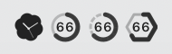
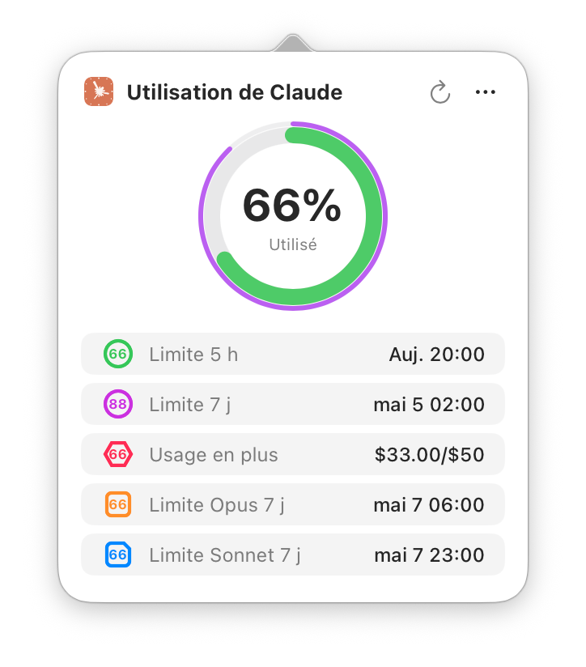
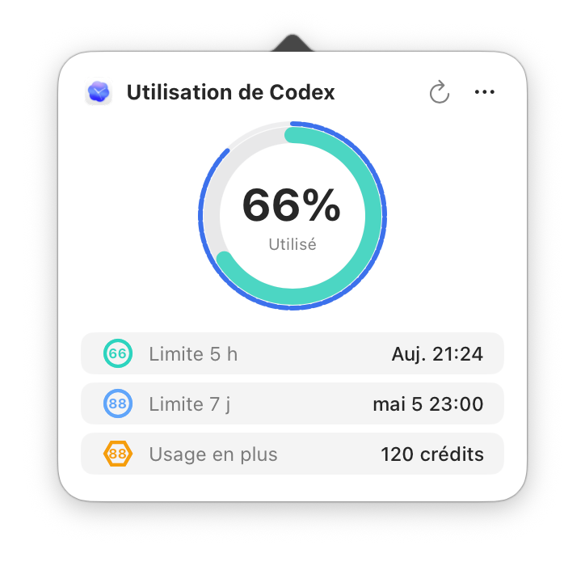
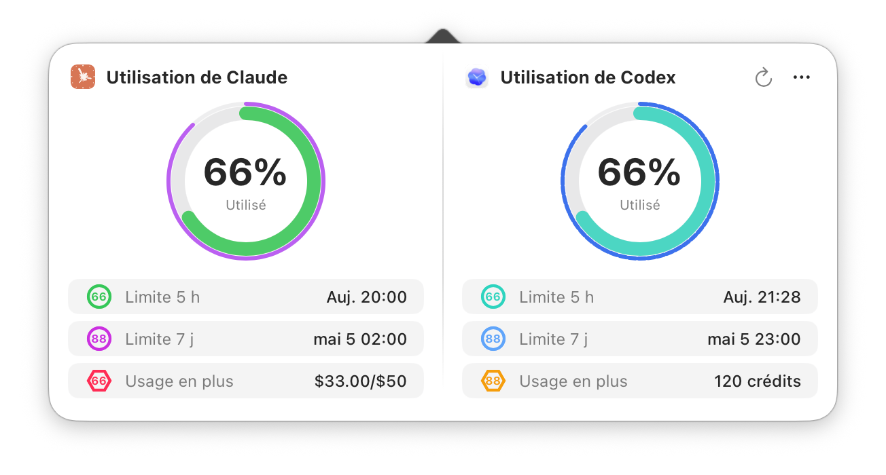
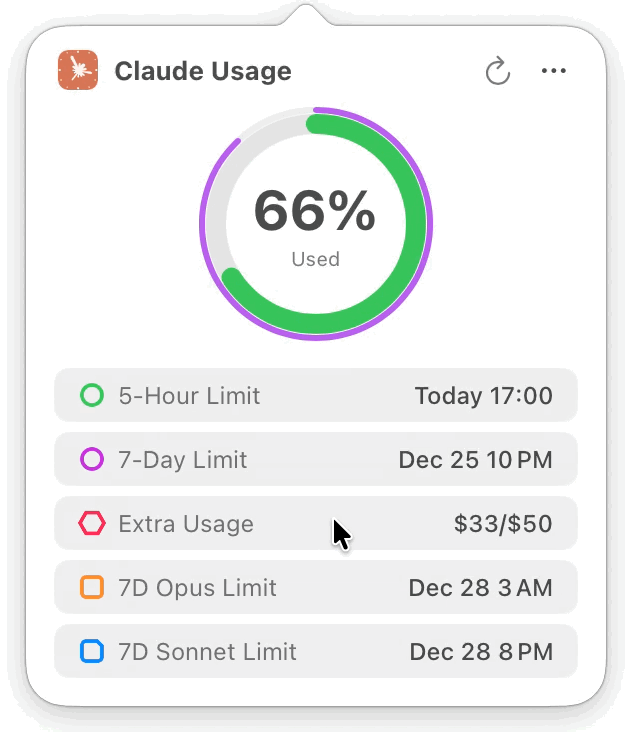

# Usage4Claude

[English](../README.md) | [日本語](README.ja.md) | [简体中文](README.zh-CN.md) | [繁體中文](README.zh-TW.md) | [한국어](README.ko.md) | [Français](README.fr.md)

<div align="center">


[](https://www.apple.com/macos/)
[](https://swift.org)
[](https://developer.apple.com/xcode/swiftui/)
[](../LICENSE)
[](https://github.com/f-is-h/Usage4Claude/releases)
[](https://github.com/f-is-h/Usage4Claude/releases)

**Suivez vos quotas d'abonnement Claude (et Codex) avec elegance, directement dans la barre des menus.**

✨ **Surveille toutes les plateformes Claude : Web • Claude Code • Desktop • App Mobile • Cowork** ✨

[Fonctionnalites](#-fonctionnalites) • [Installation](#-installation) • [Guide d'utilisation](#-guide-dutilisation) • [FAQ](#-faq) • [Support](#-support)

</div>

---

## ✨ Fonctionnalites

### 🎯 Fonctionnalites principales

- **📊 Surveillance en temps reel** - Affiche le quota d'utilisation de l'abonnement Claude (Free/Pro/Team/Max) dans la barre des menus, avec surveillance Codex optionnelle
- **🎯 Support multi-limites** - Claude prend en charge jusqu'a 5 limites (5h/7j/Extra/7j Opus/7j Sonnet), Codex prend en charge 5h, 7j et Extra Usage/credits
- **🎨 Mode d'affichage intelligent** - Detection et affichage automatiques de tous les types de limites avec donnees disponibles
- **⚙️ Affichage personnalise** - Selection manuelle des types de limites a afficher, toute combinaison possible
- **🎨 Couleurs intelligentes** - Changement automatique des couleurs selon l'utilisation, chaque type de limite a son propre schema
- **🔔 Notifications d'utilisation** - Avertissement a 90 % d'utilisation, notification lors de la reinitialisation du quota
- **👥 Gestion multi-comptes** - Support de plusieurs comptes Claude / plusieurs organisations par compte, avec gestion de comptes Codex independante et changement rapide
- **🧩 Support Codex** - Surveillance optionnelle des quotas Codex ; utilisez Codex seul ou aux cotes de Claude en vue a deux colonnes
- **🌐 Connexion via navigateur integre** - Claude extrait automatiquement la Session Key ; Codex utilise le navigateur integre pour se connecter a ChatGPT
- **🎨 Reglages d'apparence** - Support du mode systeme / clair / sombre
- **🕐 Format horaire** - Support du format systeme / 12h / 24h
- **⏰ Minuterie precise** - Heure de reinitialisation du quota affichee a la minute pres
- **🔄 Actualisation intelligente** - Rafraichissement adaptatif intelligent a 4 niveaux ou intervalles fixes (1/3/5/10 min)
- **⚡ Actualisation manuelle** - Cliquez sur le bouton d'actualisation pour mettre a jour instantanement (protection anti-rebond de 10 s)
- **💻 Experience native** - Application macOS 100 % native, legere et elegante

### 🌐 Support multiplateforme

Fonctionne avec tous les produits Claude :
- 🌐 **Claude.ai** (Interface web)
- 💻 **Claude Code** (Outil CLI pour developpeurs)
- 🖥️ **Application de bureau** (macOS/Windows)
- 📱 **Application mobile** (iOS/Android)
- 🤝 **Cowork** (Agent IA)

Toutes les plateformes partagent le meme quota d'utilisation, surveille en un seul endroit !

### 🧩 Support Codex

- Surveillez Codex seul ou avec Claude
- Prend en charge les informations Codex 5h, 7j et Extra Usage/credits
- Ajoutez un compte Codex en vous connectant a ChatGPT dans le navigateur integre
- Les utilisateurs Claude-only n'ont rien a configurer ; l'experience reste inchangee tant qu'aucun compte Codex n'est ajoute

### 🎨 Personnalisation

- **🕓 Modes d'affichage multiples**
  - Pourcentage uniquement - Epure et intuitif, visible en un coup d'oeil
  - Icone uniquement - Discret et elegant, details au clic
  - Icone + Pourcentage - Information complete, identification visuelle rapide

- **🌍 Support multilingue**
  - English
  - 日本語
  - 简体中文
  - 繁体中文
  - 한국어
  - Français
  - D'autres langues a venir...

### 🔒 Securite et confidentialite

- 🏠 **Stockage local uniquement** - Toutes les donnees sont stockees localement, aucune collecte ni envoi d'informations personnelles
- 🔐 **Protection Keychain** - Session Key Claude et jeton d'authentification Codex securises dans le trousseau, pas de cles en clair
- 📖 **Open source transparent** - Code entierement public, auditable par tous
- 🛡️ **Protection Sandbox** - App Sandbox activee pour une securite renforcee

---

## 📸 Captures d'ecran

### Affichage dans la barre des menus

- Les icones et indicateurs de limites Claude et Codex sont presentes ci-dessous
- La forme et la couleur servent de double indicateur, lisible meme avec le theme monochrome

| Icone | 5h | 7j | Extra | 7j Opus | 7j Sonnet | Monochrome (adaptatif) |
|:---:|:---:|:---:|:---:|:---:|:---:|-----|
|  |  |  |  |  |  | </br>  |
|  |  |  |  | — | — | </br>  |

**Indicateurs de couleur** :

Couleurs Claude actuelles :

- **Limite 5h** :  →  → 
- **Limite 7j** :  →  → 
- **Extra Usage** :  →  → 
- **Limite 7j Opus** :  →  → 
- **Limite 7j Sonnet** :  →  → 

Couleurs Codex actuelles :

- **Limite Codex 5h** :  →  → 
- **Limite Codex 7j** :  →  → 
- **Codex Extra Usage / credits** :  →  → 

### Fenetre de detail

<table border="0">
<tr>
<td align="top" valign="top">

<br/>
<sub><i>Mode Claude seul</i></sub>
</td>
<td align="center" valign="top">

<br/>
<sub><i>Mode Codex seul</i></sub>
</td>
</tr>
<tr>
<td align="center" valign="top" colspan="2">

<br/>
<sub><i>Mode Claude + Codex</i></sub>
</td>
</tr>
<tr>
<td align="center" valign="top" colspan="2">

<br/>
<sub><i>Animation de bascule du temps restant</i></sub>
</td>
</tr>
</table>

---

## 💾 Installation

### Option 1 : Telecharger le binaire (recommande)

1. Rendez-vous sur la [page des Releases](https://github.com/f-is-h/Usage4Claude/releases)
2. Telechargez le dernier fichier `.dmg`
3. Double-cliquez pour ouvrir, glissez l'application dans le dossier Applications
4. Faites un clic droit sur l'app et selectionnez « Ouvrir » au premier lancement (autoriser l'app non signee)
5. Autorisez l'acces au trousseau pour les informations d'authentification (une nouvelle autorisation peut etre demandee apres une mise a jour ; la fenetre indique le jeton concerne)

### Option 2 : Compiler depuis les sources

#### Prerequis
- macOS 13.0 ou ulterieur
- Xcode 15.0 ou ulterieur
- Git

#### Etapes de compilation

```bash
# Cloner le depot
git clone https://github.com/f-is-h/Usage4Claude.git
cd Usage4Claude

# Ouvrir dans Xcode
open Usage4Claude.xcodeproj

# Appuyez sur Cmd + R pour lancer dans Xcode
```

---

## 📖 Guide d'utilisation

### Configuration initiale

1. **Lancer l'application**
   L'ecran de bienvenue apparait au premier lancement

2. **Configurer l'authentification**
   - **Claude option 1 : Connexion via le navigateur (recommande)**
     - Cliquez sur le bouton « Connexion via le navigateur »
     - Connectez-vous a votre compte Claude dans le navigateur integre
     - La Session Key sera extraite automatiquement apres la connexion
   - **Claude option 2 : Saisie manuelle**
     - Ouvrez votre navigateur et visitez la page d'utilisation de Claude
     - Ouvrez les outils de developpement (F12 ou Cmd + Option + I)
     - Allez dans l'onglet « Reseau », rechargez la page
     - Trouvez la requete `usage`, extrayez `sessionKey=sk-ant-...` depuis le Cookie
     - Collez dans le champ de saisie
   - **Compte Codex (facultatif)**
     - Ouvrez Reglages → Authentification
     - Cliquez sur « Connexion via le navigateur » pour Codex
     - Connectez-vous a votre compte ChatGPT dans la fenetre integree
     - Les informations d'authentification sont enregistrees automatiquement
     - Codex ne prend actuellement pas en charge la saisie manuelle de Session Key

### Utilisation quotidienne

- **Affichage par defaut** - L'icone de la barre des menus affiche le pourcentage d'utilisation
- **Voir les details** - Cliquez sur l'icone de la barre des menus ; avec Claude/Codex seul, une colonne Claude/Codex est affichee, et avec les deux fournisseurs la vue passe en deux colonnes
- **Actualisation manuelle** - Cliquez sur le bouton d'actualisation ou utilisez le raccourci ⌘R ; en vue a deux colonnes, Claude et Codex peuvent aussi etre actualises separement
- **Changer de compte** - Menu « … » dans la fenetre de detail ou clic droit sur l'icone pour choisir un compte Claude / Codex
- **Raccourcis clavier**
  - ⌘R - Actualiser les donnees
  - ⌘, - Ouvrir les reglages generaux
  - ⌘⇧A - Ouvrir les reglages d'authentification
  - ⌘Q - Quitter l'application

### Mode d'actualisation

**Frequence intelligente (recommande)**
- Ajuste automatiquement l'intervalle selon l'activite
- Mode actif (1 min) - Actualisation rapide pendant l'utilisation de Claude ou Codex
- Modes inactifs (3/5/10 min) - Ralentissement progressif lorsque l'utilisation est stable
- Reduit fortement les appels API pendant les periodes inactives
- Retour automatique a 1 minute lorsqu'une activite est detectee
- Actualisation automatique apres la sortie de veille du systeme

---

## ❓ FAQ

<details>
<summary><b>Q : Que faire si l'application affiche « Session expiree » ?</b></summary>

R : La Session Key Claude ou le jeton d'authentification Codex expire periodiquement (generalement des semaines a des mois), il faut se reconnecter :
1. Ouvrez Reglages → Authentification
2. Pour Claude, cliquez sur « Connexion via le navigateur » (recommande), ou obtenez manuellement une nouvelle Session Key
3. Pour Codex, cliquez sur la connexion navigateur Codex et reconnectez-vous a ChatGPT dans la fenetre integree
4. C'est fait, la surveillance reprendra

</details>

<details>
<summary><b>Q : Comment activer le lancement automatique au demarrage ?</b></summary>

R : Deux methodes :

**Methode 1 : Option integree (recommande)**
1. Ouvrez Reglages → General
2. Cochez « Demarrer automatiquement a la connexion »

**Methode 2 : Via les Reglages Systeme**
1. Ouvrez Reglages Systeme → General → Ouverture
2. Cliquez sur « + » pour ajouter Usage4Claude

</details>

<details>
<summary><b>Q : Combien de ressources systeme sont utilisees ?</b></summary>

R : Tres leger :
- Utilisation CPU : < 0,1 % (au repos)
- Memoire : ~20 Mo
- Reseau : Actualisation selon la frequence configuree ; avec Claude et Codex, chaque service est appele separement

</details>

<details>
<summary><b>Q : Quelles versions de macOS sont supportees ?</b></summary>

R : Necessite macOS 13.0 (Ventura) ou ulterieur. Supporte les puces Intel et Apple Silicon (M1/M2/M3).

</details>

<details>
<summary><b>Q : Pourquoi l'application demande-t-elle l'acces au trousseau ?</b></summary>

R :
- Le trousseau est le gestionnaire de mots de passe au niveau systeme de macOS
- La Session Key Claude et le jeton d'authentification Codex sont chiffres dans le trousseau
- L'Organization ID Claude est stocke dans la configuration locale (identifiant non sensible)
- C'est la methode de stockage securise recommandee par Apple
- Seule cette application peut acceder aux informations, les autres applications ne peuvent pas les consulter

</details>

<details>
<summary><b>Q : Mes donnees sont-elles en securite ? Comment la confidentialite est-elle protegee ?</b></summary>

**Entierement securise !**

**Stockage des donnees :**
- Toutes les donnees sont stockees **uniquement** sur votre Mac local
- Aucune collecte, aucun suivi, aucune statistique
- Aucune requete reseau en dehors des appels aux API Claude et Codex
- Aucun service tiers utilise

**Securite de l'authentification :**
- Session Key Claude et jeton d'authentification Codex chiffres via le trousseau macOS (chiffrement au niveau systeme)
- Le trousseau utilise le chiffrement AES-256 + protection materielle (T2 / Secure Enclave)
- Seule cette application peut acceder a vos identifiants
- Vous pouvez revoquer l'acces a tout moment via l'application « Trousseaux d'acces »

**Transparence du code :**
- 100 % open source
- Pas d'obfuscation ni de fonctionnalites cachees
- La communaute peut auditer et verifier

</details>

<details>
<summary><b>Q : Comment activer Codex ? Peut-on utiliser Codex seul ?</b></summary>

R : Oui. Ouvrez Reglages → Authentification, cliquez sur la connexion navigateur Codex, puis connectez-vous a ChatGPT dans la fenetre integree.

- Codex seul : la barre des menus et la fenetre de detail affichent l'utilisation Codex
- Claude + Codex : la fenetre de detail affiche les deux fournisseurs cote a cote
- Codex prend actuellement en charge uniquement la connexion via navigateur, pas la saisie manuelle de Session Key

</details>

<details>
<summary><b>Q : L'application fonctionne-t-elle avec Claude Code / l'app de bureau / l'app mobile ?</b></summary>

R : **Oui, elle fonctionne avec toutes les plateformes Claude !**

Puisque tous les produits Claude (Web, Claude Code, Application de bureau, Application mobile, Cowork) partagent le meme quota d'utilisation, Usage4Claude surveille votre utilisation combinee sur toutes les plateformes.

</details>

<details>
<summary><b>Q : Comment gerer plusieurs comptes ?</b></summary>

R : Usage4Claude prend en charge plusieurs comptes Claude, plusieurs organisations sous un meme compte Claude, ainsi que des comptes Codex independants :
- **Ajouter un compte** - Connexion navigateur Claude, saisie manuelle Claude ou connexion navigateur Codex dans Reglages → Authentification
- **Changer de compte** - Menu « … » dans la fenetre de detail ou clic droit sur l'icone de la barre des menus
- **Modifier l'alias** - Donnez a chaque compte un nom facile a reconnaitre
- **Supprimer un compte** - Supprimez les comptes inutiles depuis la liste des comptes

</details>

<details>
<summary><b>Q : Comment activer les notifications d'utilisation ?</b></summary>

R : Les notifications d'utilisation Claude se reglent dans Reglages → General :
- **Avertissement d'utilisation** - Notification systeme lorsque l'utilisation Claude atteint 90 %
- **Notification de reinitialisation** - Notification lorsque le quota Claude est reinitialise
- Une autorisation macOS est requise au premier activation

</details>

---

## 🛠 Stack technique

Ce projet est construit avec des technologies macOS natives modernes :

- **Langage** : Swift 5.0+
- **Framework UI** : SwiftUI + AppKit hybride
- **Architecture** : MVVM
- **Reseau** : URLSession
- **Reactif** : Combine Framework
- **Localisation** : prise en charge i18n integree
- **Plateforme** : macOS 13.0+

---

## 🗺 Feuille de route

### ✅ Termine
- [x] Fonctions de surveillance de base
- [x] Affichage en temps reel dans la barre des menus
- [x] Indicateur de progression circulaire
- [x] Alertes de couleur intelligentes
- [x] Compte a rebours en temps reel
- [x] Plusieurs modes d'affichage de la barre des menus
- [x] Interface de reglages visuelle
- [x] Support multilingue
- [x] Assistant de premiere ouverture
- [x] Verification des mises a jour avec alertes visuelles
- [x] Stockage des informations d'authentification dans le trousseau
- [x] Packaging DMG automatique via shell
- [x] Publication automatique avec GitHub Actions
- [x] Optimisation de l'affichage des reglages
- [x] Option de lancement a l'ouverture de session
- [x] Prise en charge des raccourcis clavier
- [x] Actualisation manuelle
- [x] Adaptation du menu a trois points au mode sombre
- [x] Support du double mode de limite (5 heures + 7 jours)
- [x] Icone de barre des menus a double anneau
- [x] Gestion unifiee des schemas de couleur
- [x] Mode debug (fausses donnees, mises a jour simulees)
- [x] Suppression de l'etat Focus dans la fenetre de detail
- [x] Support de plusieurs types de limites (5 types)
- [x] Mode d'affichage intelligent/personnalise
- [x] Recuperation automatique de l'Organization ID
- [x] Parcours d'accueil optimise
- [x] Affichage des icones en theme monochrome
- [x] Support de la langue coreenne
- [x] Verification de la version en ligne avec GitHub Actions
- [x] Reglages d'apparence (systeme/clair/sombre)
- [x] Authentification automatique avec navigateur integre
- [x] Configuration automatique des identifiants
- [x] Notifications d'utilisation
- [x] Gestion multi-comptes
- [x] Reglages de format horaire unifies
- [x] Adaptation de l'interface des reglages au mode sombre
- [x] Support de la surveillance d'utilisation Codex
- [x] Mode Codex seul
- [x] Fenetre de detail Claude + Codex a deux colonnes
- [x] Gestion des comptes Codex et connexion navigateur
- [x] Localisation francaise
- [x] Actualisation automatique apres la sortie de veille du systeme

### Plans a moyen terme
1. **Ajout de fonctionnalites**
    - Plus de localisations linguistiques

### Vision a long terme
3. **Plus de modes d'affichage**
   - Widgets de bureau
   - Affichage de l'utilisation dans une icone d'extension de navigateur

4. **Analyse des donnees**
   - Historique d'utilisation
   - Graphiques de tendance

5. **Support multiplateforme**
   - Version iOS / iPadOS
   - Version Apple Watch
   - Version Windows

---

## 🤝 Contribution

Toutes les contributions sont les bienvenues, qu'il s'agisse de nouvelles fonctionnalites, de corrections de bugs ou d'ameliorations de la documentation.

Pour les consignes detaillees de contribution, consultez [CONTRIBUTING.md](../CONTRIBUTING.md).

### Comment contribuer

1. Forkez ce depot
2. Creez votre branche de fonctionnalite (`git checkout -b feature/AmazingFeature`)
3. Commitez vos changements (`git commit -m 'Add some AmazingFeature'`)
4. Poussez la branche (`git push origin feature/AmazingFeature`)
5. Ouvrez une Pull Request

### Contributeurs

Merci a toutes les personnes qui ont contribue a ce projet !

<!-- ALL-CONTRIBUTORS-LIST:START -->
<!-- La liste des contributeurs sera generee automatiquement ici -->
<!-- ALL-CONTRIBUTORS-LIST:END -->

---

## 📝 Journal des modifications

Pour l'historique detaille des versions et des mises a jour, consultez [CHANGELOG.md](../CHANGELOG.md).

---

## 💖 Soutenir le projet

Si ce projet vous aide, vous pouvez le soutenir des facons suivantes :

### ⭐ Donner une Star au projet
Une Star est le meilleur encouragement !

### ☕ M'offrir un cafe

<!-- GitHub Sponsors -->
<a href="https://github.com/sponsors/f-is-h?frequency=one-time">
  
</a>

<!-- Ko-fi -->
<a href="https://ko-fi.com/1attle">
  
</a>

<!-- Buy Me A Coffee -->
<!-- <a href="https://buymeacoffee.com/fish_">
  
</a> -->

### 📢 Partager le projet
Si vous aimez ce projet, partagez-le avec davantage de personnes !

---

## 📄 Licence

Ce projet est sous licence MIT - voir le fichier [LICENSE](../LICENSE) pour plus de details

---

## 🙏 Remerciements

- Merci a Claude/Codex - La majeure partie du code a ete ecrite par l'IA
- Merci a tous les contributeurs et utilisateurs pour leur soutien
- Le design des icones s'inspire des marques officielles Claude/Codex

---

## 📞 Contact

- **Issues** : [Soumettre un probleme ou une suggestion](https://github.com/f-is-h/Usage4Claude/issues)
- **Discussions** : [Rejoindre les discussions](https://github.com/f-is-h/Usage4Claude/discussions)
- **GitHub** : [@f-is-h](https://github.com/f-is-h)

---

## ⚖️ Avertissement

Ce projet est un outil tiers independant sans affiliation officielle avec Anthropic, Claude AI, OpenAI ou Codex. Veuillez respecter les conditions d'utilisation des services concernes lors de l'utilisation de ce logiciel.

---

<div align="center">

**Si ce projet vous aide, n'hesitez pas a lui donner une ⭐ Star !**

Fait avec ❤️ par [f-is-h](https://github.com/f-is-h)

[⬆ Retour en haut](#usage4claude)

</div>
