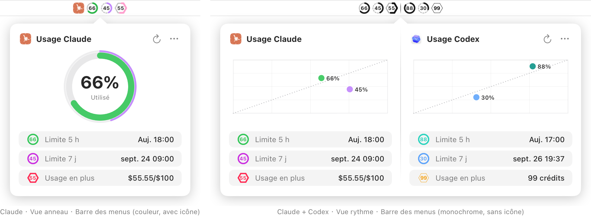
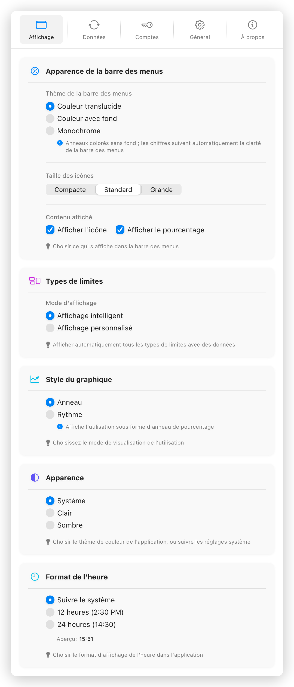

# Usage4Claude

[English](../README.md) | [日本語](README.ja.md) | [简体中文](README.zh-CN.md) | [繁體中文](README.zh-TW.md) | [한국어](README.ko.md) | [Français](README.fr.md) | [Deutsch](README.de.md)

<div align="center">

<picture>
  <source media="(prefers-color-scheme: dark)" srcset="images/hero.fr.dark@2x.png">
  
</picture>

[](https://www.apple.com/macos/)
[](https://swift.org)
[](https://developer.apple.com/xcode/swiftui/)
[](../LICENSE)
[](https://github.com/f-is-h/Usage4Claude/releases)
[](https://github.com/f-is-h/Usage4Claude/releases)
[](https://github.com/sponsors/f-is-h?frequency=one-time&metadata_project=usage4claude&metadata_source=readme&metadata_placement=header&metadata_lang=fr)

**Suivez l'utilisation de vos abonnements Claude et Codex depuis la barre des menus.**

[Fonctionnalités](#-fonctionnalités) · [Installation](#-installation) · [Utilisation](#-utilisation) · [Confidentialité et sécurité](#-confidentialité-et-sécurité) · [Questions fréquentes](#-questions-fréquentes) · [Contribuer](#-contribuer)

</div>

---

## ✨ Fonctionnalités

### Périmètre

Claude et Codex se configurent séparément ou ensemble. Toutes les applications d'un même service partagent un seul quota, et la barre des menus en affiche toujours l'utilisation totale.

| Service | Applications | Limites |
|---|---|---|
| **Claude** | claude.ai, Claude Code, application de bureau, application mobile, Cowork | 5 heures, 7 jours, utilisation supplémentaire, ainsi que l'utilisation hebdomadaire par modèle (Opus, Sonnet, Fable, etc., selon ce que renvoie le compte) |
| **Codex** | Codex CLI, extension IDE, Codex web | 5 heures, 7 jours, solde de credits |

Avec un seul service configuré, l'interface tient sur une colonne. Avec les deux, la fenêtre de détail se divise en deux colonnes et la barre des menus affiche les deux icônes côte à côte.

Les offres Claude Pro, Max, Team et Enterprise sont prises en charge. Les comptes gratuits n'ont pas de tableau de bord d'utilisation et ne peuvent pas être lus. Pour Team et Enterprise, un administrateur doit activer le tableau de bord des membres.

### Deux styles de graphique

**Anneau** affiche la part utilisée de chaque limite, avec les heures de réinitialisation en dessous.

**Rythme** trace chaque limite en fonction du temps écoulé, avec une diagonale qui représente une consommation régulière. Au-dessus de la diagonale, la consommation va plus vite que le temps ; en dessous, il reste de la marge. Les limites hebdomadaires peuvent ne compter que les jours ouvrés.

Le choix se fait dans Réglages → Affichage → Style du graphique. Un clic sur la liste des limites bascule entre « part utilisée et heure de réinitialisation » et « part disponible et temps restant ».

<div align="center">

</div>

### Icônes de la barre des menus

Chaque type de limite a sa propre forme et ses propres couleurs, et la couleur évolue à mesure que l'utilisation augmente.

| | Icône | 5 heures | 7 jours | Utilisation supplémentaire | Modèle 1 hebdo<br>(ex. Fable) | Modèle 2 hebdo<br>(ex. Opus, Sonnet) | Monochrome |
|---|:---:|:---:|:---:|:---:|:---:|:---:|:---:|
| **Claude** |  |  |  |  |  |  | <br> |
| **Codex** |  |  |  |  | | | <br> |

L'utilisation hebdomadaire par modèle prend les styles Modèle 1 et Modèle 2 dans l'ordre renvoyé par l'API, avec les noms de modèles tels que le compte les renvoie. La barre des menus affiche au plus les deux premiers modèles ; la fenêtre de détail les liste tous en alternant les deux styles.

Couleurs Claude :

- **5 heures** :  →  → 
- **7 jours** :  →  → 
- **Utilisation supplémentaire** :  →  → 
- **Modèle 1 hebdo** (ex. Fable) :  →  → 
- **Modèle 2 hebdo** (ex. Opus, Sonnet) :  →  → 

Couleurs Codex :

- **5 heures** :  →  → 
- **7 jours** :  →  → 
- **credits** :  →  → 

En thème monochrome, les limites restent distinguables par leur forme, et les icônes s'inversent automatiquement selon la barre des menus. La luminosité de la barre des menus dépend du fond d'écran, pas de l'apparence claire ou sombre du système.

| Option | Valeurs |
|---|---|
| Contenu affiché | Pourcentage uniquement, Icône uniquement, Icône et pourcentage |
| Taille de l'icône | Compacte, Standard, Grande |
| Thème | Couleur translucide, Couleur avec fond, Monochrome |

Par défaut, la barre des menus affiche toutes les limites qui ont des données. Pour les choisir une à une, passez en Affichage personnalisé dans Réglages → Affichage → Types de limites.

### Notifications

Une notification système est envoyée quand l'utilisation atteint un seuil, puis à la réinitialisation du quota. Les seuils se règlent par catégorie, de 50 % à 100 % par pas de 5 %.

| Catégorie | Niveaux | Par défaut |
|---|---|---|
| 5 heures | 1 | 90 % |
| Hebdomadaire (y compris l'utilisation hebdomadaire par modèle) | 2 | 75 %, 90 % |
| Utilisation supplémentaire / credits | 2 | 75 %, 90 % |

### Actualisation

**Le mode intelligent** s'adapte à l'évolution de l'utilisation : une fois par minute tant qu'elle change, puis toutes les 3, 5 et 10 minutes quand rien ne bouge, et retour à une fois par minute dès qu'un changement est détecté. Au repos, il envoie environ dix fois moins de requêtes.

**Le mode fixe** actualise toutes les 1, 3, 5 ou 10 minutes.

En cas de limitation de débit, l'application espace automatiquement ses requêtes. Si une actualisation échoue, les données précédentes restent affichées avec un simple indicateur à côté du titre. L'actualisation est automatique à la sortie de veille et à l'ouverture de la fenêtre de détail ; un clic sur l'anneau ou le graphique actualise manuellement, avec un anti-rebond de 10 secondes.

### Comptes

Claude prend en charge plusieurs comptes et plusieurs organisations au sein d'un compte ; les comptes Codex sont gérés à part. Chaque compte peut recevoir un alias. Le changement de compte se fait depuis le menu « … » de la fenêtre de détail ou le menu contextuel de l'icône de la barre des menus.

La connexion passe par le navigateur du système, ce qui rend compatibles Google, Microsoft, le SSO d'entreprise et les clés d'identification. Claude accepte aussi une clé de session saisie manuellement.

### Annonce de réinitialisation Codex (Beta)

Quand OpenAI annonce une réinitialisation globale à venir, un badge apparaît à côté du titre de la colonne Codex ; le reste du temps, rien ne s'affiche. Les données proviennent du projet communautaire tiers [codex-reset.com](https://codex-reset.com), et non d'une API officielle. L'option peut être désactivée dans les réglages.

### Langues

English, 日本語, 简体中文, 繁體中文, 한국어, Français ([@mtreize](https://github.com/mtreize)), Deutsch ([@schaitl](https://github.com/schaitl)). La langue du système est utilisée par défaut. Les nouvelles traductions sont les bienvenues ; voir [Contribuer](#-contribuer).

---

## 💾 Installation

### Téléchargement

1. Téléchargez le dernier `.dmg` depuis [Releases](https://github.com/f-is-h/Usage4Claude/releases) et faites glisser l'application dans Applications
2. Gatekeeper bloque le premier lancement ; voir la première entrée des [questions fréquentes](#-questions-fréquentes) pour l'autoriser
3. Au premier accès aux identifiants, autorisez l'accès au trousseau en choisissant « Toujours autoriser »

Nécessite macOS 13 (Ventura) ou version ultérieure, sur Intel ou Apple silicon.

Les mises à jour s'installent depuis l'application grâce à [Sparkle](https://sparkle-project.org). Chaque mise à jour est vérifiée par une signature EdDSA avant installation. Aucune installation via Homebrew n'est proposée pour le moment.

### Compiler depuis les sources

Nécessite Xcode 26 ou version ultérieure.

```bash
git clone https://github.com/f-is-h/Usage4Claude.git
cd Usage4Claude
open Usage4Claude.xcodeproj
```

Appuyez sur ⌘R dans Xcode pour lancer l'application. Elle est écrite en Swift et SwiftUI, avec AppKit pour la barre des menus et la gestion des fenêtres.

---

## 📖 Utilisation

### Connexion

Au premier lancement, une fenêtre d'accueil s'ouvre ; Claude et Codex peuvent tous deux s'y connecter. Cette étape peut être passée, et les comptes ajoutés plus tard dans Réglages → Comptes.

**Connexion via le navigateur** : cliquez sur le bouton de connexion, autorisez l'accès dans le navigateur du système, et l'application récupère le résultat automatiquement. Le retour est reçu sur un port local temporaire. Si un pare-feu bloque les connexions locales, le navigateur reste sur une adresse `localhost` ; collez cette adresse dans la fenêtre de connexion pour terminer.

**Saisie manuelle de la clé de session** (Claude uniquement) :

1. Ouvrez la page d'utilisation de claude.ai dans un navigateur
2. Ouvrez les outils de développement (⌥⌘I), passez à l'onglet Réseau et rechargez la page
3. Repérez la requête `usage` et copiez la valeur complète `sessionKey=sk-ant-...` dans l'en-tête Cookie de la requête
4. Collez-la dans le champ de saisie. L'identifiant d'organisation est récupéré automatiquement, et toutes les organisations liées à la clé de session sont ajoutées

### Au quotidien

Un clic gauche sur l'icône de la barre des menus ouvre la fenêtre de détail ; un clic droit ouvre le menu. Celui-ci donne accès au changement de compte, aux réglages, à Vérifier les mises à jour et aux pages d'état de Claude et de Codex.

Quand une nouvelle version est disponible, l'icône de la barre des menus affiche un badge et l'entrée Vérifier les mises à jour est signalée dans le menu.

### Réglages

<div align="center">
<picture>
  <source media="(prefers-color-scheme: dark)" srcset="images/settings.display.fr.dark@2x.png">
  
</picture>
</div>

| Onglet | Contenu |
|---|---|
| **Affichage** | Apparence de la barre des menus, types de limites, style du graphique, apparence, format de l'heure |
| **Données** | Mode d'actualisation, seuils de notification, annonce de réinitialisation Codex |
| **Comptes** | Comptes Claude et Codex, connexion via le navigateur, saisie manuelle de la clé de session, diagnostic de connexion |
| **Général** | Langue de l'interface, lancement au démarrage, restauration des réglages par défaut |
| **À propos** | Informations de version et liens |

---

## 🔒 Confidentialité et sécurité

- Aucun serveur : les données restent sur le Mac, sans statistiques ni télémétrie
- Les requêtes réseau se limitent à trois catégories : les API de connexion et d'utilisation de Claude et Codex, la vérification des mises à jour sur GitHub par Sparkle, et codex-reset.com lorsque l'annonce de réinitialisation Codex est activée
- Les clés de session et les jetons sont stockés dans le trousseau, jamais en clair ; les réponses des API ne sont pas écrites dans le cache disque
- L'App Sandbox est activée. En plus de l'accès réseau, elle n'ouvre que le port local utilisé par le retour de connexion et les services système dont Sparkle a besoin pour installer les mises à jour
- Les rapports de diagnostic sont anonymisés avant export : les jetons et autres champs sensibles sont remplacés
- Le code source est entièrement public et peut être audité

---

## ❓ Questions fréquentes

<details>
<summary><b>L'application ne s'ouvre pas : « impossible de vérifier le développeur »</b></summary>

L'application n'est pas notariée par Apple ; le premier lancement doit donc être autorisé manuellement :

- **macOS 15 et versions ultérieures** : double-cliquez sur l'application et cliquez sur « Terminé » dans la boîte de dialogue. Ouvrez ensuite Réglages Système → Confidentialité et sécurité, puis cliquez sur « Ouvrir quand même » en bas de la page
- **macOS 14 et versions antérieures** : cliquez sur l'application en maintenant la touche Contrôle, choisissez « Ouvrir » et confirmez dans la boîte de dialogue

Cette opération n'est nécessaire qu'une fois. L'application s'ouvre ensuite normalement, et les mises à jour intégrées ne la redemandent pas.

</details>

<details>
<summary><b>L'accès au trousseau est redemandé après une mise à jour</b></summary>

Le trousseau identifie une application par sa signature. Celle-ci utilise un certificat auto-signé, si bien que certaines mises à jour amènent le système à redemander l'accès. Choisissez « Toujours autoriser ». Les identifiants du trousseau ne sont lisibles que par cette application.

</details>

<details>
<summary><b>« Requête bloquée par le système de sécurité »</b></summary>

La protection Cloudflare placée devant claude.ai bloque les requêtes qu'elle juge automatisées. Ouvrez claude.ai une fois dans un navigateur et effectuez la vérification humaine ; l'application se rétablit généralement ensuite. Le blocage survient plus souvent derrière un VPN ou un proxy. Il n'a aucun rapport avec l'état du compte, et il est inutile de se reconnecter.

</details>

<details>
<summary><b>« Session expirée »</b></summary>

Les clés de session et les jetons de connexion expirent régulièrement, au bout de quelques semaines à quelques mois. Reconnectez-vous dans Réglages → Comptes.

</details>

<details>
<summary><b>« Trop de requêtes »</b></summary>

L'API d'utilisation a atteint sa limite de débit. L'application espace automatiquement ses requêtes puis réessaie plus tard, en gardant les données précédentes à l'écran. Actualiser manuellement à répétition prolonge l'attente.

</details>

<details>
<summary><b>Codex redemande sans cesse de se connecter</b></summary>

Lorsque « Advanced Security » est activé sur un compte ChatGPT, les jetons de connexion expirent beaucoup plus vite et l'application doit se reconnecter souvent. Pour suivre Codex sur la durée, envisagez de désactiver cette option.

</details>

<details>
<summary><b>Aucune donnée d'utilisation pour un compte Claude</b></summary>

Le message « Votre offre ne fournit pas de données d'utilisation » signifie que le compte n'a pas de tableau de bord d'utilisation sur claude.ai. Les comptes gratuits n'en ont pas ; pour Team et Enterprise, demandez à un administrateur d'activer le tableau de bord des membres. Se reconnecter n'y change rien.

</details>

<details>
<summary><b>L'icône est absente de la barre des menus</b></summary>

macOS masque certaines icônes quand la barre des menus manque de place, et des outils comme Bartender ou Hidden Bar peuvent aussi la replier. Maintenez ⌘ et faites glisser les icônes de la barre des menus pour les réorganiser.

</details>

<details>
<summary><b>L'application se ferme de manière inattendue</b></summary>

Exportez un rapport depuis Réglages → Comptes → Diagnostic de connexion et joignez-le à une [issue](https://github.com/f-is-h/Usage4Claude/issues). Le rapport indique si la dernière fermeture était anormale et contient les journaux récents. Il est anonymisé avant export.

</details>

---

## 🗺 Feuille de route

Les changements de chaque version sont consignés dans [CHANGELOG.md](../CHANGELOG.md).

**En cours** : améliorations continues et résolution des issues

**À l'étude** : davantage de langues d'interface, widgets de bureau, graphiques d'historique d'utilisation

**Hors du périmètre**

- **Les services autres que Claude et Codex.** La place dans la barre des menus est limitée, et chaque fournisseur ajouté en prend à tous les utilisateurs. Le projet se concentre sur ces deux services plutôt que de devenir un tableau de bord générique.
- **L'envoi de données, sous quelque forme que ce soit.** Le projet n'a pas de serveur et n'a pas l'intention d'en ajouter.
- **La distribution sur l'App Store.** L'application lit l'utilisation via des API non documentées, ce qui n'est pas conforme aux règles de l'App Store.

---

## 🤝 Contribuer

Les issues et les pull requests sont les bienvenues ; la marche à suivre figure dans [CONTRIBUTING.md](../CONTRIBUTING.md).

**Ajouter une langue** : copiez `Usage4Claude/Resources/en.lproj/Localizable.strings` dans un nouveau dossier `<code-langue>.lproj` et traduisez les valeurs. La CI vérifie que toutes les langues ont les mêmes clés.

### Contributeurs

**Code**

<a href="https://github.com/f-is-h/Usage4Claude/graphs/contributors"></a>

**Traduction**


**Retours et propositions de fonctionnalités**


### Soutien

<a href="https://github.com/sponsors/f-is-h?frequency=one-time&amp;metadata_project=usage4claude&amp;metadata_source=readme&amp;metadata_placement=badge&amp;metadata_lang=fr"></a>
<a href="https://ko-fi.com/1atte"></a>

---

## 📄 Licence et mentions

Licence MIT ; voir [LICENSE](../LICENSE). Copyright © 2025-2026 f-is-h.

Ce projet est un outil tiers indépendant, sans lien officiel avec Anthropic ni OpenAI. Son utilisation doit respecter les conditions de chaque service.

La majeure partie du code a été écrite par Claude et Codex. Le design de l'icône s'inspire de l'identité visuelle officielle des deux entreprises.

Les problèmes se signalent dans les [Issues](https://github.com/f-is-h/Usage4Claude/issues) ; pour le reste, rendez-vous dans les [Discussions](https://github.com/f-is-h/Usage4Claude/discussions).

<div align="center">

[⬆ Retour en haut](#usage4claude)

</div>
