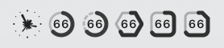
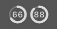
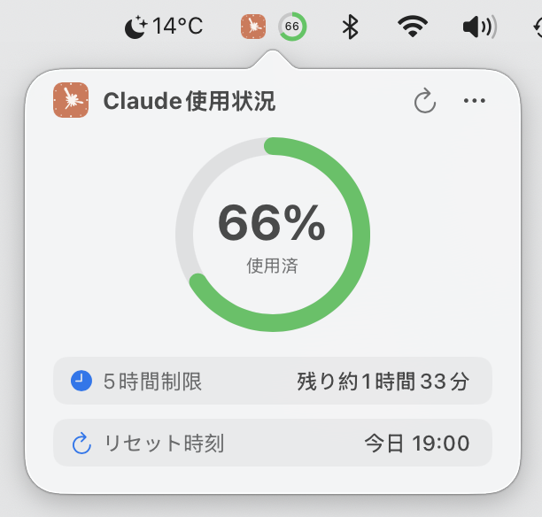
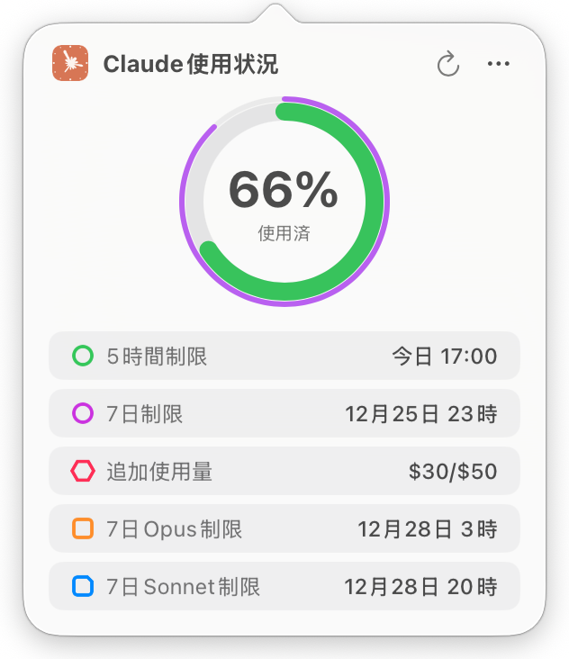

# Usage4Claude

[English](../README.md) | [日本語](README.ja.md) | [简体中文](README.zh-CN.md) | [繁體中文](README.zh-TW.md) | [한국어](README.kr.md)

<div align="center">


[](https://www.apple.com/macos/)
[](https://swift.org)
[](https://developer.apple.com/xcode/swiftui/)
[](LICENSE)
[](https://github.com/f-is-h/Usage4Claude/releases)
[](https://github.com/f-is-h/Usage4Claude/releases)

**Claude AI の使用状況をリアルタイムで監視するエレガントな macOS メニューバーアプリ。**

✨ **すべてのClaudeプラットフォームに対応: Web • Claude Code • Desktop • Mobile App** ✨

[機能](#-機能) • [インストール](#-インストール) • [使用ガイド](#-使用ガイド) • [よくある質問](#-よくある質問) • [サポート](#-サポート)

</div>

---

## ✨ 機能

### 🎯 コア機能

- **📊 リアルタイム監視** - Claude サブスクリプションの使用クォータをメニューバーに表示
- **🎯 マルチ制限サポート** - 最大5種類の制限を同時表示（5時間/7日間/追加使用量/7日間Opus/7日間Sonnet）
- **🎨 スマート表示モード** - データのある制限タイプを自動検出して表示
- **⚙️ カスタム表示** - 表示する制限タイプを手動で選択、任意の組み合わせをサポート
- **🎨 スマートカラー** - 使用率に応じた自動色変更（5時間：緑/オレンジ/赤；7日間：紫グラデーション）
- **⏰ 正確なタイミング** - 分単位でクォータリセット時間を表示
- **🔄 スマートリフレッシュシステム** - インテリジェント4レベル適応型更新または固定間隔（1/3/5/10分）
- **⚡ 手動リフレッシュ** - リフレッシュボタンをクリックしてデータを即座に更新（10秒デバウンス保護）
- **💻 ネイティブ体験** - 純粋な macOS ネイティブアプリ、軽量でエレガント

### 🌐 クロスプラットフォーム対応

すべてのClaude製品とシームレスに連携:
- 🌐 **Claude.ai** (Webインターフェース)
- 💻 **Claude Code** (開発者向けCLIツール)
- 🖥️ **Desktop App** (macOS/Windows)
- 📱 **Mobile App** (iOS/Android)

すべてのプラットフォームで同じ使用量クォータを共有し、一箇所で監視できます!

### 🎨 カスタマイズ

- **🕓 複数の表示モード**
  - パーセンテージのみ - シンプルで直感的、クリック不要で確認可能
  - アイコンのみ - 控えめでエレガント、クリックで詳細表示
  - アイコン + パーセンテージ - 完全な情報、素早く視覚的に識別

- **🌍 多言語サポート**
  - English
  - 日本語
  - 简体中文
  - 繁体中文
  - 한국어
  - さらに多くの言語に対応予定...

### 🔧 便利な機能

- **⚙️ ビジュアル設定** - コード変更不要、すべてのオプションをGUIで設定
- **🆕 スマート更新通知** - メニューバーバッジとレインボーアニメーションで新バージョンを通知
- **🚀 ログイン時に起動** - システム起動時に自動起動するオプション
- **⌨️ キーボードショートカット** - よく使う操作をショートカットでサポート（⌘R、⌘,、⌘Q）
- **👋 親切なガイド** - 初回起動時に詳細な設定ウィザード
- **… メニュー表示** - 複数のメニューアクセス方法、詳細ビューと右クリック
- **🛠️ デバッグモード** - 開発者オプション：偽データテスト、シミュレート更新、即時リフレッシュ

### 🔒 セキュリティとプライバシー

- 🏠 **ローカル保存のみ** - すべてのデータはローカルにのみ保存、個人情報の収集・アップロードは一切なし
- 🔐 **Keychain 保護** - 機密情報は Keychain で保護、平文キーなし
- 📖 **オープンソース** - コード完全公開、誰でも監査可能
- 🛡️ **Sandbox 保護** - App Sandbox 有効でセキュリティ強化

---

## 📸 スクリーンショット

### メニューバー表示

- アイコンと任意の使用量制限を自由に組み合わせて表示可能（最低1項目は表示が必要）
- 形状と色の二重指示により、モノクロテーマでも識別しやすい

| アイコン | 5時間 | 7日間 | 追加使用量 | 7日間 Opus | 7日間 Sonnet | モノクロ(自動調整) |
|:---:|:---:|:---:|:---:|:---:|:---:|-----|
|  |  |  |  |  |  | </br>  |

**カラーインジケーター**：

- **5時間制限（詳細ウィンドウ含む）**： →  → 
- **7日間制限（詳細ウィンドウ含む）**： →  → 
- **追加使用量**： →  → 
- **7日間 Opus 制限**： →  → 
- **7日間 Sonnet 制限**： →  → 

### 詳細ウィンドウ

<table border="0">
<tr>
<td align="top" valign="top">

<br/><br/><br/><br/>
<sub><i>5時間制限モード</i></sub>
</td>
<td align="center" valign="top">

<br/>
<sub><i>全制限モード（任意の組み合わせ可能）</i></sub>
</td>
<td align="center" valign="top">

<br/>
<sub><i>残り時間切り替えアニメーション</i></sub>
</td>
</tr>
</table>

### 設定画面

**一般** - ログイン時起動、表示、テーマ設定、更新、言語オプションをカスタマイズ
**認証情報** - Claude アカウント認証情報を設定、接続診断
**について** - バージョン情報と関連リンク

### ウェルカム画面

**認証情報の設定** - Session Key、Organization ID を自動取得
**表示オプションの設定** - 表示オプションとテーマ設定、ライブプレビュー対応
**後で設定** - ウェルカム画面を閉じて、後で設定画面で設定

---

## 💾 インストール

### 方法1：ビルド済みをダウンロード（推奨）

1. [Releases ページ](https://github.com/f-is-h/Usage4Claude/releases)へ移動
2. 最新バージョンの `.dmg` ファイルをダウンロード
3. ダブルクリックして開き、アプリを「アプリケーション」フォルダにドラッグ
4. 初回起動時は、アプリを右クリックして「開く」を選択（未署名アプリの許可）
5. Keychain での認証情報保存を許可（バージョン更新後は再度許可が必要。認証プロンプトは1回表示：Session Key）

### 方法2：ソースからビルド

#### 必要要件
- macOS 13.0 以降
- Xcode 15.0 以降
- Git

#### ビルド手順

```bash
# リポジトリをクローン
git clone https://github.com/f-is-h/Usage4Claude.git
cd Usage4Claude

# Xcode で開く
open Usage4Claude.xcodeproj

# Xcode で Cmd + R を押して実行
```

---

## 📖 使用ガイド

### 初期設定

1. **アプリを起動**  
   初回実行時にウェルカム画面が表示されます

2. **認証情報を設定**  
   「認証情報の設定へ」ボタンをクリック

3. **Session Key を取得**
   - 「ブラウザで Claude 使用量ページを開く」をクリック
   - ブラウザの開発者ツールを開く（F12 または Cmd + Option + I）
   - 「ネットワーク」タブに切り替え
   - ページを更新
   - `usage` という名前のリクエストを見つける
   - ヘッダーを表示し、`Cookie` 内の `sessionKey=sk-ant-...` 値を確認

4. **情報を入力**
   - Session Key を「Session Key」フィールドに貼り付け
   - 設定完了後、自動的に監視が開始されます

### 日常使用

- **デフォルト表示** - メニューバーアイコンに使用量パーセンテージを表示
- **詳細を表示** - メニューバーアイコンまたはパーセンテージをクリック
- **手動リフレッシュ** - 詳細ウィンドウのリフレッシュボタンをクリック、またはショートカット ⌘R を使用
- **メニューを表示** - 詳細ウィンドウの「…」アイコンをクリック、またはメニューバーアイコンを右クリック
- **キーボードショートカット**
  - ⌘R - データを手動でリフレッシュ
  - ⌘, - 一般設定を開く
  - ⌘⇧A - 認証設定を開く
  - ⌘Q - アプリを終了
- **更新通知** - 新バージョンがある場合、メニューバーアイコンにバッジが表示され、メニュー項目にレインボーテキストが表示されます
- **更新を確認** - メニュー → 更新を確認

### 更新モード

**スマート頻度（推奨）**
- 使用パターンに応じて自動的に更新間隔を調整
- アクティブモード（1分）- Claude をアクティブに使用しているときは高速更新
- アイドルモード（3/5/10分）- アイドル時は段階的に更新を遅く
- アイドル時のAPI呼び出しを大幅に削減（10倍まで）
- 使用が検出されると即座に1分更新に戻る

**固定頻度**
- **1分** - 一貫した監視に推奨
- **3分** - バランスの取れた監視
- **5分** - 低頻度監視
- **10分** - 最小限のAPI呼び出し

---

## ❓ よくある質問

<details>
<summary><b>Q: アプリが「セッションが期限切れ」と表示される場合は？</b></summary>

A: Session Key は定期的に期限切れになります（通常数週間から数ヶ月）。再取得が必要です：
1. 設定 → 認証情報を開く
2. 設定ガイドに従って新しい Session Key を取得
3. 新しい Session Key を貼り付け

</details>

<details>
<summary><b>Q: 起動時に自動起動するには？</b></summary>

A: 2つの方法があります：

**方法1：アプリ内蔵オプションを使用（推奨）**
1. 設定 → 一般を開く
2. 「ログイン時に起動」オプションをチェック

**方法2：システム設定経由**
1. システム設定 → 一般 → ログイン項目を開く
2. 「+」をクリックして Usage4Claude を追加

</details>

<details>
<summary><b>Q: システムリソースの使用量は？</b></summary>

A: 非常に軽量です：
- CPU 使用率：< 0.1%（アイドル時）
- メモリ使用量：約 20MB
- ネットワーク：1分あたり1リクエストのみ

</details>

<details>
<summary><b>Q: サポートされている macOS バージョンは？</b></summary>

A: macOS 13.0 (Ventura) 以降が必要です。Intel と Apple Silicon（M1/M2/M3）チップの両方をサポートしています。

</details>

<details>
<summary><b>Q: なぜ Keychain の許可が必要ですか？</b></summary>

A:
- Keychain は macOS のシステムレベルパスワードマネージャー
- Session Key は Keychain で暗号化されて保存されます
- Organization ID はローカル設定に保存（非機密識別子）
- これは Apple が推奨する最も安全な機密情報保存方法
- このアプリのみがこの情報にアクセス可能、他のアプリは閲覧不可

</details>

<details>
<summary><b>Q: データは安全ですか？プライバシーはどう保護されていますか？</b></summary>

**完全に安全です！** 

**データ保存：**
- すべてのデータはローカル Mac に**のみ**保存
- 情報の収集、追跡、統計は一切なし
- Claude API 呼び出し以外のネットワークリクエストなし
- サードパーティサービス未使用

**認証情報のセキュリティ：**
- Session Key は macOS Keychain 経由で暗号化（システムレベル暗号化）
- Keychain は AES-256 暗号化 + ハードウェア保護（T2 / Secure Enclave）使用
- このアプリのみが認証情報にアクセス可能、他のアプリは読み取り不可
- 「キーチェーンアクセス」アプリからいつでも権限を取り消し可能

**コードの透明性：**
- 100% オープンソース
- 難読化や隠し機能なし
- コミュニティが監査・検証可能

**追加保護：**
- App Sandbox 有効（システムアクセス制限）
- ファイル、連絡先、他のアプリへのアクセス権限なし
- 最小限の権限（ネットワーク + Keychain のみ）

GitHub でソースコードを確認してこれらすべてを検証できます！

</details>

<details>
<summary><b>Q: Claude Code / Desktop App / Mobile App でも動作しますか?</b></summary>

A: **はい、すべてのClaudeプラットフォームで動作します!**

すべてのClaude製品 (Web, Claude Code, Desktop App, Mobile App) は同じ使用量クォータを共有しているため、Usage4Claudeはすべてのプラットフォームでの総使用量を監視します。

以下のような場合でも:
- ターミナルで `claude code` を使用してコーディング
- claude.ai でチャット
- デスクトップアプリを使用
- モバイルアプリを使用

メニューバーでリアルタイムの総使用量を確認できます。プラットフォーム固有の設定は不要です!

</details>

<details>
<summary><b>Q: メニューバーにアイコンが表示されない場合は？</b></summary>

A: macOS システムまたはサードパーティソフトウェア（Bartender、Hidden Bar など）がメニューバーアイコンを自動的に非表示にすることがあります。

**解決方法：**
1. **Command (⌘) キー**を押したまま
2. メニューバー内のアイコンをマウスでドラッグ
3. Usage4Claude アイコンをメニューバー右側の可視エリアにドラッグ
4. マウスを離す

**ヒント：**
- macOS Sonoma (14.0+) では、使用頻度の低いアイコンが自動的に「コントロールセンター」に非表示になります
- 「システム設定」→「コントロールセンター」でメニューバーアイコンの表示を調整できます

</details>

---

## 🛠 技術スタック

最新の macOS ネイティブ技術で構築：

- **言語**: Swift 5.0+
- **UI フレームワーク**: SwiftUI + AppKit ハイブリッド
- **アーキテクチャ**: MVVM
- **ネットワーク**: URLSession
- **リアクティブ**: Combine Framework
- **ローカライゼーション**: 組み込み i18n サポート
- **プラットフォーム**: macOS 13.0+

---

## 🗺 ロードマップ

### ✅ 完了
- [x] 基本監視機能
- [x] メニューバーリアルタイム表示
- [x] 円形プログレスインジケーター
- [x] スマートカラーアラート
- [x] リアルタイムカウントダウン
- [x] メニューバー複数表示モード
- [x] ビジュアル設定画面
- [x] 多言語サポート
- [x] 初回起動ガイド
- [x] 更新チェック
- [x] 認証情報 Keychain 保存
- [x] Shell 自動 DMG パッケージング
- [x] GitHub Actions 自動リリース
- [x] 設定画面表示の最適化
- [x] 起動時自動起動設定
- [x] キーボードショートカット
- [x] 手動リフレッシュ機能
- [x] 三点メニューのダークモード対応
- [x] デュアル制限モードサポート（5時間 + 7日間）
- [x] デュアルリングメニューバーアイコン
- [x] 統一カラースキーム管理
- [x] デバッグモード（偽データ、シミュレート更新）
- [x] 詳細ウィンドウ Focus 状態削除
- [x] マルチ制限タイプサポート（5種類）
- [x] スマート/カスタム表示モード
- [x] Organization ID 自動取得
- [x] ウェルカムフロー最適化
- [x] モノクロテーマアイコン表示
- [x] 韓国語サポート

### 短期計画
1. **開発者向け**
    - 🚧 GitHub Actions オンラインのバージョンチェック

### 中期計画
2. **表示の最適化**
    - 🚧 設定画面ダークモード対応

3. **機能追加**
    - 使用量通知
    - より多くの言語ローカライゼーション

### 長期ビジョン
4. **自動セットアップ**

- ブラウザ拡張機能による自動認証
- 認証情報の自動設定

5. **より多くの表示方法**

- デスクトップウィジェット
- ブラウザ拡張機能アイコン使用量表示

6. **データ分析**
   - 使用履歴記録
   - トレンドグラフ

7. **マルチプラットフォーム対応**
   - iOS / iPadOS バージョン
   - Apple Watch バージョン
   - Windows バージョン

---

## 🤝 コントリビュート

あらゆる形式のコントリビュートを歓迎します！新機能、バグ修正、ドキュメント改善など。

詳細なコントリビュートガイドラインについては、[CONTRIBUTING.md](../CONTRIBUTING.md) をご覧ください。

### コントリビュート方法

1. このリポジトリをフォーク
2. 機能ブランチを作成 (`git checkout -b feature/AmazingFeature`)
3. 変更をコミット (`git commit -m 'Add some AmazingFeature'`)
4. ブランチにプッシュ (`git push origin feature/AmazingFeature`)
5. プルリクエストを開く

### コントリビューター

このプロジェクトにコントリビュートしてくださったすべての方に感謝します！

<!-- ALL-CONTRIBUTORS-LIST:START -->
<!-- コントリビューターリストは自動生成されます -->
<!-- ALL-CONTRIBUTORS-LIST:END -->

---

## 📝 変更履歴

詳細なバージョン履歴と更新内容については、[CHANGELOG.md](../CHANGELOG.md) をご覧ください。

---

## 💖 サポート

このプロジェクトが役立つ場合は、以下の方法でサポートしてください：

### ⭐ プロジェクトにスター
スターを付けることが最大の励みになります！

### ☕ コーヒーをおごる

<!-- GitHub Sponsors -->
<a href="https://github.com/sponsors/f-is-h?frequency=one-time">
  
</a>

<!-- Ko-fi -->
<a href="https://ko-fi.com/1attle">
  
</a>

<!-- Buy Me A Coffee -->
<!-- <a href="https://buymeacoffee.com/fish_">
  
</a> -->

### 📢 プロジェクトを共有
このプロジェクトが気に入ったら、より多くの人に共有してください！

---

## 📄 ライセンス

このプロジェクトは MIT ライセンスの下でライセンスされています - 詳細は [LICENSE](LICENSE) ファイルを参照

```
MIT License

Copyright (c) 2025 f-is-h

ソフトウェアのコピーを自由に使用、コピー、変更、マージ、公開、配布、
サブライセンス、および/または販売できます。
```

---

## 🙏 謝辞

- [Claude AI](https://claude.ai) に感謝 - ほとんどのコードは AI によって書かれました
- すべてのコントリビューターとユーザーのサポートに感謝
- アイコンデザインは Claude AI 公式ブランディングからインスピレーション

---

## 📞 連絡先

- **Issues**: [問題や提案を送信](https://github.com/f-is-h/Usage4Claude/issues)
- **Discussions**: [ディスカッションに参加](https://github.com/f-is-h/Usage4Claude/discussions)
- **GitHub**: [@f-is-h](https://github.com/f-is-h)

---

## ⚖️ 免責事項

このプロジェクトは独立したサードパーティツールであり、Anthropic または Claude AI との公式な関連はありません。このソフトウェアを使用する際は、Claude AI の利用規約を遵守してください。

---

<div align="center">

**このプロジェクトが役立つ場合は、⭐ スターをお願いします！**

Made with ❤️ by [f-is-h](https://github.com/f-is-h)

[⬆ トップに戻る](#usage4claude)

</div> 
