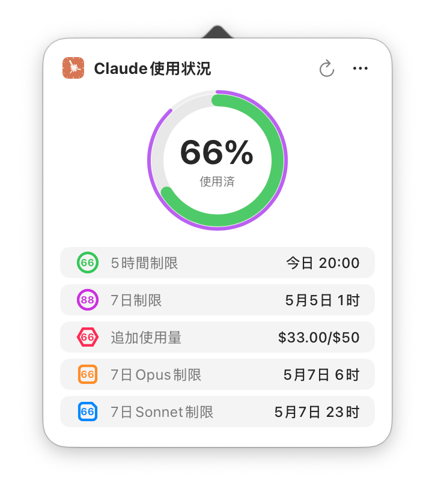
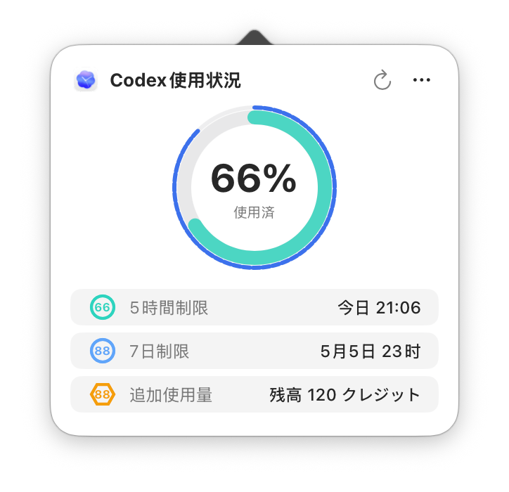
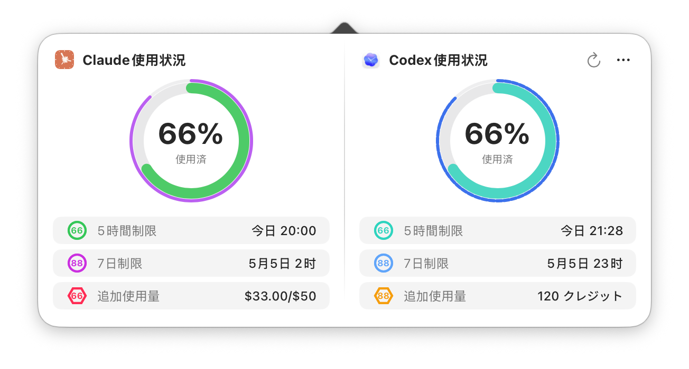

# Usage4Claude

[English](../README.md) | [日本語](README.ja.md) | [简体中文](README.zh-CN.md) | [繁體中文](README.zh-TW.md) | [한국어](README.ko.md) | [Français](README.fr.md) | [Deutsch](README.de.md)

<div align="center">


[](https://www.apple.com/macos/)
[](https://swift.org)
[](https://developer.apple.com/xcode/swiftui/)
[](../LICENSE)
[](https://github.com/f-is-h/Usage4Claude/releases)
[](https://github.com/f-is-h/Usage4Claude/releases)

**Claude（および Codex）のサブスクリプション使用量を、メニューバーで美しく追跡。**

✨ **すべてのClaudeプラットフォームに対応: Web • Claude Code • Desktop • Mobile App • Cowork** ✨

[機能](#-機能) • [インストール](#-インストール) • [使用ガイド](#-使用ガイド) • [よくある質問](#-よくある質問) • [サポート](#-サポート)

</div>

---

## ✨ 機能

### 🎯 コア機能

- **📊 リアルタイム監視** - Claude サブスクリプション（Free/Pro/Team/Max）の使用クォータをメニューバーに表示し、Codex 使用量も任意で監視
- **🎯 マルチ制限サポート** - Claude は最大5種類の制限（5時間/7日間/追加使用量/7日間Opus/7日間Sonnet）、Codex は5時間・7日間・追加使用量/creditsに対応
- **🎨 スマート表示モード** - データのある制限タイプを自動検出して表示
- **⚙️ カスタム表示** - 表示する制限タイプを手動で選択、任意の組み合わせをサポート
- **🎨 スマートカラー** - 使用率に応じた自動色変更、制限タイプごとに独自のカラースキーム
- **🔔 使用量通知** - 使用率90%で警告通知、クォータリセット時にリセット通知を送信
- **👥 マルチアカウント管理** - Claude の複数アカウント / 同一アカウント複数組織に加え、独立した Codex アカウント管理と素早い切り替えに対応
- **🧩 Codex サポート** - 任意の Codex 使用量監視。Codex 単独でも、Claude と並列のデュアルカラムビューでも使用可能（設定で Codex アカウントを追加すると有効化）
- **🌐 内蔵ブラウザログイン** - Claude ログインでは Session Key を自動抽出、Codex は内蔵ブラウザで ChatGPT にログインして認証情報を取得
- **🎨 外観設定** - システム設定に従う / ライト / ダークの3つの外観モードをサポート
- **🕐 時刻形式** - システムデフォルト / 12時間制 / 24時間制をサポート
- **⏰ 正確なタイミング** - 分単位でクォータリセット時間を表示
- **🔄 スマートリフレッシュシステム** - インテリジェント4レベル適応型更新または固定間隔（1/3/5/10分）
- **⚡ 手動リフレッシュ** - リフレッシュボタンをクリックしてデータを即座に更新（10秒デバウンス保護）
- **💻 ネイティブ体験** - 純粋な macOS ネイティブアプリ、軽量でエレガント

### 🌐 クロスプラットフォーム対応

すべてのClaude製品とシームレスに連携:
- 🌐 **Claude.ai** (Webインターフェース)
- 💻 **Claude Code** (開発者向けCLIツール)
- 🖥️ **Desktop App** (macOS/Windows)
- 📱 **Mobile App** (iOS/Android)
- 🤝 **Cowork** (AIエージェント)

すべてのプラットフォームで同じ使用量クォータを共有し、一箇所で監視できます!

### 🧩 Codex サポート

- Codex 単独でも、Claude と一緒でも監視可能
- Codex の5時間、7日間、追加使用量/credits 情報に対応
- 内蔵ブラウザで ChatGPT にログインして Codex アカウントを追加
- Claude-only ユーザーは追加設定不要。Codex アカウントを追加するまで既存体験のまま利用できます

### 🎨 カスタマイズ

- **🕓 複数の表示モード**
  - パーセンテージのみ - シンプルで直感的、クリック不要で確認可能
  - アイコンのみ - 控えめでエレガント、クリックで詳細表示
  - アイコン + パーセンテージ - 完全な情報、素早く視覚的に識別

- **🌍 多言語サポート**
  - English
  - 日本語
  - 简体中文
  - 繁体中文
  - 한국어
  - Français
  - さらに多くの言語に対応予定...

### 🔧 便利な機能

- **⚙️ ビジュアル設定** - コード変更不要、すべてのオプションをGUIで設定
- **🆕 スマート更新通知** - メニューバーバッジとレインボーアニメーションで新バージョンを通知
- **🚀 ログイン時に起動** - システム起動時に自動起動するオプション
- **⌨️ キーボードショートカット** - よく使う操作をショートカットでサポート（⌘R、⌘,、⌘Q）
- **👋 親切なガイド** - 初回起動時に詳細な設定ウィザード
- **… メニュー表示** - 複数のメニューアクセス方法、詳細ビューと右クリック
- **🔔 使用量通知** - Claude 使用量警告とリセット通知をサポート、設定でオン/オフ可能
- **🛠️ デバッグモード** - 開発者オプション：Claude/Codex 偽データテスト、シミュレート更新、即時リフレッシュ

### 🔒 セキュリティとプライバシー

- 🏠 **ローカル保存のみ** - すべてのデータはローカルにのみ保存、個人情報の収集・アップロードは一切なし
- 🔐 **Keychain 保護** - Claude Session Key と Codex 認証トークンは Keychain で保護、平文キーなし
- 📖 **オープンソース** - コード完全公開、誰でも監査可能
- 🛡️ **Sandbox 保護** - App Sandbox 有効でセキュリティ強化

---

## 📸 スクリーンショット

### メニューバー表示

- Claude と Codex のメニューバーアイコンと制限インジケーターを以下に示します
- 形状と色の二重指示により、モノクロテーマでも識別しやすい

| アイコン | 5時間 | 7日間 | 追加使用量 | 7日間 Opus | 7日間 Sonnet | モノクロ(自動調整) |
|:---:|:---:|:---:|:---:|:---:|:---:|-----|
|  |  |  |  |  |  | </br>  |
|  |  |  |  | — | — | </br>  |

**カラーインジケーター**：

Claude 現在の配色：

- **5時間制限（詳細ウィンドウ含む）**： →  → 
- **7日間制限（詳細ウィンドウ含む）**： →  → 
- **追加使用量**： →  → 
- **7日間 Opus 制限**： →  → 
- **7日間 Sonnet 制限**： →  → 

Codex 現在の配色：

- **Codex 5時間制限**： →  → 
- **Codex 7日間制限**： →  → 
- **Codex 追加使用量 / credits**： →  → 

### 詳細ウィンドウ

<table border="0">
<tr>
<td align="top" valign="top">

<br/>
<sub><i>Claude 単独使用モード</i></sub>
</td>
<td align="center" valign="top">

<br/>
<sub><i>Codex 単独使用モード</i></sub>
</td>
</tr>
<tr>
<td align="center" valign="top" colspan="2">

<br/>
<sub><i>Claude + Codex 共存モード</i></sub>
</td>
</tr>
<tr>
<td align="center" valign="top" colspan="2">

<br/>
<sub><i>残り時間切り替えアニメーション</i></sub>
</td>
</tr>
</table>

### 設定画面

**一般** - 表示オプション、メニューバーテーマ、通知設定、外観（システム設定に従う/ライト/ダーク）、リフレッシュモード、時刻形式、言語オプション、ログイン時起動
**認証情報** - Claude/Codex アカウント管理（追加/削除/切り替え/エイリアス編集）、内蔵ブラウザログイン、Claude 手動入力、接続診断
**について** - バージョン情報と関連リンク

### ウェルカム画面

**認証情報の設定** - Claude は内蔵ブラウザワンクリックログイン（推奨）または Session Key の手動入力に対応し、Organization ID を自動取得、同一 Session Key 下の複数組織を自動作成；Codex は設定画面から内蔵ブラウザで ChatGPT にログインして追加可能
**表示オプションの設定** - メニューバーテーマ、表示内容、表示モード（スマート/カスタム）選択、ライブプレビュー対応
**後で設定** - ウェルカム画面を閉じて、後で設定画面で設定

---

## 💾 インストール

### 方法1：ビルド済みをダウンロード（推奨）

1. [Releases ページ](https://github.com/f-is-h/Usage4Claude/releases)へ移動
2. 最新バージョンの `.dmg` ファイルをダウンロード
3. ダブルクリックして開き、アプリを「アプリケーション」フォルダにドラッグ
4. 初回起動時は、アプリを右クリックして「開く」を選択（未署名アプリの許可）
5. Keychain での認証情報保存を許可（バージョン更新後は再度許可が必要な場合があります。認証プロンプトには該当する認証トークン名が表示されます）

### 方法2：ソースからビルド

#### 必要要件
- macOS 13.0 以降
- Xcode 15.0 以降
- Git

#### ビルド手順

```bash
# リポジトリをクローン
git clone https://github.com/f-is-h/Usage4Claude.git
cd Usage4Claude

# Xcode で開く
open Usage4Claude.xcodeproj

# Xcode で Cmd + R を押して実行
```

---

## 📖 使用ガイド

### 初期設定

1. **アプリを起動**
   初回実行時にウェルカム画面が表示されます

2. **認証情報を設定**
   - **Claude 方法1：ブラウザログイン（推奨）**
     - 「ブラウザログイン」ボタンをクリック
     - 内蔵ブラウザで Claude アカウントにログイン
     - ログイン成功後、Session Key が自動的に抽出されます
   - **Claude 方法2：手動入力**
     - ブラウザで Claude 使用量ページにアクセス
     - 開発者ツールを開く（F12 または Cmd + Option + I）
     - 「ネットワーク」タブに切り替え、ページを更新
     - `usage` リクエストを見つけ、Cookie から `sessionKey=sk-ant-...` を抽出
     - 入力フィールドに貼り付け
   - **Codex アカウント（任意）**
     - 設定 → 認証情報を開く
     - Codex の「ブラウザログイン」をクリック
     - 内蔵ブラウザで ChatGPT アカウントにログイン
     - ログイン成功後、認証情報が自動保存されます
     - Codex は現在、Session Key の手動入力に対応していません

### 日常使用

- **デフォルト表示** - メニューバーアイコンに使用量パーセンテージを表示
- **詳細を表示** - メニューバーアイコンをクリックして詳細を表示。Claude/Codex のみ設定時は Claude/Codex 単列、両方設定時はデュアルカラムビューで表示
- **手動リフレッシュ** - 詳細ウィンドウのリフレッシュボタンをクリック、またはショートカット ⌘R を使用（メインウィンドウを開くとデータも自動更新）。デュアルカラムビューでは Claude / Codex を個別に更新可能
- **アカウント切り替え** - 詳細ウィンドウの「…」メニューまたはメニューバーアイコンを右クリックして、切り替える Claude / Codex アカウントを選択
- **キーボードショートカット**
  - ⌘R - データを手動でリフレッシュ
  - ⌘, - 一般設定を開く
  - ⌘⇧A - 認証設定を開く
  - ⌘Q - アプリを終了
- **更新通知** - 新バージョンがある場合、メニューバーアイコンにバッジが表示され、メニュー項目にレインボーテキストが表示されます
- **更新を確認** - メニュー → 更新を確認

### 更新モード

**スマート頻度（推奨）**
- 使用パターンに応じて自動的に更新間隔を調整
- アクティブモード（1分）- Claude または Codex をアクティブに使用しているときは高速更新
- アイドルモード（3/5/10分）- アイドル時は段階的に更新を遅く
- アイドル時のAPI呼び出しを大幅に削減（10倍まで）
- 使用が検出されると即座に1分更新に戻る
- システムのスリープ解除後に自動更新し、古いデータ表示を防止

**固定頻度**
- **1分** - 一貫した監視に推奨
- **3分** - バランスの取れた監視
- **5分** - 低頻度監視
- **10分** - 最小限のAPI呼び出し

---

## ❓ よくある質問

<details>
<summary><b>Q: アプリが「セッションが期限切れ」と表示される場合は？</b></summary>

A: Claude Session Key または Codex 認証トークンは定期的に期限切れになります（通常数週間から数ヶ月）。再ログインが必要です：
1. 設定 → 認証情報を開く
2. Claude アカウントは「ブラウザログイン」で再ログイン（推奨）、または手動で新しい Session Key を取得
3. Codex アカウントは Codex の「ブラウザログイン」をクリックし、内蔵ブラウザで ChatGPT に再ログイン
4. 完了後、監視が再開されます

</details>

<details>
<summary><b>Q: 起動時に自動起動するには？</b></summary>

A: 2つの方法があります：

**方法1：アプリ内蔵オプションを使用（推奨）**
1. 設定 → 一般を開く
2. 「ログイン時に起動」オプションをチェック

**方法2：システム設定経由**
1. システム設定 → 一般 → ログイン項目を開く
2. 「+」をクリックして Usage4Claude を追加

</details>

<details>
<summary><b>Q: システムリソースの使用量は？</b></summary>

A: 非常に軽量です：
- CPU 使用率：< 0.1%（アイドル時）
- メモリ使用量：約 20MB
- ネットワーク：設定されたスマート頻度で更新。Claude と Codex を両方設定している場合は、それぞれのサービスへ個別にリクエストします

</details>

<details>
<summary><b>Q: サポートされている macOS バージョンは？</b></summary>

A: macOS 13.0 (Ventura) 以降が必要です。Intel と Apple Silicon（M1/M2/M3）チップの両方をサポートしています。

</details>

<details>
<summary><b>Q: なぜ Keychain の許可が必要ですか？</b></summary>

A:
- Keychain は macOS のシステムレベルパスワードマネージャー
- Claude Session Key と Codex 認証トークンは Keychain で暗号化されて保存されます
- Claude Organization ID はローカル設定に保存（非機密識別子）
- これは Apple が推奨する最も安全な機密情報保存方法
- このアプリのみがこの情報にアクセス可能、他のアプリは閲覧不可

</details>

<details>
<summary><b>Q: データは安全ですか？プライバシーはどう保護されていますか？</b></summary>

**完全に安全です！** 

**データ保存：**
- すべてのデータはローカル Mac に**のみ**保存
- 情報の収集、追跡、統計は一切なし
- Claude と Codex の使用量関連 API 呼び出し以外のネットワークリクエストなし
- サードパーティサービス未使用

**認証情報のセキュリティ：**
- Claude Session Key と Codex 認証トークンは macOS Keychain 経由で暗号化（システムレベル暗号化）
- Keychain は AES-256 暗号化 + ハードウェア保護（T2 / Secure Enclave）使用
- このアプリのみが認証情報にアクセス可能、他のアプリは読み取り不可
- 「キーチェーンアクセス」アプリからいつでも権限を取り消し可能

**コードの透明性：**
- 100% オープンソース
- 難読化や隠し機能なし
- コミュニティが監査・検証可能

**追加保護：**
- App Sandbox 有効（システムアクセス制限）
- ファイル、連絡先、他のアプリへのアクセス権限なし
- 最小限の権限（ネットワーク + Keychain のみ）

GitHub でソースコードを確認してこれらすべてを検証できます！

</details>

<details>
<summary><b>Q: Claude Code / Desktop App / Mobile App でも動作しますか?</b></summary>

A: **はい、すべてのClaudeプラットフォームで動作します!**

すべてのClaude製品 (Web, Claude Code, Desktop App, Mobile App, Cowork) は同じ使用量クォータを共有しているため、Usage4Claudeはすべてのプラットフォームでの総使用量を監視します。

以下のような場合でも:
- ターミナルで `claude code` を使用してコーディング
- claude.ai でチャット
- デスクトップアプリを使用
- モバイルアプリを使用
- Cowork エージェントを使用

メニューバーでリアルタイムの総使用量を確認できます。プラットフォーム固有の設定は不要です!

</details>

<details>
<summary><b>Q: Codex サポートを有効にするには？Codex だけでも使えますか？</b></summary>

A: はい。設定 → 認証情報を開き、Codex の「ブラウザログイン」をクリックして、内蔵ブラウザで ChatGPT にログインしてください。

- Codex のみ設定：メニューバーと詳細ウィンドウに Codex 使用量が表示されます
- Claude + Codex：詳細ウィンドウに両方の Provider が横並びで表示されます
- Codex は現在ブラウザログインのみ対応しており、Session Key の手動入力には対応していません

</details>

<details>
<summary><b>Q: メニューバーにアイコンが表示されない場合は？</b></summary>

A: macOS システムまたはサードパーティソフトウェア（Bartender、Hidden Bar など）がメニューバーアイコンを自動的に非表示にすることがあります。

**解決方法：**
1. **Command (⌘) キー**を押したまま
2. メニューバー内のアイコンをマウスでドラッグ
3. Usage4Claude アイコンをメニューバー右側の可視エリアにドラッグ
4. マウスを離す

**ヒント：**
- macOS Sonoma (14.0+) では、使用頻度の低いアイコンが自動的に「コントロールセンター」に非表示になります
- 「システム設定」→「コントロールセンター」でメニューバーアイコンの表示を調整できます

</details>

<details>
<summary><b>Q: 複数のアカウントを管理するには？</b></summary>

A: Usage4Claude は Claude の複数アカウント、同一 Claude アカウント下の複数組織、独立した Codex アカウント管理をサポートしています：
- **アカウント追加** - 設定 → 認証情報で Claude ブラウザログイン、Claude 手動入力、または Codex ブラウザログインで追加
- **アカウント切り替え** - 詳細ウィンドウの「…」メニューまたはメニューバーアイコンを右クリックして、切り替える Claude / Codex アカウントを選択
- **エイリアス編集** - 各アカウントに識別しやすいエイリアスを設定
- **アカウント削除** - 左スワイプまたは編集モードで不要なアカウントを削除

</details>

<details>
<summary><b>Q: 使用量通知を有効にするには？</b></summary>

A: 設定 → 一般で Claude 使用量通知機能のオン/オフを切り替えられます：
- **使用量警告** - Claude 使用率が90%に達するとシステム通知を送信
- **リセット通知** - Claude クォータがリセットされると通知を送信
- 初回有効化時に macOS の通知権限の許可が必要です

</details>

---

## 🛠 技術スタック

最新の macOS ネイティブ技術で構築：

- **言語**: Swift 5.0+
- **UI フレームワーク**: SwiftUI + AppKit ハイブリッド
- **アーキテクチャ**: MVVM
- **ネットワーク**: URLSession
- **リアクティブ**: Combine Framework
- **ローカライゼーション**: 組み込み i18n サポート
- **プラットフォーム**: macOS 13.0+

---

## 🗺 ロードマップ

### ✅ 完了
- [x] 基本監視機能
- [x] メニューバーリアルタイム表示
- [x] 円形プログレスインジケーター
- [x] スマートカラーアラート
- [x] リアルタイムカウントダウン
- [x] メニューバー複数表示モード
- [x] ビジュアル設定画面
- [x] 多言語サポート
- [x] 初回起動ガイド
- [x] 更新チェック
- [x] 認証情報 Keychain 保存
- [x] Shell 自動 DMG パッケージング
- [x] GitHub Actions 自動リリース
- [x] 設定画面表示の最適化
- [x] 起動時自動起動設定
- [x] キーボードショートカット
- [x] 手動リフレッシュ機能
- [x] 三点メニューのダークモード対応
- [x] デュアル制限モードサポート（5時間 + 7日間）
- [x] デュアルリングメニューバーアイコン
- [x] 統一カラースキーム管理
- [x] デバッグモード（偽データ、シミュレート更新）
- [x] 詳細ウィンドウ Focus 状態削除
- [x] マルチ制限タイプサポート（5種類）
- [x] スマート/カスタム表示モード
- [x] Organization ID 自動取得
- [x] ウェルカムフロー最適化
- [x] モノクロテーマアイコン表示
- [x] 韓国語サポート
- [x] GitHub Actions オンラインバージョンチェック
- [x] 外観設定（システム設定に従う/ライト/ダーク）
- [x] 内蔵ブラウザ自動認証
- [x] 認証情報の自動設定
- [x] 使用量通知
- [x] マルチアカウント管理
- [x] 統一時刻形式設定
- [x] 設定画面ダークモード対応
- [x] Codex 使用量監視サポート
- [x] Codex 単独使用モード
- [x] Claude + Codex デュアルカラム詳細ウィンドウ
- [x] Codex アカウント管理とブラウザログイン
- [x] フランス語ローカライゼーション
- [x] システムスリープ解除後の自動更新

### 中期計画
1. **機能追加**
    - より多くの言語ローカライゼーション

### 長期ビジョン
2. **より多くの表示方法**
   - デスクトップウィジェット
   - ブラウザ拡張機能アイコン使用量表示

3. **データ分析**
   - 使用履歴記録
   - トレンドグラフ

4. **マルチプラットフォーム対応**
   - iOS / iPadOS バージョン
   - Apple Watch バージョン
   - Windows バージョン

---

## 🤝 コントリビュート

あらゆる形式のコントリビュートを歓迎します！新機能、バグ修正、ドキュメント改善など。

詳細なコントリビュートガイドラインについては、[CONTRIBUTING.md](../CONTRIBUTING.md) をご覧ください。

### コントリビュート方法

1. このリポジトリをフォーク
2. 機能ブランチを作成 (`git checkout -b feature/AmazingFeature`)
3. 変更をコミット (`git commit -m 'Add some AmazingFeature'`)
4. ブランチにプッシュ (`git push origin feature/AmazingFeature`)
5. プルリクエストを開く

### コントリビューター

このプロジェクトにコントリビュートしてくださったすべての方に感謝します！

<!-- ALL-CONTRIBUTORS-LIST:START -->
<!-- コントリビューターリストは自動生成されます -->
<!-- ALL-CONTRIBUTORS-LIST:END -->

---

## 📝 変更履歴

詳細なバージョン履歴と更新内容については、[CHANGELOG.md](../CHANGELOG.md) をご覧ください。

---

## 💖 サポート

このプロジェクトが役立つ場合は、以下の方法でサポートしてください：

### ⭐ プロジェクトにスター
スターを付けることが最大の励みになります！

### ☕ コーヒーをおごる

<!-- GitHub Sponsors -->
<a href="https://github.com/sponsors/f-is-h?frequency=one-time">
  
</a>

<!-- Ko-fi -->
<a href="https://ko-fi.com/1attle">
  
</a>

<!-- Buy Me A Coffee -->
<!-- <a href="https://buymeacoffee.com/fish_">
  
</a> -->

### 📢 プロジェクトを共有
このプロジェクトが気に入ったら、より多くの人に共有してください！

---

## 📄 ライセンス

このプロジェクトは MIT ライセンスの下でライセンスされています - 詳細は [LICENSE](../LICENSE) ファイルを参照

```
MIT License

Copyright (c) 2025 f-is-h

ソフトウェアのコピーを自由に使用、コピー、変更、マージ、公開、配布、
サブライセンス、および/または販売できます。
```

---

## 🙏 謝辞

- Claude/Codex に感謝 - ほとんどのコードは AI によって書かれました
- すべてのコントリビューターとユーザーのサポートに感謝
- アイコンデザインは Claude/Codex 公式ブランディングからインスピレーション

---

## 📞 連絡先

- **Issues**: [問題や提案を送信](https://github.com/f-is-h/Usage4Claude/issues)
- **Discussions**: [ディスカッションに参加](https://github.com/f-is-h/Usage4Claude/discussions)
- **GitHub**: [@f-is-h](https://github.com/f-is-h)

---

## ⚖️ 免責事項

このプロジェクトは独立したサードパーティツールであり、Anthropic、Claude AI、OpenAI、Codex との公式な関連はありません。このソフトウェアを使用する際は、関連サービスの利用規約を遵守してください。

---

<div align="center">

**このプロジェクトが役立つ場合は、⭐ スターをお願いします！**

Made with ❤️ by [f-is-h](https://github.com/f-is-h)

[⬆ トップに戻る](#usage4claude)

</div> 
