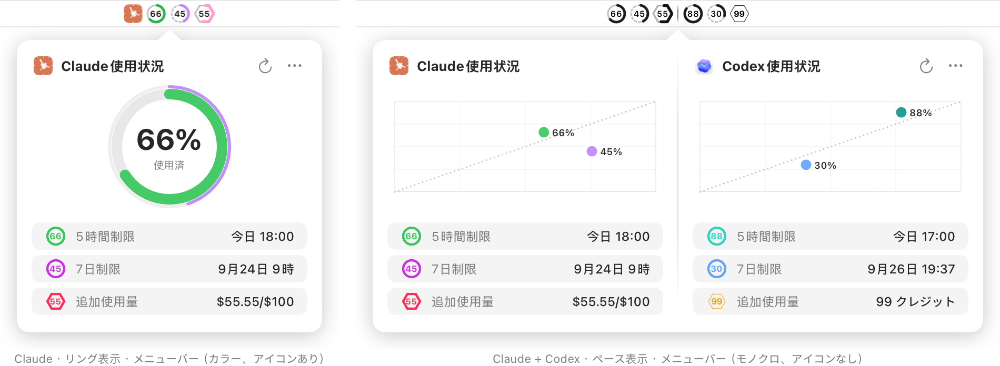
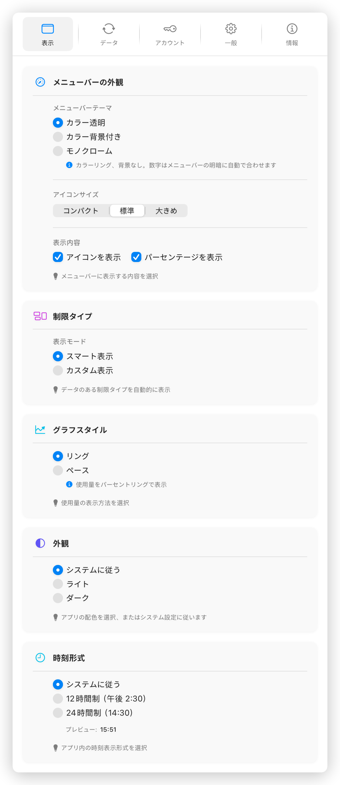

# Usage4Claude

[English](../README.md) | [日本語](README.ja.md) | [简体中文](README.zh-CN.md) | [繁體中文](README.zh-TW.md) | [한국어](README.ko.md) | [Français](README.fr.md) | [Deutsch](README.de.md)

<div align="center">

<picture>
  <source media="(prefers-color-scheme: dark)" srcset="images/hero.ja.dark@2x.png">
  
</picture>

[](https://www.apple.com/macos/)
[](https://swift.org)
[](https://developer.apple.com/xcode/swiftui/)
[](../LICENSE)
[](https://github.com/f-is-h/Usage4Claude/releases)
[](https://github.com/f-is-h/Usage4Claude/releases)
[](https://github.com/sponsors/f-is-h?frequency=one-time&metadata_project=usage4claude&metadata_source=readme&metadata_placement=header&metadata_lang=ja)

**Claude と Codex のサブスクリプション使用量をメニューバーで追跡する。**

[機能](#-機能) · [インストール](#-インストール) · [使い方](#-使い方) · [プライバシーとセキュリティ](#-プライバシーとセキュリティ) · [よくある質問](#-よくある質問) · [参加](#-参加)

</div>

---

## ✨ 機能

### 監視対象

Claude と Codex は個別にも同時にも設定できる。各サービスのすべての利用手段は同じ枠を共有し、メニューバーには常にその合計使用量が表示される。

| サービス | 利用手段 | 制限 |
|---|---|---|
| **Claude** | claude.ai、Claude Code、デスクトップ版、モバイル版、Cowork | 5時間、7日間、追加使用量、およびモデル別の週間使用量（Opus、Sonnet、Fable など。アカウントが実際に返すものに準ずる） |
| **Codex** | Codex CLI、IDE 拡張機能、Codex Web 版 | 5時間、7日間、credits 残高 |

1つのサービスのみ設定した場合は1列表示、両方を設定した場合は詳細ウィンドウが2列になり、メニューバーには両方のアイコンが並ぶ。

対応プランは Claude の Pro、Max、Team、Enterprise。無料プランには使用量ダッシュボードがなく、読み取れない。Team と Enterprise では管理者がメンバー使用量ダッシュボードを有効にする必要がある。

### 2種類のグラフ

**リング**は各制限の使用率をリングで表示し、その下にリセット時刻を並べる。

**ペース**は各制限を「使用率 / 経過時間」の座標上に描き、対角線で均等な消費を示す。対角線より上なら時間の経過より速く消費しており、下なら余裕がある。週間制限は平日のみで計算するよう設定できる。

「設定 → 表示 → グラフスタイル」で切り替える。制限リストをクリックすると「使用率とリセット時刻」と「残量と残り時間」が切り替わる。

<div align="center">

</div>

### メニューバーアイコン

制限タイプごとに固有の形と配色を持ち、使用量が増えるにつれて色が変わる。

| | アイコン | 5時間 | 7日間 | 追加使用量 | モデル1 週間<br>（例：Fable） | モデル2 週間<br>（例：Opus、Sonnet） | モノクローム |
|---|:---:|:---:|:---:|:---:|:---:|:---:|:---:|
| **Claude** |  |  |  |  |  |  | <br> |
| **Codex** |  |  |  |  | | | <br> |

モデル別の週間使用量は、API が返す順にモデル1、モデル2の2つのスタイルを使い、モデル名はアカウントが実際に返すものに準ずる。メニューバーに表示されるのは先頭の2モデルまでで、詳細ウィンドウではすべてのモデルを一覧し、2つのスタイルを交互に使う。

Claude の配色：

- **5時間**： →  → 
- **7日間**： →  → 
- **追加使用量**： →  → 
- **モデル1 週間**（例：Fable）： →  → 
- **モデル2 週間**（例：Opus、Sonnet）： →  → 

Codex の配色：

- **5時間**： →  → 
- **7日間**： →  → 
- **credits**： →  → 

モノクロームテーマでも各制限は形で区別でき、メニューバーの明暗に合わせて自動で反転する。メニューバーの明暗は壁紙によって決まり、システムのライト / ダーク外観とは関係しない。

| 項目 | 選択肢 |
|---|---|
| 表示内容 | パーセンテージのみ、アイコンのみ、アイコンとパーセンテージ |
| アイコンサイズ | コンパクト、標準、大きめ |
| テーマ | カラー透明、カラー背景付き、モノクローム |

メニューバーには既定でデータのあるすべての制限が表示される。「設定 → 表示 → 制限タイプ」でカスタム表示に切り替えると、個別に選択できる。

### 通知

使用量がしきい値に達するとシステム通知を送り、リセット時にも通知する。しきい値はカテゴリごとに設定し、範囲は 50% から 100%、5% 刻み。

| カテゴリ | 段階数 | 既定値 |
|---|---|---|
| 5時間 | 1 | 90% |
| 週間制限（モデル別の週間使用量を含む） | 2 | 75%、90% |
| 追加使用量 / credits | 2 | 75%、90% |

### 更新

**スマートモード**は使用量の変化に応じて頻度を調整する。変化があれば1分ごと、変化がなければ 3、5、10 分へと段階的に下げ、変化を検知するとすぐに1分ごとに戻る。アイドル時のリクエスト数はアクティブ時の約10分の1。

**固定モード**は 1、3、5、10 分から選ぶ。

API のレート制限に達すると自動でバックオフする。更新に失敗しても前回のデータを残し、タイトルの横に表示するだけにとどめる。スリープからの復帰時と詳細ウィンドウを開いたときに自動で更新し、リングまたはグラフをクリックすると手動で更新できる（10秒のデバウンスあり）。

### アカウント

Claude は複数アカウントと、1つのアカウント内の複数組織に対応する。Codex のアカウントは別に管理する。各アカウントにはエイリアスを設定でき、詳細ウィンドウの「…」メニューまたはメニューバーアイコンの右クリックメニューで切り替える。

ログインはシステムのブラウザで行うため、Google、Microsoft、企業 SSO、パスキーがいずれも使える。Claude は Session Key の手動入力にも対応する。

### Codex リセット予告（Beta）

OpenAI がまだ来ていない全体リセットを予告しているとき、Codex 列のタイトル横にバッジを表示する。それ以外のときは何も表示しない。データはサードパーティのコミュニティプロジェクト [codex-reset.com](https://codex-reset.com) から取得しており、公式 API ではない。設定でオフにできる。

### インターフェース言語

English、日本語、简体中文、繁體中文、한국어、Français（[@mtreize](https://github.com/mtreize)）、Deutsch（[@schaitl](https://github.com/schaitl)）。既定ではシステムの言語に従う。新しい言語への翻訳を歓迎する。方法は[参加](#-参加)を参照。

---

## 💾 インストール

### ダウンロード

1. [Releases](https://github.com/f-is-h/Usage4Claude/releases) から最新の `.dmg` をダウンロードし、アプリを「アプリケーション」フォルダへドラッグする
2. 初回起動は Gatekeeper にブロックされる。許可する方法は[よくある質問](#-よくある質問)の最初の項目を参照
3. 初めて認証情報を読み込むときにキーチェーンへのアクセスを求められるので、「常に許可」を選ぶ

macOS 13 (Ventura) 以降が必要。Intel と Apple シリコンの両方に対応する。

アップデートは [Sparkle](https://sparkle-project.org) によりアプリ内で行われ、EdDSA 署名の検証に通ったものだけがインストールされる。現時点で Homebrew でのインストールは提供していない。

### ソースからビルド

Xcode 26 以降が必要。

```bash
git clone https://github.com/f-is-h/Usage4Claude.git
cd Usage4Claude
open Usage4Claude.xcodeproj
```

Xcode で ⌘R を押して実行する。Swift と SwiftUI で書かれており、メニューバーとウィンドウ管理には AppKit を使っている。

---

## 📖 使い方

### ログイン

初回起動時にオンボーディングウィンドウが開き、Claude と Codex のどちらもここでログインできる。オンボーディングはスキップでき、後から「設定 → アカウント」で追加できる。

**ブラウザログイン**：ログインボタンを押すとシステムのブラウザで認可ページが開き、認可が終わると自動でアプリに戻る。認可結果はローカルの一時ポートで受け取る。ファイアウォールがローカル接続をブロックしている場合、ブラウザは `localhost` のアドレスで止まるので、アドレスバーのリンクをログインウィンドウに貼り付ければ完了する。

**Session Key の手動入力**（Claude のみ）：

1. ブラウザで claude.ai の使用量ページを開く
2. 開発者ツール（⌥⌘I）を開き、「ネットワーク」タブに切り替えてページを再読み込みする
3. `usage` リクエストを探し、リクエストヘッダーの Cookie から `sessionKey=sk-ant-...` の値をすべてコピーする
4. 入力欄に貼り付ける。Organization ID は自動で取得され、同じ Session Key 配下の複数の組織もまとめて追加される

### 日常の使い方

メニューバーアイコンを左クリックすると詳細ウィンドウが開き、右クリックでメニューが開く。メニューにはアカウントの切り替え、設定、アップデートを確認、Claude と Codex のステータスページへのリンクがある。

新しいバージョンがあると、メニューバーアイコンにバッジが付き、メニューの「アップデートを確認」にも表示が付く。

### 設定

<div align="center">
<picture>
  <source media="(prefers-color-scheme: dark)" srcset="images/settings.display.ja.dark@2x.png">
  
</picture>
</div>

| タブ | 内容 |
|---|---|
| **表示** | メニューバーの外観、制限タイプ、グラフスタイル、外観、時刻形式 |
| **データ** | 更新モード、通知のしきい値、Codex リセット予告 |
| **アカウント** | Claude と Codex のアカウント、ブラウザログイン、Session Key の手動入力、接続診断 |
| **一般** | インターフェース言語、ログイン時に起動、設定のリセット |
| **情報** | バージョン情報と関連リンク |

---

## 🔒 プライバシーとセキュリティ

- サーバーはなく、データはこの Mac にのみ保存される。解析やテレメトリもない
- ネットワークリクエストは3種類に限られる：Claude と Codex のログインおよび使用量 API、Sparkle による GitHub でのアップデート確認、Codex リセット予告が有効な場合の codex-reset.com へのアクセス
- Session Key と各種トークンはキーチェーンに保存され、平文では保存されない。API のレスポンスもディスクキャッシュに書き込まない
- App Sandbox を有効にしている。ネットワークアクセス以外に開放しているのは、ログインのコールバックに使うローカルポートと、Sparkle がアップデートのインストールに使うシステムサービスのみ
- 診断レポートはエクスポート前に自動でマスクされ、トークンなどの機密項目は置き換えられる
- ソースコードはすべて公開されており、誰でも監査できる

---

## ❓ よくある質問

<details>
<summary><b>開けない：「開発元を検証できません」と表示される</b></summary>

アプリは Apple の公証を受けていないため、初回起動時に手動で許可する必要がある。

- **macOS 15 以降**：アプリをダブルクリックし、ダイアログで「完了」をクリックする。続いて「システム設定 → プライバシーとセキュリティ」を開き、ページ下部の「このまま開く」をクリックする
- **macOS 14 以前**：Control キーを押しながらアプリをクリックして「開く」を選び、ダイアログで再度確認する

許可は一度だけでよく、以降は通常どおりダブルクリックで起動できる。アプリ内アップデートの後に同じ操作をする必要はない。

</details>

<details>
<summary><b>アップデート後にキーチェーンへのアクセスを再度求められる</b></summary>

キーチェーンはアプリの署名で同一性を判断する。本アプリは自己署名証明書を使っているため、一部のアップデート後にシステムが再度確認を求める。「常に許可」を選べばよい。キーチェーン内の認証情報は本アプリだけが読み取れる。

</details>

<details>
<summary><b>「リクエストがセキュリティシステムによってブロックされました」と表示される</b></summary>

claude.ai の手前にある Cloudflare の保護が、リクエストを自動化プログラムからのものと判断するとブロックする。ブラウザで一度 claude.ai にアクセスして人間であることの確認を済ませれば、通常はアプリも復旧する。VPN やプロキシを使っていると発生しやすい。このブロックはアカウントの状態とは関係なく、再ログインは不要。

</details>

<details>
<summary><b>「セッションが期限切れです」と表示される</b></summary>

Session Key とログイントークンは定期的に失効し、その周期は数週間から数か月。「設定 → アカウント」で再ログインすればよい。

</details>

<details>
<summary><b>「リクエストが多すぎます」と表示される</b></summary>

使用量 API のレート制限に達している。アプリは自動でバックオフしてしばらく後に再試行し、その間は前回のデータを表示し続ける。手動更新を繰り返すとバックオフが長くなる。

</details>

<details>
<summary><b>Codex にログインしてもすぐに再ログインを求められる</b></summary>

ChatGPT アカウントで「Advanced Security」を有効にすると、ログイントークンの有効期間が大幅に短くなり、頻繁な再ログインが必要になる。Codex の使用量を長期的に監視したい場合は、このオプションをオフにすることを検討してほしい。

</details>

<details>
<summary><b>Claude アカウントの使用量が読み取れない</b></summary>

「現在のプランでは使用量データを取得できません」と表示される場合、そのアカウントには claude.ai 上の使用量ダッシュボードがない。無料プランにはダッシュボードがなく、Team と Enterprise では管理者にメンバー使用量ダッシュボードの有効化を依頼する必要がある。再ログインしても解決しない。

</details>

<details>
<summary><b>メニューバーにアイコンが見当たらない</b></summary>

メニューバーの空きが足りないと macOS は一部のアイコンを隠す。Bartender や Hidden Bar などのツールが格納している場合もある。⌘ キーを押しながらメニューバーアイコンをドラッグすると位置を変えられる。

</details>

<details>
<summary><b>アプリが勝手に終了する</b></summary>

「設定 → アカウント → 接続診断」で診断レポートをエクスポートし、[issue](https://github.com/f-is-h/Usage4Claude/issues) に添付してほしい。レポートには前回の終了が異常だったかどうかの判定と最近のログが含まれ、エクスポート前にマスク済みである。

</details>

---

## 🗺 ロードマップ

各バージョンの変更点は [CHANGELOG.md](../CHANGELOG.md) に記録している。

**進行中**：継続的な改善と Issue の解決

**検討中**：インターフェース言語の追加、デスクトップウィジェット、使用量履歴のグラフ

**実装しないもの**

- **Claude と Codex 以外のサービス。** メニューバーの幅は限られており、サービスを1つ増やすごとにすべてのユーザーのメニューバーを占有する。本プロジェクトはこの2つを深く作り込むことに集中し、汎用の使用量ダッシュボードにはしない。
- **あらゆる形でのデータのアップロード。** 本プロジェクトにはサーバーがなく、導入する予定もない。
- **App Store での配布。** 本アプリは非公開の API で使用量を取得しており、App Store の掲載基準を満たさない。

---

## 🤝 参加

Issue と PR はいずれも歓迎する。手順は [CONTRIBUTING.md](../CONTRIBUTING.md) を参照。

**インターフェース言語の追加**：`Usage4Claude/Resources/en.lproj/Localizable.strings` を新しい `<言語コード>.lproj` フォルダにコピーし、値を翻訳する。各言語のキーが揃っているかは CI が検証する。

### コントリビューター

**コード**

<a href="https://github.com/f-is-h/Usage4Claude/graphs/contributors"></a>

**翻訳**


**不具合報告と機能提案**


### サポート

<a href="https://github.com/sponsors/f-is-h?frequency=one-time&amp;metadata_project=usage4claude&amp;metadata_source=readme&amp;metadata_placement=badge&amp;metadata_lang=ja"></a>
<a href="https://ko-fi.com/1atte"></a>

---

## 📄 ライセンスと免責事項

MIT ライセンス。詳細は [LICENSE](../LICENSE) を参照。Copyright © 2025-2026 f-is-h。

本プロジェクトは独立したサードパーティ製ツールであり、Anthropic および OpenAI とは公式な関係はない。利用にあたっては各サービスの規約に従うこと。

コードの大部分は Claude と Codex が書いた。アイコンのデザインは両社の公式ブランドを参考にしている。

不具合の報告は [Issues](https://github.com/f-is-h/Usage4Claude/issues) へ、その他の議論は [Discussions](https://github.com/f-is-h/Usage4Claude/discussions) へ。

<div align="center">

[⬆ トップに戻る](#usage4claude)

</div>
