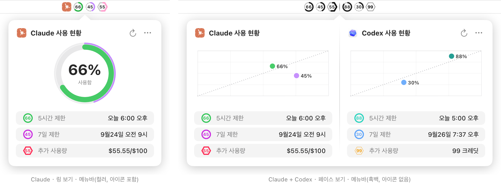
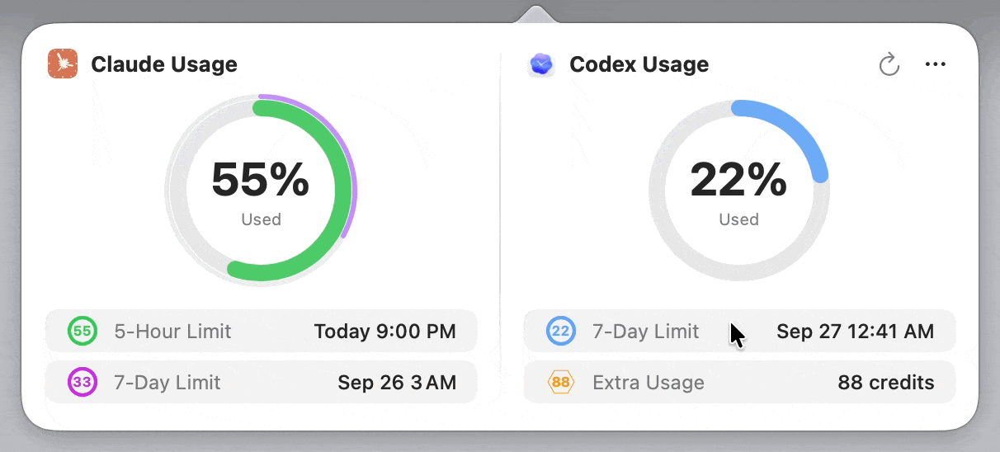
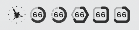
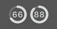
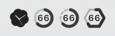
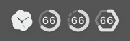
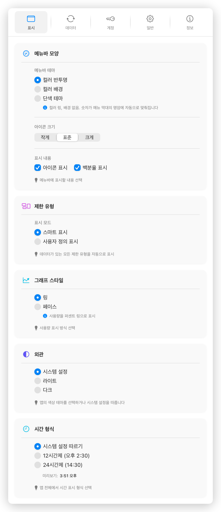

# Usage4Claude

[English](../README.md) | [日本語](README.ja.md) | [简体中文](README.zh-CN.md) | [繁體中文](README.zh-TW.md) | [한국어](README.ko.md) | [Français](README.fr.md) | [Deutsch](README.de.md)

<div align="center">

<picture>
  <source media="(prefers-color-scheme: dark)" srcset="images/hero.ko.dark@2x.png">
  
</picture>

[](https://www.apple.com/macos/)
[](https://swift.org)
[](https://developer.apple.com/xcode/swiftui/)
[](../LICENSE)
[](https://github.com/f-is-h/Usage4Claude/releases)
[](https://github.com/f-is-h/Usage4Claude/releases)
[](https://github.com/sponsors/f-is-h?frequency=one-time&metadata_project=usage4claude&metadata_source=readme&metadata_placement=header&metadata_lang=ko)

**메뉴 막대에서 Claude와 Codex의 구독 사용량을 추적한다.**

[기능](#-기능) · [설치](#-설치) · [사용법](#-사용법) · [개인정보와 보안](#-개인정보와-보안) · [자주 묻는 질문](#-자주-묻는-질문) · [참여](#-참여)

</div>

---

## ✨ 기능

### 모니터링 범위

Claude와 Codex는 각각 또는 함께 설정할 수 있다. 각 서비스의 모든 이용 경로는 같은 한도를 공유하며, 메뉴 막대에는 항상 그 총사용량이 표시된다.

| 서비스 | 이용 경로 | 제한 |
|---|---|---|
| **Claude** | claude.ai, Claude Code, 데스크톱 앱, 모바일 앱, Cowork | 5시간, 7일, 추가 사용량, 그리고 모델별 주간 사용량(Opus, Sonnet, Fable 등, 계정이 실제로 반환하는 값 기준) |
| **Codex** | Codex CLI, IDE 확장 프로그램, Codex 웹 | 5시간, 7일, credits 잔액 |

서비스를 하나만 설정하면 한 열로, 둘 다 설정하면 상세 창이 두 열로 나뉘고 메뉴 막대에 두 아이콘이 나란히 표시된다.

Claude의 Pro, Max, Team, Enterprise 요금제를 지원한다. 무료 플랜에는 사용량 대시보드가 없어 읽을 수 없으며, Team과 Enterprise는 관리자가 멤버 사용량 대시보드를 활성화해야 한다.

### 두 가지 그래프

**링**은 각 제한의 사용 비율을 링으로 표시하고, 아래에 재설정 시간을 나열한다.

**페이스**는 각 제한을 '사용 비율 / 경과 시간' 좌표에 그리고, 대각선으로 균등한 소비를 나타낸다. 대각선 위에 있으면 시간보다 빠르게 소비하고 있다는 뜻이고, 아래에 있으면 여유가 있다는 뜻이다. 주간 제한은 평일만 계산하도록 설정할 수 있다.

'설정 → 표시 → 그래프 스타일'에서 전환한다. 제한 목록을 클릭하면 '사용 비율과 재설정 시각'과 '사용 가능 비율과 남은 시간' 사이를 전환한다.

<div align="center">

</div>

### 메뉴 막대 아이콘

제한 유형마다 고유한 모양과 색상이 있으며, 사용량이 늘어남에 따라 색이 바뀐다.

| | 아이콘 | 5시간 | 7일 | 추가 사용량 | 모델 1 주간<br>(예: Fable) | 모델 2 주간<br>(예: Opus, Sonnet) | 단색 |
|---|:---:|:---:|:---:|:---:|:---:|:---:|:---:|
| **Claude** |  |  |  |  |  |  | <br> |
| **Codex** |  |  |  |  | | | <br> |

모델별 주간 사용량은 API가 반환하는 순서대로 모델 1, 모델 2 두 가지 스타일을 사용하며, 모델 이름은 계정이 실제로 반환하는 값을 따른다. 메뉴 막대에는 앞의 두 모델까지만 표시되고, 상세 창에는 모든 모델이 두 스타일을 번갈아 사용해 표시된다.

Claude 색상:

- **5시간**:  →  → 
- **7일**:  →  → 
- **추가 사용량**:  →  → 
- **모델 1 주간**(예: Fable):  →  → 
- **모델 2 주간**(예: Opus, Sonnet):  →  → 

Codex 색상:

- **5시간**:  →  → 
- **7일**:  →  → 
- **credits**:  →  → 

단색 테마에서도 각 제한은 모양으로 구분되며, 메뉴 막대의 밝기에 맞춰 자동으로 반전된다. 메뉴 막대의 밝기는 배경화면에 따라 정해지며, 시스템의 라이트 / 다크 모드와는 무관하다.

| 항목 | 선택지 |
|---|---|
| 표시 내용 | 백분율만 표시, 아이콘만 표시, 아이콘과 백분율 |
| 아이콘 크기 | 작게, 표준, 크게 |
| 테마 | 컬러 반투명, 컬러 배경, 단색 테마 |

메뉴 막대에는 기본적으로 데이터가 있는 모든 제한이 표시된다. '설정 → 표시 → 제한 유형'에서 사용자 정의 표시로 바꾸면 개별적으로 선택할 수 있다.

### 알림

사용량이 임계값에 도달하면 시스템 알림을 보내고, 한도가 재설정될 때도 알린다. 임계값은 범주별로 설정하며, 범위는 50%~100%, 5% 단위다.

| 범주 | 단계 수 | 기본값 |
|---|---|---|
| 5시간 | 1 | 90% |
| 주간 제한(모델별 주간 사용량 포함) | 2 | 75%, 90% |
| 추가 사용량 / credits | 2 | 75%, 90% |

### 새로고침

**스마트 모드**는 사용량 변화에 따라 빈도를 조절한다. 변화가 있으면 1분마다, 변화가 없으면 3분, 5분, 10분으로 차례로 늘리고, 변화가 감지되면 즉시 1분으로 돌아간다. 유휴 시 요청 수는 활동 시의 약 10분의 1이다.

**고정 모드**는 1, 3, 5, 10분 중에서 고른다.

API 요청 제한에 걸리면 자동으로 백오프한다. 새로고침에 실패하면 이전 데이터를 유지하고 제목 옆에만 표시한다. 잠자기에서 깨어날 때와 상세 창을 열 때 자동으로 새로고침하며, 링이나 그래프를 클릭하면 수동으로 새로고침할 수 있다(10초 디바운스 적용).

### 계정

Claude는 여러 계정과 한 계정 안의 여러 조직을 지원하고, Codex 계정은 따로 관리한다. 각 계정에 별명을 지정할 수 있으며, 상세 창의 '…' 메뉴나 메뉴 막대 아이콘의 오른쪽 클릭 메뉴에서 전환한다.

로그인은 시스템 브라우저에서 진행되므로 Google, Microsoft, 기업 SSO, 패스키를 모두 사용할 수 있다. Claude는 Session Key 수동 입력도 지원한다.

### Codex 리셋 예고 (Beta)

OpenAI가 아직 오지 않은 전체 한도 리셋을 예고하면 Codex 열 제목 옆에 배지가 표시되고, 그 밖에는 아무것도 표시되지 않는다. 데이터는 서드파티 커뮤니티 프로젝트 [codex-reset.com](https://codex-reset.com)에서 가져오며 공식 API가 아니다. 설정에서 끌 수 있다.

### 인터페이스 언어

English, 日本語, 简体中文, 繁體中文, 한국어, Français([@mtreize](https://github.com/mtreize)), Deutsch([@schaitl](https://github.com/schaitl)). 기본적으로 시스템 언어를 따른다. 새로운 언어 번역을 환영하며, 방법은 [참여](#-참여)를 참고한다.

---

## 💾 설치

### 다운로드

1. [Releases](https://github.com/f-is-h/Usage4Claude/releases)에서 최신 `.dmg`를 내려받아 앱을 '응용 프로그램' 폴더로 드래그한다
2. 처음 실행하면 Gatekeeper가 차단한다. 허용하는 방법은 [자주 묻는 질문](#-자주-묻는-질문)의 첫 항목을 참고한다
3. 처음 자격 증명을 읽을 때 키체인 접근 권한을 요청하면 '항상 허용'을 선택한다

macOS 13 (Ventura) 이상이 필요하며, Intel과 Apple 실리콘을 모두 지원한다.

업데이트는 [Sparkle](https://sparkle-project.org)이 앱 안에서 설치하며, EdDSA 서명 검증을 통과한 업데이트만 설치된다. 현재 Homebrew 설치는 제공하지 않는다.

### 소스에서 빌드

Xcode 26 이상이 필요하다.

```bash
git clone https://github.com/f-is-h/Usage4Claude.git
cd Usage4Claude
open Usage4Claude.xcodeproj
```

Xcode에서 ⌘R을 눌러 실행한다. Swift와 SwiftUI로 작성되었으며, 메뉴 막대와 창 관리에는 AppKit을 사용한다.

---

## 📖 사용법

### 로그인

처음 실행하면 온보딩 창이 열리며, 여기서 Claude와 Codex 모두 로그인할 수 있다. 온보딩은 건너뛸 수 있고, 나중에 '설정 → 계정'에서 추가할 수 있다.

**브라우저 로그인**: 로그인 버튼을 누르면 시스템 브라우저에서 인증 페이지가 열리고, 인증이 끝나면 자동으로 앱으로 돌아온다. 인증 결과는 로컬의 임시 포트로 받는다. 방화벽이 로컬 연결을 차단하면 브라우저가 `localhost` 주소에서 멈추는데, 주소 표시줄의 링크를 로그인 창에 붙여 넣으면 완료된다.

**Session Key 수동 입력**(Claude 전용):

1. 브라우저에서 claude.ai의 사용량 페이지를 연다
2. 개발자 도구(⌥⌘I)를 열고 '네트워크' 탭으로 전환한 뒤 페이지를 새로고침한다
3. `usage` 요청을 찾아 요청 헤더의 Cookie에서 `sessionKey=sk-ant-...` 값을 전부 복사한다
4. 입력란에 붙여 넣는다. Organization ID는 자동으로 가져오며, 같은 Session Key 아래의 여러 조직도 함께 추가된다

### 일상 사용

메뉴 막대 아이콘을 왼쪽 클릭하면 상세 창이, 오른쪽 클릭하면 메뉴가 열린다. 메뉴에는 계정 전환, 설정, 업데이트 확인, Claude와 Codex 서비스 상태 페이지 링크가 있다.

새 버전이 있으면 메뉴 막대 아이콘에 배지가 표시되고, 메뉴의 '업데이트 확인'에도 표시가 붙는다.

### 설정

<div align="center">
<picture>
  <source media="(prefers-color-scheme: dark)" srcset="images/settings.display.ko.dark@2x.png">
  
</picture>
</div>

| 탭 | 내용 |
|---|---|
| **표시** | 메뉴 막대 외관, 제한 유형, 그래프 스타일, 외관, 시간 형식 |
| **데이터** | 새로고침 모드, 알림 임계값, Codex 리셋 예고 |
| **계정** | Claude와 Codex 계정, 브라우저 로그인, Session Key 수동 입력, 연결 진단 |
| **일반** | 인터페이스 언어, 시작 프로그램, 기본 설정 복원 |
| **정보** | 버전 정보와 관련 링크 |

---

## 🔒 개인정보와 보안

- 서버가 없으며 데이터는 이 Mac에만 저장된다. 분석이나 원격 측정도 없다
- 네트워크 요청은 세 가지뿐이다: Claude와 Codex의 로그인 및 사용량 API, Sparkle의 GitHub 업데이트 확인, Codex 리셋 예고를 켰을 때의 codex-reset.com 접속
- Session Key와 각종 토큰은 키체인에 저장되며 평문으로 저장되지 않는다. API 응답도 디스크 캐시에 기록하지 않는다
- App Sandbox를 사용한다. 네트워크 접근 외에는 로그인 콜백용 로컬 포트와 Sparkle이 업데이트 설치에 쓰는 시스템 서비스만 연다
- 진단 보고서는 내보내기 전에 자동으로 마스킹되며, 토큰 등 민감한 항목은 치환된다
- 소스 코드는 모두 공개되어 있어 누구나 검토할 수 있다

---

## ❓ 자주 묻는 질문

<details>
<summary><b>'개발자를 확인할 수 없다'며 열리지 않는다</b></summary>

앱이 Apple의 공증을 받지 않았으므로 처음 실행할 때 직접 허용해야 한다.

- **macOS 15 이상**: 앱을 더블 클릭하고 대화상자에서 '완료'를 클릭한다. 이어서 '시스템 설정 → 개인정보 보호 및 보안'을 열고 페이지 아래쪽의 '그래도 열기'를 클릭한다
- **macOS 14 이하**: Control 키를 누른 채 앱을 클릭하고 '열기'를 선택한 뒤 대화상자에서 한 번 더 확인한다

허용은 한 번이면 되고, 이후에는 평소처럼 더블 클릭으로 실행된다. 앱 내 업데이트 후에 다시 할 필요는 없다.

</details>

<details>
<summary><b>업데이트 후 키체인 접근 권한을 다시 묻는다</b></summary>

키체인은 앱의 서명으로 같은 앱인지 판단한다. 이 앱은 자체 서명 인증서를 사용하므로 일부 업데이트 후 시스템이 다시 묻는다. '항상 허용'을 선택하면 된다. 키체인의 자격 증명은 이 앱만 읽을 수 있다.

</details>

<details>
<summary><b>'요청이 보안 시스템에 의해 차단되었습니다'라고 표시된다</b></summary>

claude.ai 앞단의 Cloudflare 보호가 요청을 자동화 프로그램으로 판단하면 차단한다. 브라우저에서 claude.ai에 한 번 접속해 사람 확인을 마치면 보통 앱도 복구된다. VPN이나 프록시를 쓰면 더 자주 발생한다. 이 차단은 계정 상태와 무관하므로 다시 로그인할 필요는 없다.

</details>

<details>
<summary><b>'세션이 만료되었습니다'라고 표시된다</b></summary>

Session Key와 로그인 토큰은 주기적으로 만료되며, 주기는 몇 주에서 몇 달이다. '설정 → 계정'에서 다시 로그인하면 된다.

</details>

<details>
<summary><b>'요청이 너무 빈번합니다'라고 표시된다</b></summary>

사용량 API의 요청 제한에 걸린 것이다. 앱은 자동으로 백오프한 뒤 잠시 후 다시 시도하며, 그동안 이전 데이터를 계속 표시한다. 수동 새로고침을 반복하면 백오프 시간이 길어진다.

</details>

<details>
<summary><b>Codex에 로그인해도 금방 다시 로그인을 요구한다</b></summary>

ChatGPT 계정에서 'Advanced Security'를 켜면 로그인 토큰의 유효 기간이 크게 짧아져 자주 다시 로그인해야 한다. Codex 사용량을 장기간 모니터링하려면 이 옵션을 끄는 것을 고려한다.

</details>

<details>
<summary><b>Claude 계정의 사용량을 읽지 못한다</b></summary>

'현재 요금제에서는 사용량 데이터를 제공하지 않습니다'라고 표시되면 해당 계정에는 claude.ai의 사용량 대시보드가 없다. 무료 플랜에는 대시보드가 없으며, Team과 Enterprise는 관리자에게 멤버 사용량 대시보드 활성화를 요청해야 한다. 다시 로그인해도 해결되지 않는다.

</details>

<details>
<summary><b>메뉴 막대에 아이콘이 보이지 않는다</b></summary>

메뉴 막대 공간이 부족하면 macOS가 일부 아이콘을 숨기며, Bartender나 Hidden Bar 같은 도구가 접어 둘 수도 있다. ⌘ 키를 누른 채 메뉴 막대 아이콘을 드래그하면 위치를 바꿀 수 있다.

</details>

<details>
<summary><b>앱이 저절로 종료된다</b></summary>

'설정 → 계정 → 연결 진단'에서 진단 보고서를 내보내 [issue](https://github.com/f-is-h/Usage4Claude/issues)에 첨부한다. 보고서에는 직전 종료가 비정상이었는지에 대한 판정과 최근 로그가 들어 있으며, 내보내기 전에 마스킹된다.

</details>

---

## 🗺 로드맵

버전별 변경 사항은 [CHANGELOG.md](../CHANGELOG.md)에 기록한다.

**진행 중**: 지속적인 개선과 Issue 해결

**검토 중**: 인터페이스 언어 추가, 데스크톱 위젯, 사용량 기록 그래프

**구현하지 않는 것**

- **Claude와 Codex 이외의 서비스.** 메뉴 막대 폭은 한정되어 있어 서비스를 하나 늘릴 때마다 모든 사용자의 메뉴 막대 공간을 차지한다. 이 프로젝트는 두 서비스를 제대로 지원하는 데 집중하며, 범용 사용량 대시보드로 확장하지 않는다.
- **어떤 형태의 데이터 업로드.** 프로젝트에는 서버가 없으며, 도입할 계획도 없다.
- **App Store 배포.** 앱이 공개되지 않은 API로 사용량을 읽으므로 App Store 등록 기준에 맞지 않는다.

---

## 🤝 참여

Issue와 PR 모두 환영한다. 절차는 [CONTRIBUTING.md](../CONTRIBUTING.md)를 참고한다.

**인터페이스 언어 추가**: `Usage4Claude/Resources/en.lproj/Localizable.strings`를 새 `<언어 코드>.lproj` 폴더에 복사하고 값을 번역한다. 각 언어의 키가 일치하는지는 CI가 검사한다.

### 기여자

**코드**

<a href="https://github.com/f-is-h/Usage4Claude/graphs/contributors"></a>

**번역**


**문제 제보와 기능 제안**


### 후원

<a href="https://github.com/sponsors/f-is-h?frequency=one-time&amp;metadata_project=usage4claude&amp;metadata_source=readme&amp;metadata_placement=badge&amp;metadata_lang=ko"></a>
<a href="https://ko-fi.com/1atte"></a>

---

## 📄 라이선스와 고지

MIT 라이선스. 자세한 내용은 [LICENSE](../LICENSE)를 참고한다. Copyright © 2025-2026 f-is-h.

이 프로젝트는 독립적인 서드파티 도구로, Anthropic 및 OpenAI와 공식적인 관계가 없다. 사용 시 각 서비스의 약관을 따른다.

코드의 대부분은 Claude와 Codex가 작성했다. 아이콘 디자인은 두 회사의 공식 브랜드를 참고했다.

문제 제보는 [Issues](https://github.com/f-is-h/Usage4Claude/issues)로, 그 밖의 논의는 [Discussions](https://github.com/f-is-h/Usage4Claude/discussions)로.

<div align="center">

[⬆ 맨 위로](#usage4claude)

</div>
