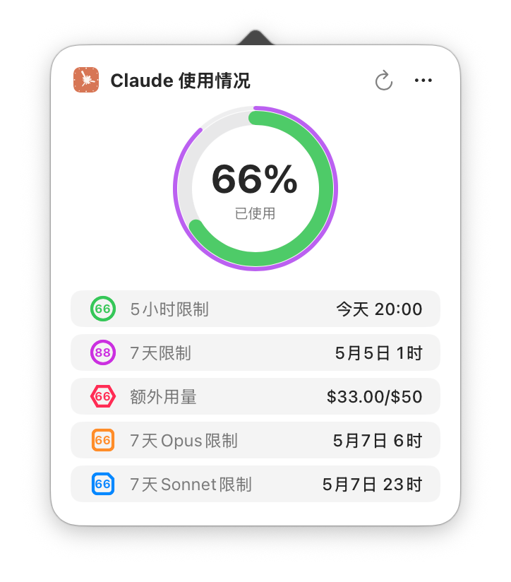
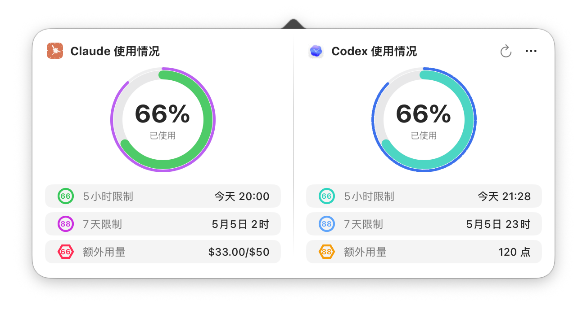

# Usage4Claude

[English](../README.md) | [日本語](README.ja.md) | [简体中文](README.zh-CN.md) | [繁體中文](README.zh-TW.md) | [한국어](README.ko.md) | [Français](README.fr.md)

<div align="center">


[](https://www.apple.com/macos/)
[](https://swift.org)
[](https://developer.apple.com/xcode/swiftui/)
[](../LICENSE)
[](https://github.com/f-is-h/Usage4Claude/releases)
[](https://github.com/f-is-h/Usage4Claude/releases)

**在菜单栏中优雅地追踪您的 Claude（以及 Codex）订阅用量。**

✨ **支持监控所有Claude平台: Web • Claude Code • Desktop • Mobile App • Cowork** ✨

[功能特性](#-功能特性) • [下载安装](#-下载安装) • [使用指南](#-使用指南) • [常见问题](#-常见问题) • [支持项目](#-支持项目)

</div>

---

## ✨ 功能特性

### 🎯 核心功能

- **📊 实时监控** - 在菜单栏实时显示 Claude 订阅（Free/Pro/Team/Max）的使用配额，并可选监控 Codex 用量
- **🎯 多限制支持** - Claude 支持最多5种限制（5小时/7天/额外用量/7天Opus/7天Sonnet），Codex 支持 5小时、7天与额外用量/credits
- **🎨 智能显示模式** - 自动检测并显示所有有数据的限制类型
- **⚙️ 自定义显示** - 手动选择要显示的限制类型，支持任意组合
- **🎨 智能色彩** - 根据使用率自动变色提醒，不同限制类型拥有各自的色彩方案
- **🔔 用量通知** - 用量达到 90% 时发送警告通知，配额重置时发送重置通知
- **👥 多账户管理** - 支持 Claude 多账户 / 同一账户多组织，也支持独立的 Codex 账户管理与快速切换
- **🧩 Codex 支持** - 可选的 Codex 用量监控；可单独使用 Codex，也可与 Claude 并列显示为双栏视图（在设置中添加 Codex 账户即可启用）
- **🌐 内置浏览器登录** - Claude 登录自动提取 Session Key；Codex 通过内置浏览器登录 ChatGPT 获取认证信息
- **🎨 外观设置** - 支持跟随系统 / 浅色 / 深色三种外观模式
- **🕐 时间格式** - 支持系统默认 / 12小时制 / 24小时制
- **⏰ 精确计时** - 精确到分的配额重置时间显示
- **🔄 智能刷新系统** - 智能4级自适应刷新或固定间隔（1/3/5/10分钟）
- **⚡ 手动刷新** - 点击刷新按钮立即更新数据（10秒防抖保护）
- **💻 原生体验** - 纯原生 macOS 应用，轻量且优雅

### 🌐 跨平台支持

无缝支持所有Claude产品:
- 🌐 **Claude.ai** (Web界面)
- 💻 **Claude Code** (开发者CLI工具)
- 🖥️ **Desktop App** (macOS/Windows)
- 📱 **Mobile App** (iOS/Android)
- 🤝 **Cowork** (AI代理)

所有平台共享同一使用配额，在一个地方监控！

### 🧩 Codex 支持

- 可单独监控 Codex 用量，也可与 Claude 一起显示
- 支持 Codex 5小时、7天与额外用量/credits 信息
- 通过内置浏览器登录 ChatGPT 添加 Codex 账户
- Claude-only 用户无需额外配置；未添加 Codex 账户时界面保持原有体验

### 🎨 个性化

- **🕓 多种显示模式**
  - 仅显示百分比 - 简洁直观，无须点击即可查看
  - 仅显示图标 - 低调优雅，点击后显示详细信息
  - 图标 + 百分比 - 信息完整，视觉定位快速易识别

- **🌍 多语言支持**
  - English
  - 日本語
  - 简体中文
  - 繁体中文
  - 한국어
  - Français
  - 更多语言适配中…

### 🔧 便捷功能

- **⚙️ 可视化设置** - 无需修改代码，图形化配置所有选项
- **🆕 智能更新提醒** - 菜单栏徽章和彩虹动画提示新版本
- **🚀 开机启动选项** - 可选择系统启动时自动运行
- **⌨️ 快捷键支持** - 常用操作支持键盘快捷键（⌘R、⌘,、⌘Q）
- **👋 友好引导** - 首次启动提供详细的配置向导
- **… 菜单显示** - 多种菜单打开方式，详情页与右键
- **🔔 用量通知** - 支持 Claude 用量警告和重置通知，可在设置中开关
- **🛠️ 调试模式** - 开发者选项：Claude/Codex 假数据测试、模拟更新、即时刷新

### 🔒 安全与隐私

- 🏠 **仅本地存储** - 所有数据仅存储在本地，绝不收集和上传任何个人信息
- 🔐 **Keychain保护** - Claude Session Key 与 Codex 认证令牌使用 Keychain 存储，无明文密钥
- 📖 **开源透明** - 代码完全公开，任何人都可审计
- 🛡️ **沙盒防护** - 启用 App Sandbox，增强安全性

---

## 📸 截图预览

### 菜单栏显示效果

- 以下展示 Claude 与 Codex 的菜单栏图标与限制指示
- 图形形状与颜色双重指示，保证在单色主题下仍容易识别

| 图标 | 5小时 | 7天 | 额外用量 | 7天 Opus | 7天 Sonnet | 单色(自适应) |
|:---:|:---:|:---:|:---:|:---:|:---:|-----|
|  |  |  |  |  |  | </br>  |
|  |  |  |  | — | — | </br>  |

**颜色指示**：

Claude 当前配色：

- **5小时用量限制（含详情窗口）**： →  → 
- **7天用量限制（含详情窗口）**： →  → 
- **额外使用量**： →  → 
- **7天 Opus 用量限制**： →  → 
- **7天 Sonnet 用量限制**： →  → 

Codex 当前配色：

- **Codex 5小时限制**： →  → 
- **Codex 7天限制**： →  → 
- **Codex 额外用量 / credits**： →  → 

### 详情窗口

<table border="0">
<tr>
<td align="top" valign="top">

<br/>
<sub><i>Claude 单独使用模式</i></sub>
</td>
<td align="center" valign="top">

<br/>
<sub><i>Codex 单独使用模式</i></sub>
</td>
</tr>
<tr>
<td align="center" valign="top" colspan="2">

<br/>
<sub><i>Claude + Codex 共存模式</i></sub>
</td>
</tr>
<tr>
<td align="center" valign="top" colspan="2">

<br/>
<sub><i>剩余时间切换动画</i></sub>
</td>
</tr>
</table>


### 设置界面

**通用设置** - 显示选项、菜单栏主题、通知设置、外观（跟随系统/浅色/深色）、刷新模式、时间格式、语言选项、开机启动
**认证信息** - Claude/Codex 账户管理（添加/删除/切换/别名编辑）、内置浏览器登录、Claude 手动输入、连接诊断
**关于** - 版本信息和相关链接

### 欢迎界面

**配置认证信息** - Claude 支持内置浏览器一键登录（推荐）或手动输入 Session Key，自动获取 Organization ID，支持同一 Session Key 下的多组织自动创建；Codex 可在设置中通过内置浏览器登录 ChatGPT 添加
**显示选项配置** - 菜单栏主题、显示内容、显示模式（智能/自定义）选择，支持实时预览
**稍后设置** - 关闭欢迎窗口，稍后可在设置界面中进行配置

---

## 💾 下载安装

### 方式一：下载预编译版本（推荐）

1. 前往 [Releases 页面](https://github.com/f-is-h/Usage4Claude/releases)
2. 下载最新版本的 `.dmg` 文件
3. 双击打开，将应用拖入「应用程序」文件夹
4. 首次运行时，右键点击应用选择「打开」（需要允许运行未签名应用）
5. 需要允许使用 Keychain 存储认证信息（版本更新后可能需要再次允许。授权窗口会显示对应的认证令牌名称）

### 方式二：从源码构建

#### 前置要求
- macOS 13.0 或更高版本
- Xcode 15.0 或更高版本
- Git

#### 构建步骤

```bash
# 克隆仓库
git clone https://github.com/f-is-h/Usage4Claude.git
cd Usage4Claude

# 在 Xcode 中打开
open Usage4Claude.xcodeproj

# 在 Xcode 中按 Cmd + R 运行
```

---

## 📖 使用指南

### 首次配置

1. **启动应用**
   首次运行会显示欢迎界面

2. **配置认证信息**
   - **Claude 方式一：浏览器登录（推荐）**
     - 点击「浏览器登录」按钮
     - 在内置浏览器中登录 Claude 账户
     - 登录成功后自动提取 Session Key 并完成配置
   - **Claude 方式二：手动输入**
     - 打开浏览器访问 Claude 用量页面
     - 打开开发者工具（F12 或 Cmd + Option + I）
     - 切换到「网络」标签，刷新页面
     - 找到 `usage` 请求，从 Cookie 中提取 `sessionKey=sk-ant-...`
     - 粘贴到输入框
   - **Codex 账户（可选）**
     - 打开设置 → 认证信息
     - 点击 Codex 的「浏览器登录」
     - 在内置浏览器中登录 ChatGPT 账户
     - 登录成功后自动保存认证信息
     - Codex 目前不支持手动输入 Session Key

### 日常使用

- **默认显示** - 菜单栏图标显示使用量百分比
- **查看详情** - 点击菜单栏图标即可查看详情；仅配置 Claude/Codex 时显示 Claude/Codex 单列，同时配置 Claude 与 Codex 时显示双栏视图
- **手动刷新** - 详情窗口点击刷新按钮或使用快捷键 ⌘R（打开主界面时也会自动刷新数据）；双栏视图中也可分别刷新 Claude 或 Codex
- **切换账户** - 在详情窗口点击「…」菜单或右键点击菜单栏图标，选择要切换的 Claude / Codex 账户
- **快捷键操作**
  - ⌘R - 手动刷新数据
  - ⌘, - 打开通用设置
  - ⌘⇧A - 打开认证设置
  - ⌘Q - 退出应用
- **更新提醒** - 有新版本时菜单栏图标显示徽章，菜单项显示彩虹文字
- **检查更新** - 菜单 → 检查更新

### 刷新模式

**智能频率（推荐）**
- 根据使用情况自动调整刷新间隔
- 活跃模式（1分钟）- 正在使用 Claude 或 Codex 时快速刷新
- 静默模式（3/5/10分钟）- 静默时逐步减慢刷新
- 静默期间显著减少 API 调用（最多10倍）
- 检测到使用变化后立即恢复到1分钟刷新
- 系统从睡眠唤醒后会自动重新刷新，避免长时间停留在旧数据

**固定频率**
- **1分钟** - 推荐的持续监控
- **3分钟** - 平衡监控
- **5分钟** - 低频监控
- **10分钟** - 最少 API 调用

---

## ❓ 常见问题

<details>
<summary><b>Q: 应用显示"会话已过期"怎么办？</b></summary>

A: Claude Session Key 或 Codex 认证令牌会定期过期（通常几周到几个月），需要重新登录：
1. 打开设置 → 认证信息
2. Claude 账户可点击「浏览器登录」重新登录（推荐），也可按照手动方式重新获取 Session Key
3. Codex 账户请点击 Codex 的「浏览器登录」，在内置浏览器中重新登录 ChatGPT
4. 完成后即可恢复正常

</details>

<details>
<summary><b>Q: 如何让应用开机自动启动？</b></summary>

A: 有两种方式：

**方式一：使用应用内置选项（推荐）**
1. 打开设置 → 通用设置
2. 勾选「开机时启动」选项

**方式二：通过系统设置**
1. 打开「系统设置」→「通用」→「登录项」
2. 点击「+」添加 Usage4Claude

</details>

<details>
<summary><b>Q: 应用占用多少系统资源？</b></summary>

A: 非常轻量：
- CPU 使用率：< 0.1%（空闲时）
- 内存占用：约 20MB
- 网络请求：默认按智能频率刷新；同时配置 Claude 与 Codex 时会分别请求对应服务

</details>

<details>
<summary><b>Q: 支持哪些 macOS 版本？</b></summary>

A: 需要 macOS 13.0 (Ventura) 或更高版本。支持 Intel 和 Apple Silicon (M1/M2/M3) 芯片。

</details>

<details>
<summary><b>Q: 为什么需要 Keychain 权限？</b></summary>

A:
- Keychain 是 macOS 的系统级密码管理器
- Claude Session Key 与 Codex 认证令牌会被加密存储在 Keychain 中
- Claude Organization ID 存储在本地配置中（非敏感标识符）
- 这是 Apple 推荐的最安全的敏感信息存储方式
- 只有本应用可以访问这些信息，其它应用无权查看

</details>

<details>
<summary><b>Q: 我的数据安全吗？隐私如何保护？</b></summary>

**完全安全！**

**数据存储：**
- 所有数据**仅**存储在您本地 Mac 上
- 不收集、不追踪、不统计任何信息
- 除了调用 Claude 与 Codex 相关用量接口外无其他网络请求
- 不使用任何第三方服务

**认证信息安全：**
- Claude Session Key 与 Codex 认证令牌通过 macOS Keychain 加密（系统级加密）
- Keychain 使用 AES-256 加密 + 硬件保护（T2 / Secure Enclave）
- 仅本应用可访问您的凭证，其他应用无法读取
- 您可随时通过"钥匙串访问"应用撤销权限

**代码透明性：**
- 100% 开源
- 无混淆或隐藏功能
- 社区可审计和验证

**额外保护：**
- 启用 App Sandbox（限制系统访问）
- 无权访问您的文件、通讯录或其他应用
- 最小化权限（仅网络 + Keychain）

您可以通过GitHub查看源代码来验证这一切！

</details>

<details>
<summary><b>Q: 是否支持 Claude Code / Desktop App / Mobile App?</b></summary>

A: **是的，支持所有Claude平台！**

由于所有Claude产品 (Web, Claude Code, Desktop App, Mobile App, Cowork) 共享同一使用配额，Usage4Claude会监控您在所有平台上的总使用量。

无论您是:
- 在终端使用 `claude code` 编程
- 在 claude.ai 聊天
- 使用桌面应用
- 使用手机应用
- 使用 Cowork 协作

您都能在菜单栏中看到实时的总使用量。无需特定平台的配置！

</details>

<details>
<summary><b>Q: Codex 支持如何启用？可以只用 Codex 吗？</b></summary>

A: 可以。打开设置 → 认证信息，点击 Codex 的「浏览器登录」，在内置浏览器中登录 ChatGPT 后即可启用。

- 只配置 Codex：菜单栏和详情窗口会显示 Codex 用量
- 同时配置 Claude 与 Codex：详情窗口会以双栏视图并列显示两者
- Codex 目前仅支持浏览器登录，不支持手动输入 Session Key

</details>

<details>
<summary><b>Q: 菜单栏看不到图标怎么办？</b></summary>

A: macOS 系统或第三方软件（如 Bartender、Hidden Bar 等）有时会自动隐藏菜单栏图标。

**解决方法：**
1. 按住 **Command (⌘) 键**
2. 用鼠标拖动菜单栏中的图标
3. 将 Usage4Claude 图标拖到菜单栏右侧可见区域
4. 松开鼠标即可

**提示：**
- macOS Sonoma (14.0+) 会自动隐藏不常用的图标到"控制中心"
- 您可以在「系统设置」→「控制中心」中调整菜单栏图标显示

</details>

<details>
<summary><b>Q: 如何管理多个账户？</b></summary>

A: Usage4Claude 支持 Claude 多账户、同一 Claude 账户下的多组织，以及独立的 Codex 账户管理：
- **添加账户** - 在设置 → 认证信息中通过 Claude 浏览器登录、Claude 手动输入或 Codex 浏览器登录添加
- **切换账户** - 在详情窗口点击「…」菜单或右键点击菜单栏图标，选择要切换的 Claude / Codex 账户
- **编辑别名** - 为每个账户设置易于辨识的别名
- **删除账户** - 左滑或通过编辑模式移除不需要的账户

</details>

<details>
<summary><b>Q: 如何开启用量通知？</b></summary>

A: 在设置 → 通用设置中可以开关 Claude 用量通知功能：
- **用量警告** - 当 Claude 使用量达到 90% 时发送系统通知
- **重置通知** - 当 Claude 配额重置时发送通知提醒
- 首次开启时需要授权 macOS 通知权限

</details>

---

## 🛠 技术栈

本项目采用现代 macOS 原生技术栈构建：

- **语言**: Swift 5.0+
- **UI 框架**: SwiftUI + AppKit 混合
- **架构**: MVVM
- **网络**: URLSession
- **响应式**: Combine Framework
- **本地化**: 内置 i18n 支持
- **平台**: macOS 13.0+

---

## 🗺 路线图

### ✅ 已完成
- [x] 基础监控功能
- [x] 菜单栏实时显示
- [x] 圆形进度指示器
- [x] 智能颜色提醒
- [x] 实时倒计时
- [x] 菜单栏多种显示模式
- [x] 可视化设置界面
- [x] 多语言支持
- [x] 首次启动引导
- [x] 更新检查与视觉提醒
- [x] 认证信息 Keychain 存储
- [x] Shell 自动打包 DMG
- [x] GitHub Actions 自动发布
- [x] 设置界面显示优化
- [x] 开机启动选项
- [x] 快捷键支持
- [x] 手动刷新功能
- [x] 三点菜单暗黑模式适配
- [x] 双限制模式支持（5小时 + 7天）
- [x] 双圆环菜单栏图标
- [x] 统一配色方案管理
- [x] 调试模式（假数据、模拟更新）
- [x] 详情窗口 去除Focus 状态
- [x] 多限制类型支持（5种）
- [x] 智能/自定义显示模式
- [x] 自动获取 Organization ID
- [x] 优化的欢迎流程
- [x] 单色主题图标显示
- [x] 韩语支持
- [x] GitHub Actions 检查在线版本
- [x] 外观设置（跟随系统/浅色/深色）
- [x] 内置浏览器自动获取认证信息
- [x] 认证信息自动设置
- [x] 用量通知提醒
- [x] 多账户管理
- [x] 统一时间格式设置
- [x] 设置界面暗黑模式适配
- [x] Codex 用量监控支持
- [x] Codex 单独使用模式
- [x] Claude + Codex 双栏详情窗口
- [x] Codex 账户管理与浏览器登录
- [x] 法语本地化
- [x] 系统睡眠唤醒后自动刷新数据

### 中期计划
1. **功能增加**
    - 更多语言本地化

### 长期愿景
3. **更多显示方式**
   - 桌面小组件
   - 浏览器插件图标用量显示

4. **数据分析**
   - 历史使用记录
   - 趋势图表展示

5. **多平台支持**
   - iOS / iPadOS 版本
   - Apple Watch 版本
   - Windows 版本

---

## 🤝 贡献

欢迎所有形式的贡献！无论是新功能、Bug 修复还是文档改进。

详细的贡献指南，请参阅 [CONTRIBUTING.md](../CONTRIBUTING.md)。

### 如何贡献

1. Fork 本仓库
2. 创建您的特性分支 (`git checkout -b feature/AmazingFeature`)
3. 提交您的更改 (`git commit -m 'Add some AmazingFeature'`)
4. 推送到分支 (`git push origin feature/AmazingFeature`)
5. 开启一个 Pull Request

### 贡献者

感谢所有为这个项目做出贡献的人！

<!-- ALL-CONTRIBUTORS-LIST:START -->
<!-- 这里将自动生成贡献者列表 -->
<!-- ALL-CONTRIBUTORS-LIST:END -->

---

## 📝 更新日志

详细的版本历史和更新内容，请参阅 [CHANGELOG.md](../CHANGELOG.md)。

---

## 💖 支持项目

如果这个项目对您有帮助，欢迎通过以下方式支持：

### ⭐ Star 项目
给项目一个 Star 是对我最大的鼓励！

### ☕ 请我喝杯咖啡

<!-- GitHub Sponsors -->
<a href="https://github.com/sponsors/f-is-h?frequency=one-time">
  
</a>

<!-- Ko-fi -->
<a href="https://ko-fi.com/1attle">
  
</a>

<!-- Buy Me A Coffee -->
<!-- <a href="https://buymeacoffee.com/fish_">
  
</a> -->

### 📢 分享项目
如果您喜欢这个项目，请分享给更多可能需要的人！

---

## 📄 许可证

本项目采用 MIT 许可证 - 详见 [LICENSE](../LICENSE) 文件

```
MIT License

Copyright (c) 2025 f-is-h

您可以自由地使用、复制、修改、合并、发布、分发、再许可和/或销售本软件的副本。
```

---

## 🙏 致谢

- 感谢 Claude/Codex 大部分代码均由 AI 编写
- 感谢所有贡献者和用户的支持
- 图标设计灵感来自 Claude/Codex 官方品牌

---

## 📞 联系方式

- **Issues**: [提交问题或建议](https://github.com/f-is-h/Usage4Claude/issues)
- **Discussions**: [参与讨论](https://github.com/f-is-h/Usage4Claude/discussions)
- **GitHub**: [@f-is-h](https://github.com/f-is-h)

---

## ⚖️ 免责声明

本项目是一个独立的第三方工具，与 Anthropic、Claude AI、OpenAI 或 Codex 没有官方关联。使用本软件时请遵守相关服务条款。

---

<div align="center">

**如果这个项目对您有帮助，请给一个 ⭐ Star！**

Made with ❤️ by [f-is-h](https://github.com/f-is-h)

[⬆ 回到顶部](#usage4claude)

</div>
