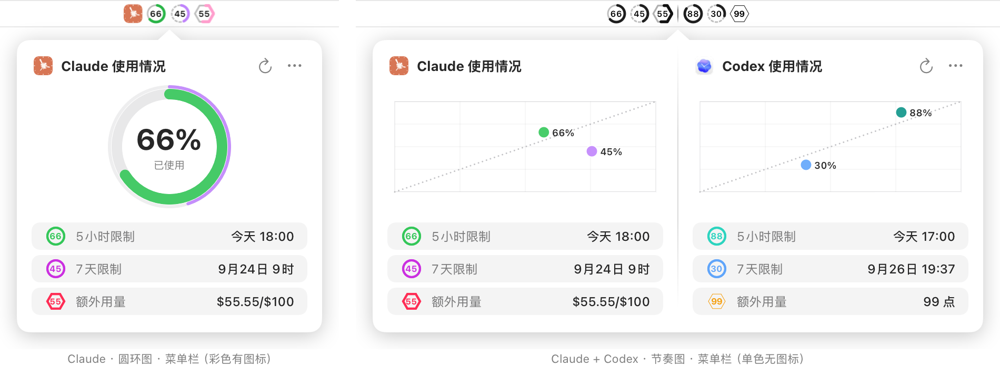
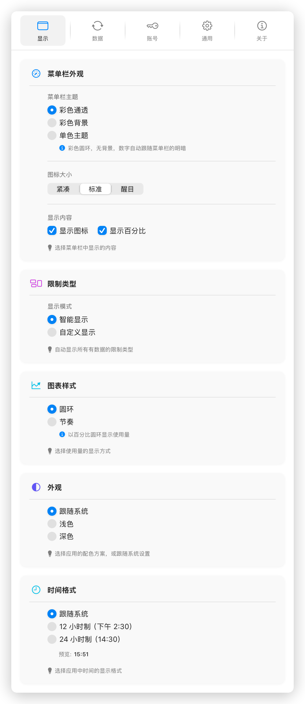

# Usage4Claude

[English](../README.md) | [日本語](README.ja.md) | [简体中文](README.zh-CN.md) | [繁體中文](README.zh-TW.md) | [한국어](README.ko.md) | [Français](README.fr.md) | [Deutsch](README.de.md)

<div align="center">

<picture>
  <source media="(prefers-color-scheme: dark)" srcset="images/hero.zh-CN.dark@2x.png">
  
</picture>

[](https://www.apple.com/macos/)
[](https://swift.org)
[](https://developer.apple.com/xcode/swiftui/)
[](../LICENSE)
[](https://github.com/f-is-h/Usage4Claude/releases)
[](https://github.com/f-is-h/Usage4Claude/releases)
[](https://github.com/sponsors/f-is-h?frequency=one-time&metadata_project=usage4claude&metadata_source=readme&metadata_placement=header&metadata_lang=zh-cn)

**在菜单栏中追踪 Claude 与 Codex 的订阅用量。**

[功能](#-功能) · [安装](#-安装) · [使用](#-使用) · [隐私与安全](#-隐私与安全) · [常见问题](#-常见问题) · [参与](#-参与)

</div>

---

## ✨ 功能

### 监控范围

Claude 和 Codex 可单独或同时配置。各服务的所有入口共享同一额度，菜单栏始终显示其总使用量。

| 服务 | 入口 | 限制 |
|---|---|---|
| **Claude** | claude.ai、Claude Code、桌面端、手机端、Cowork | 5 小时、7 天、额外用量，以及各模型的每周用量（Opus、Sonnet、Fable 等，以账户实际返回为准） |
| **Codex** | Codex CLI、IDE 扩展、Codex 网页版 | 5 小时、7 天、credits 余额 |

仅配置一项服务时界面为单栏；两项均配置时，详情窗口分为双栏，菜单栏并列显示两者的图标。

支持 Claude 的 Pro、Max、Team 与 Enterprise 档位。免费版没有用量看板，无法读取；Team 与 Enterprise 账户需由管理员开启成员用量看板。

### 两种图表

**圆环图**显示各项限制的已用比例，下方列出重置时间。

**节奏图**将各项限制绘制在「已用比例 / 已过时间」坐标上，以对角线表示匀速消耗。位于对角线上方表示消耗快于时间流逝，下方表示仍有余量。周限制可设为只计工作日。

两种图表在「设置 → 显示 → 图表样式」中切换。点击限制列表，可在「已用比例与重置时刻」和「可用比例与剩余时间」之间切换。

<div align="center">

</div>

### 菜单栏图标

各限制类型有独立的形状与配色，颜色随用量升高而变化。

| | 图标 | 5 小时 | 7 天 | 额外用量 | 模型一每周<br>（如 Fable） | 模型二每周<br>（如 Opus、Sonnet） | 单色 |
|---|:---:|:---:|:---:|:---:|:---:|:---:|:---:|
| **Claude** |  |  |  |  |  |  | <br> |
| **Codex** |  |  |  |  | | | <br> |

各模型的每周用量按接口返回的顺序依次使用模型一、模型二两种样式，模型名称以账户实际返回为准。菜单栏最多显示前两个模型，详情窗口列出全部模型并交替使用这两种样式。

Claude 配色：

- **5 小时**： →  → 
- **7 天**： →  → 
- **额外用量**： →  → 
- **模型一每周**（如 Fable）： →  → 
- **模型二每周**（如 Opus、Sonnet）： →  → 

Codex 配色：

- **5 小时**： →  → 
- **7 天**： →  → 
- **credits**： →  → 

单色主题下各限制仍可凭形状区分，并随菜单栏明暗自动反色。菜单栏的明暗由壁纸决定，与系统的浅色 / 深色外观无关。

| 项目 | 可选值 |
|---|---|
| 显示内容 | 仅百分比、仅图标、图标加百分比 |
| 图标尺寸 | 紧凑、标准、醒目 |
| 主题 | 彩色通透、彩色背景、单色 |

菜单栏默认显示所有有数据的限制，也可在「设置 → 显示 → 限制类型」中改为自定义并单独选择。

### 提醒

用量达到阈值时发送系统通知，额度重置时同样通知。阈值按类别设置，范围 50% 至 100%，步长 5%。

| 类别 | 档数 | 默认 |
|---|---|---|
| 5 小时 | 1 | 90% |
| 周限制（含各模型每周用量） | 2 | 75%、90% |
| 额外用量 / credits | 2 | 75%、90% |

### 刷新

**智能模式**按用量变化调整频率：有变化时每分钟一次，连续无变化后依次降至 3、5、10 分钟，检测到变化立即恢复。静默期间的请求量约为活跃期的十分之一。

**固定模式**为 1、3、5、10 分钟。

接口限流时自动退避。刷新失败时保留上一次的数据，仅在标题旁标注。系统唤醒与打开详情窗口时自动刷新；点击圆环或图表可手动刷新，带 10 秒防抖。

### 账户

Claude 支持多账户及同一账户下的多个组织，Codex 账户独立管理。每个账户可设置别名，在详情窗口的「…」菜单或菜单栏图标的右键菜单中切换。

登录通过系统浏览器完成，Google、Microsoft、企业 SSO 与通行密钥均可使用。Claude 另支持手动填写 Session Key。

### Codex 重置预告（测试版）

OpenAI 预告了尚未到来的全局额度重置时，Codex 栏标题旁显示徽章，其余时间不显示。数据来自第三方社区项目 [codex-reset.com](https://codex-reset.com)，非官方接口，可在设置中关闭。

### 界面语言

English、日本語、简体中文、繁體中文、한국어、Français（[@mtreize](https://github.com/mtreize)）、Deutsch（[@schaitl](https://github.com/schaitl)），默认跟随系统语言。欢迎贡献新的本地化，方法见[参与](#-参与)。

---

## 💾 安装

### 下载

1. 在 [Releases](https://github.com/f-is-h/Usage4Claude/releases) 下载最新的 `.dmg`，将应用拖入「应用程序」文件夹
2. 首次打开会被 Gatekeeper 拦截，放行方法见[常见问题](#-常见问题)第一条
3. 首次读取凭据时授予钥匙串访问权限，选择「始终允许」

系统要求 macOS 13 (Ventura) 及以上，支持 Intel 与 Apple 芯片。

安装后由 [Sparkle](https://sparkle-project.org) 在应用内更新，更新包经 EdDSA 签名校验后安装。目前不提供 Homebrew 安装方式。

### 从源码构建

需要 Xcode 26 及以上。

```bash
git clone https://github.com/f-is-h/Usage4Claude.git
cd Usage4Claude
open Usage4Claude.xcodeproj
```

在 Xcode 中按 ⌘R 运行。技术栈为 Swift 与 SwiftUI，菜单栏与窗口管理部分使用 AppKit。

---

## 📖 使用

### 登录

首次启动打开引导窗口，Claude 与 Codex 均可在此登录。引导可跳过，之后在「设置 → 账号」中添加。

**浏览器登录**：点击登录按钮，系统浏览器打开授权页，授权完成后自动返回应用。授权回调由本机的临时端口接收；若防火墙拦截了本机连接，浏览器会停留在 `localhost` 地址，将地址栏中的链接粘贴到登录窗口即可完成。

**手动填写 Session Key**（仅 Claude）：

1. 在浏览器中打开 claude.ai 的用量页面
2. 打开开发者工具（⌥⌘I），切换到「网络」标签后刷新页面
3. 找到 `usage` 请求，从请求头的 Cookie 中复制 `sessionKey=sk-ant-...` 的完整值
4. 粘贴至输入框。Organization ID 自动获取，同一 Session Key 下的多个组织一并添加

### 日常使用

左键点击菜单栏图标打开详情窗口，右键打开菜单。菜单中包含账户切换、设置、检查更新，以及 Claude 与 Codex 服务状态页的入口。

有新版本时，菜单栏图标显示徽章，菜单中的「检查更新」同时标注。

### 设置

<div align="center">
<picture>
  <source media="(prefers-color-scheme: dark)" srcset="images/settings.display.zh-CN.dark@2x.png">
  
</picture>
</div>

| 标签 | 内容 |
|---|---|
| **显示** | 菜单栏外观、限制类型、图表样式、外观模式、时间格式 |
| **数据** | 刷新模式、提醒阈值、Codex 重置预告 |
| **账号** | Claude 与 Codex 账户、浏览器登录、手动填写 Session Key、连接诊断 |
| **通用** | 界面语言、开机启动、恢复默认设置 |
| **关于** | 版本信息与相关链接 |

---

## 🔒 隐私与安全

- 无服务端，数据仅保存在本机，无统计与遥测
- 网络请求仅限三类：Claude 与 Codex 的登录及用量接口、Sparkle 从 GitHub 检查更新、开启 Codex 重置预告时访问 codex-reset.com
- Session Key 与各类令牌存入钥匙串，不以明文存储；接口响应不写入磁盘缓存
- 启用 App Sandbox，除网络访问外，仅开放登录回调所需的本机端口与 Sparkle 安装更新所需的系统服务
- 诊断报告导出前自动脱敏，令牌等敏感字段会被替换
- 源代码完全公开，可自行审计

---

## ❓ 常见问题

<details>
<summary><b>无法打开，提示无法验证开发者</b></summary>

应用未经 Apple 公证，首次打开需手动放行：

- **macOS 15 及以上**：双击应用，在弹窗中点击「完成」，再前往「系统设置 → 隐私与安全性」，在页面底部点击「仍要打开」
- **macOS 14 及以下**：按住 Control 点击应用，选择「打开」，在弹窗中再次确认

放行一次即可，此后正常双击启动，应用内更新无需重复操作。

</details>

<details>
<summary><b>更新后再次请求钥匙串权限</b></summary>

钥匙串依据应用签名判断身份。本应用使用自签名证书，部分版本更新后系统会重新询问，选择「始终允许」即可。钥匙串中的凭据仅本应用可读取。

</details>

<details>
<summary><b>提示「请求被安全系统拦截」</b></summary>

claude.ai 前置的 Cloudflare 防护判定请求来自自动化程序时会拦截。在浏览器中访问一次 claude.ai 并完成人机验证，应用通常即可恢复。使用 VPN 或代理时更易触发。此类拦截与账户状态无关，无需重新登录。

</details>

<details>
<summary><b>提示「会话已过期」</b></summary>

Session Key 与登录令牌会定期失效，周期为数周至数月。在「设置 → 账号」中重新登录即可。

</details>

<details>
<summary><b>提示「请求过于频繁」</b></summary>

用量接口触发了限流保护。应用会自动退避并稍后重试，期间保留上一次的数据。反复手动刷新会延长退避时间。

</details>

<details>
<summary><b>Codex 登录后很快失效</b></summary>

ChatGPT 账户开启「Advanced Security」后，登录令牌的有效期大幅缩短，需频繁重新登录。如需长期监控 Codex 用量，可考虑关闭该选项。

</details>

<details>
<summary><b>Claude 账户读不到用量</b></summary>

应用提示「当前账号套餐不提供用量数据」时，说明该账户在 claude.ai 上没有用量看板。免费版没有用量看板；Team 与 Enterprise 账户请联系管理员开启成员用量看板。重新登录无法解决此问题。

</details>

<details>
<summary><b>菜单栏看不到图标</b></summary>

菜单栏空间不足时 macOS 会隐藏部分图标，Bartender、Hidden Bar 等工具也可能将其收起。按住 ⌘ 拖动菜单栏图标可调整位置。

</details>

<details>
<summary><b>应用无故退出</b></summary>

在「设置 → 账号 → 连接诊断」中导出诊断报告，附于 [issue](https://github.com/f-is-h/Usage4Claude/issues) 中。报告包含上次是否异常退出的判定与近期日志，导出前已脱敏。

</details>

---

## 🗺 路线图

各版本的改动记录于 [CHANGELOG.md](../CHANGELOG.md)。

**正在进行**：持续优化与 Issue 解决

**考虑中**：更多界面语言、桌面小组件、历史用量图表

**不会实现**

- **Claude 与 Codex 之外的服务。** 菜单栏宽度有限，每增加一家服务商都会占用所有用户的菜单栏空间。本项目专注于做好这两家，不扩展为通用的用量面板。
- **任何形式的数据上传。** 项目没有服务端，也不计划引入。
- **上架 App Store。** 应用通过未公开的接口读取用量，不符合 App Store 的上架规定。

---

## 🤝 参与

Issue 与 PR 均欢迎，流程见 [CONTRIBUTING.md](../CONTRIBUTING.md)。

**新增界面语言**：将 `Usage4Claude/Resources/en.lproj/Localizable.strings` 复制到新的 `<语言代码>.lproj` 目录并翻译其中的值。CI 会校验各语言的键是否一致。

### 贡献者

**代码**

<a href="https://github.com/f-is-h/Usage4Claude/graphs/contributors"></a>

**翻译**


**问题反馈与功能提议**


### 支持

<a href="https://github.com/sponsors/f-is-h?frequency=one-time&amp;metadata_project=usage4claude&amp;metadata_source=readme&amp;metadata_placement=badge&amp;metadata_lang=zh-cn"></a>
<a href="https://ko-fi.com/1atte"></a>

---

## 📄 许可与声明

MIT 许可证，详见 [LICENSE](../LICENSE)。Copyright © 2025-2026 f-is-h。

本项目为独立的第三方工具，与 Anthropic、OpenAI 无官方关联，使用时请遵守相应服务的条款。

项目的大部分代码由 Claude 与 Codex 编写，图标设计参考了两家的官方品牌形象。

问题反馈见 [Issues](https://github.com/f-is-h/Usage4Claude/issues)，其他讨论见 [Discussions](https://github.com/f-is-h/Usage4Claude/discussions)。

<div align="center">

[⬆ 回到顶部](#usage4claude)

</div>
