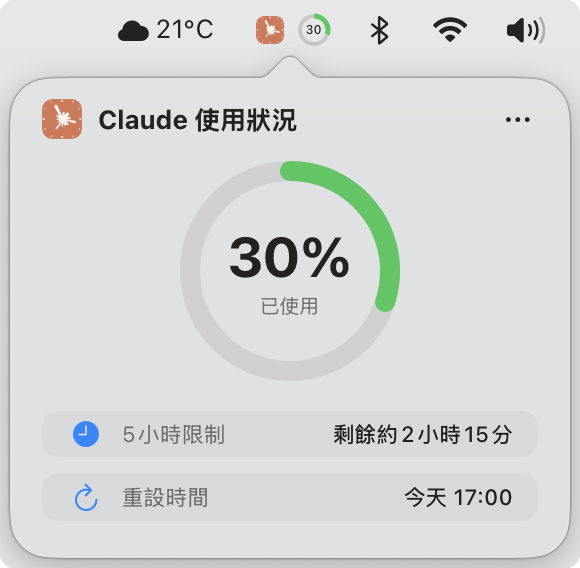

# Usage4Claude

[English](../README.md) | [日本語](README.ja.md) | [简体中文](README.zh-CN.md) | [繁體中文](README.zh-TW.md)

<div align="center">


[](https://www.apple.com/macos/)
[](https://swift.org)
[](https://developer.apple.com/xcode/swiftui/)
[](LICENSE)
[](https://github.com/f-is-h/Usage4Claude/releases)
[](https://github.com/f-is-h/Usage4Claude/releases)

**一個優雅的 macOS 選單列應用程式，即時監控您的 Claude AI 使用情況。**

✨ **支持監控所有Claude平台: Web • Claude Code • Desktop • Mobile App** ✨

[功能特性](#-功能特性) • [下載安裝](#-下載安裝) • [使用指南](#-使用指南) • [常見問題](#-常見問題) • [支持專案](#-支持專案)

</div>

---

## ✨ 功能特性

### 🎯 核心功能

- **📊 即時監控** - 在選單列即時顯示 Claude 訂閱的 5 小時使用配額
- **🎨 智慧色彩** - 根據使用率自動變色提醒（綠色/橙色/紅色）
- **⏰ 精確計時** - 精確到分鐘的配額重置時間顯示
- **🔄 智慧刷新系統** - 智惠4級自適應刷新或固定間隔（1/3/5/10分鐘）
- **⚡ 手動重新整理** - 點擊重新整理按鈕後立即更新資料（並具有 10 秒防抖保護）
- **💻 原生體驗** - 純原生 macOS 應用程式，輕量且優雅

### 🌐 跨平台支持

無縫支持所有Claude產品:
- 🌐 **Claude.ai** (Web界面)
- 💻 **Claude Code** (開發者CLI工具)
- 🖥️ **Desktop App** (macOS/Windows)
- 📱 **Mobile App** (iOS/Android)

所有平台共享同一使用配額，在一個地方監控！

### 🎨 個人化

- **🕓 多種顯示模式**
  - 僅顯示百分比 - 簡潔直觀，無須點擊即可查看
  - 僅顯示圖示 - 低調優雅，點擊後顯示詳細資訊
  - 圖示 + 百分比 - 資訊完整，視覺定位快速易識別

- **🌍 多語言支援**
  - English
  - 日本語
  - 简体中文
  - 繁體中文
  - 更多語言適配中……

### 🔧 便捷功能

- **⚙️ 視覺化設定** - 無需修改程式碼，圖形化設定所有選項
- **🆕 智慧更新提醒** - 選單列徽章和彩虹動畫提示新版本
- **🚀 開機啟動選項** - 可選擇系統啟動時自動執行
- **⌨️ 鍵盤快速鍵支援** - 常用操作支援鍵盤快速鍵（⌘R、⌘,、⌘Q）
- **👋 友善引導** - 首次啟動提供詳細的設定精靈
- **… 選單顯示** - 多種選單存取方式，詳情檢視和右鍵

### 🔒 安全與隱私

- 🏠 **僅本機儲存** - 所有資料僅儲存在本機，絕不收集和上傳任何個人資訊
- 🔐 **Keychain 保護** - 敏感資訊使用 Keychain 儲存，無明文金鑰
- 📖 **開源透明** - 程式碼完全公開，任何人都可稽核
- 🛡️ **Sandbox 防護** - 啟用 App Sandbox，增強安全性

---

## 📸 截圖預覽

### 選單列顯示效果

| 百分比模式 | 圖示模式 | 組合模式 |
|:---:|:---:|:---:|
|  |  |  |

**圓環顏色指示**：

🟢 **綠色**（0-69%）- 安全使用中

🟠 **橙色**（70-89%）- 注意用量

🔴 **紅色**（90-100%）- 接近限制

### 詳情視窗



### 設定介面

**一般設定** - 自訂顯示、重新整理和語言選項  
**認證資訊** - 設定 Claude 帳戶認證資訊  
**關於** - 版本資訊和相關連結

### 歡迎畫面

**設定認證資訊** - 立即前往認證資訊設定介面完成設定  
**稍後設定** - 關閉歡迎視窗，稍後可在設定介面中進行設定

---

## 💾 下載安裝

### 方式一：下載預編譯版本（推薦）

1. 前往 [Releases 頁面](https://github.com/f-is-h/Usage4Claude/releases)
2. 下載最新版本的 `.dmg` 檔案
3. 雙擊開啟，將應用程式拖入「應用程式」資料夾
4. 首次執行時，右鍵點擊應用程式選擇「開啟」（需要允許執行未簽署應用程式）
5. 需要允許使用 Keychain 儲存認證資訊（版本更新後需要再次允許。授權視窗顯示兩次：組織 ID、Session Key）

### 方式二：從原始碼建置

#### 前置要求
- macOS 13.0 或更高版本
- Xcode 15.0 或更高版本
- Git

#### 建置步驟

```bash
# 複製儲存庫
git clone https://github.com/f-is-h/Usage4Claude.git
cd Usage4Claude

# 在 Xcode 中開啟
open Usage4Claude.xcodeproj

# 在 Xcode 中按 Cmd + R 執行
```

---

## 📖 使用指南

### 首次設定

1. **啟動應用程式**  
   首次執行會顯示歡迎畫面

2. **設定認證資訊**  
   點擊「前往設定認證資訊」按鈕

3. **取得必要資訊**  
   - 點擊「在瀏覽器中開啟 Claude 用量頁面」
   - 開啟瀏覽器開發者工具（按 F12 或 Cmd + Option + I）
   - 切換到「網路」(Network) 分頁
   - 重新整理頁面
   - 找到名為 `usage` 的請求
   - 查看請求標頭 (Headers)，找到：
     - `Cookie` 中的 `sessionKey=sk-ant-...` 值
     - URL 中的組織 ID（格式為 `xxxxxxxx-xxxx-xxxx-xxxx-xxxxxxxxxxxx`）

4. **填寫資訊**  
   - 將組織 ID 貼上到「Organization ID」輸入框
   - 將 Session Key 貼上到「Session Key」輸入框
   - 設定完成後會自動開始監控

### 日常使用

- **預設顯示** - 工作列圖示顯示使用量百分比
- **查看詳情** - 點擊工作列圖示或百分比圖示
- **手動重新整理** - 詳情視窗點擊重新整理按鈕或使用快速鍵 ⌘R
- **顯示選單** - 在詳情視窗點擊「…」圖示或者右鍵點擊工作列圖示
- **鍵盤快速鍵操作**
  - ⌘R - 手動重新整理資料
  - ⌘, - 開啟一般設定
  - ⌘⇧A - 開啟認證設定
  - ⌘Q - 結束應用程式
- **更新提醒** - 有新版本時選單列圖示顯示徽章，選單項目顯示彩虹文字
- **檢查更新** - 選單 → 檢查更新

### 刷新模式

**智慧頻率（推薦）**
- 根據使用情況自動調整刷新間隔
- 活躍模式（1分鐘）- 正在使用 Claude 時快速刷新
- 靜默模式（3/5/10分鐘）- 靜默時逐步減慢刷新
- 靜默期間顯著減少 API 呼叫（最多10倍）
- 檢測到使用變化後立即恢復到1分鐘刷新

**固定頻率**
- **1分鐘** - 推薦的持續監控
- **3分鐘** - 平衡監控
- **5分鐘** - 低頻監控
- **10分鐘** - 最少 API 呼叫

---

## ❓ 常見問題

<details>
<summary><b>Q: 應用程式顯示「工作階段已過期」該怎麼辦？</b></summary>

A: Session Key 會定期過期（通常幾週到幾個月），需要重新取得：
1. 開啟設定 → 認證資訊
2. 按照設定指南重新取得 Session Key
3. 貼上新的 Session Key 即可

</details>

<details>
<summary><b>Q: 如何讓應用程式開機自動啟動？</b></summary>

A: 有兩種方式：

**方式一：使用應用程式內建選項（推薦）**
1. 開啟設定 → 一般設定
2. 勾選「登入時啟動」選項

**方式二：透過系統設定**
1. 開啟「系統設定」→「一般」→「登入項目」
2. 點擊「+」新增 Usage4Claude

</details>

<details>
<summary><b>Q: 應用程式佔用多少系統資源？</b></summary>

A: 非常輕量：
- CPU 使用率：< 0.1%（閒置時）
- 記憶體佔用：約 20MB
- 網路請求：每分鐘僅 1 次

</details>

<details>
<summary><b>Q: 支援哪些 macOS 版本？</b></summary>

A: 需要 macOS 13.0 (Ventura) 或更高版本。支援 Intel 和 Apple Silicon (M1/M2/M3) 晶片。

</details>

<details>
<summary><b>Q: 為什麼需要 Keychain 權限？</b></summary>

A: 
- Keychain 是 macOS 的系統級密碼管理工具
- 您的 Session Key 和組織 ID 會被加密儲存在 Keychain 中
- 這是 Apple 建議的最安全的敏感資訊儲存方式
- 只有本應用程式可以存取這些資訊，其它應用程式無權查看

</details>

<details>
<summary><b>Q: 我的資料安全嗎？隱私如何保護？</b></summary>

**完全安全！** 

**資料儲存：**
- 所有資料**僅**儲存在您本機 Mac 上
- 不收集、不追蹤、不統計任何資訊
- 除了呼叫 Claude API 外無其他網路請求
- 不使用任何第三方服務

**認證資訊安全：**
- Session Key 透過 macOS Keychain 加密（系統級加密）
- Keychain 使用 AES-256 加密 + 硬體保護（T2 / Secure Enclave）
- 僅本應用程式可存取您的憑證，其他應用程式無法讀取
- 您可隨時透過「鑰匙圈存取」應用程式撤銷權限

**程式碼透明性：**
- 100% 開源
- 無混淆或隱藏功能
- 社群可稽核和驗證

**額外保護：**
- 啟用 App Sandbox（限制系統存取）
- 無權存取您的檔案、聯絡人或其他應用程式
- 最小化權限（僅網路 + Keychain）

您可以透過 GitHub 查看原始程式碼來驗證這一切！

</details>

<details>
<summary><b>Q: 是否支持 Claude Code / Desktop App / Mobile App?</b></summary>

A: **是的，支持所有Claude平台！** 

由於所有Claude產品 (Web, Claude Code, Desktop App, Mobile App) 共享同一個5小時使用配額，Usage4Claude會監控您在所有平台上的總使用量。

無論您是:
- 在終端使用 `claude code` 編程
- 在 claude.ai 聊天
- 使用桌面應用程式
- 使用手機應用程式

您都能在選單列中看到即時的總使用量。無需特定平台的配置！

</details>

---

## 🛠 技術堆疊

本專案採用現代 macOS 原生技術堆疊建置：

- **語言**: Swift 5.0+
- **UI 框架**: SwiftUI + AppKit 混合
- **架構**: MVVM
- **網路**: URLSession
- **響應式**: Combine Framework
- **本地化**: 內建 i18n 支援
- **平台**: macOS 13.0+

---

## 🗺 路線圖

### ✅ 已完成
- [x] 基礎監控功能
- [x] 選單列即時顯示
- [x] 圓形進度指示器
- [x] 智慧顏色提醒
- [x] 即時倒數計時
- [x] 選單列多種顯示模式
- [x] 視覺化設定介面
- [x] 多語言支援
- [x] 首次啟動引導
- [x] 更新檢查
- [x] 認證資訊 Keychain 儲存
- [x] Shell 自動打包 DMG
- [x] GitHub Actions 自動發布
- [x] 設定介面視覺優化
- [x] 開機啟動設定
- [x] 快速鍵支援
- [x] 手動重新整理功能
- [x] 三點選單黑暗模式適配


### 短期計畫
1. **開發者**
    - 🚧 GitHub Actions 檢查線上版本

2. **顯示最佳化**
    - 🚧 設定介面黑暗模式適配

### 中期計畫
3. **顯示最佳化**
    - 詳情視窗 Focus 狀態

5. **功能增加**
    - 7天使用量監控支援（OAuth・Opus）
    - 用量通知提醒
    - 更多語言本地化

### 長期願景
5. **自動設定**

- 瀏覽器擴充功能自動取得認證資訊
- 認證資訊自動設定

6. **更多顯示方式**
   - 桌面小工具
   - 瀏覽器擴充功能圖示用量顯示

7. **資料分析**
   - 歷史使用記錄
   - 趨勢圖表展示

8. **多平台支援**
   - iOS / iPadOS 版本
   - Apple Watch 版本
   - Windows 版本

---

## 🤝 貢獻

歡迎所有形式的貢獻！無論是新功能、Bug 修復還是文件改進。

詳細的貢獻指南，請參閱 [CONTRIBUTING.md](../CONTRIBUTING.md)。

### 如何貢獻

1. Fork 本儲存庫
2. 建立您的特性分支 (`git checkout -b feature/AmazingFeature`)
3. 提交您的變更 (`git commit -m 'Add some AmazingFeature'`)
4. 推送到分支 (`git push origin feature/AmazingFeature`)
5. 開啟一個 Pull Request

### 貢獻者

感謝所有為這個專案做出貢獻的人！

<!-- ALL-CONTRIBUTORS-LIST:START -->
<!-- 這裡將自動產生貢獻者清單 -->
<!-- ALL-CONTRIBUTORS-LIST:END -->

---

## 📝 更新日誌

詳細的版本歷史和更新內容，請參閱 [CHANGELOG.md](../CHANGELOG.md)。

---

## 💖 支持專案

如果這個專案對您有幫助，歡迎透過以下方式支持：

### ⭐ Star 專案
給專案一個 Star 是對我最大的鼓勵！

### ☕ 請我喝杯咖啡

<!-- GitHub Sponsors -->
<!-- <a href="https://github.com/sponsors/f-is-h">
  
</a> -->

<!-- Ko-fi -->
<a href="https://ko-fi.com/1attle">
  
</a>

<!-- Buy Me A Coffee -->
<!-- <a href="https://buymeacoffee.com/fish_">
  
</a> -->

### 📢 分享專案
如果您喜歡這個專案，請分享給更多可能需要的人！

---

## 📄 授權條款

本專案採用 MIT 授權條款 - 詳見 [LICENSE](LICENSE) 檔案

```
MIT License

Copyright (c) 2025 f-is-h

您可以自由地使用、複製、修改、合併、發布、分發、再授權和/或販售本軟體的副本。
```

---

## 🙏 致謝

- 感謝 [Claude AI](https://claude.ai) 大部分程式碼均由 AI 撰寫
- 感謝所有貢獻者和使用者的支持
- 圖示設計靈感來自 Claude AI 官方品牌

---

## 📞 聯絡方式

- **Issues**: [提交問題或建議](https://github.com/f-is-h/Usage4Claude/issues)
- **Discussions**: [參與討論](https://github.com/f-is-h/Usage4Claude/discussions)
- **GitHub**: [@f-is-h](https://github.com/f-is-h)

---

## ⚖️ 免責聲明

本專案是一個獨立的第三方工具，與 Anthropic 或 Claude AI 沒有官方關聯。使用本軟體時請遵守 Claude AI 的服務條款。

---

<div align="center">

**如果這個專案對您有幫助，請給一個 ⭐ Star！**

Made with ❤️ by [f-is-h](https://github.com/f-is-h)

[⬆ 回到頂部](#usage4claude)

</div>
