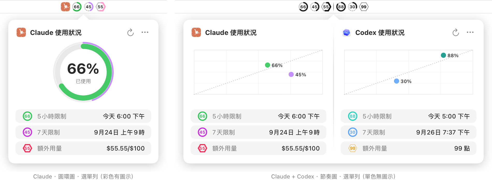
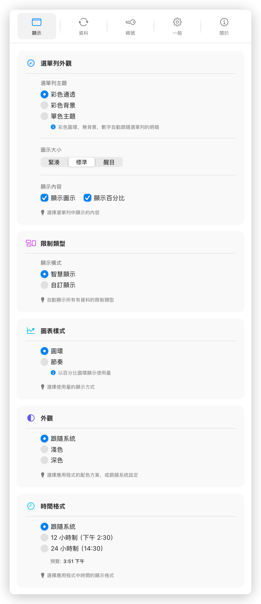

# Usage4Claude

[English](../README.md) | [日本語](README.ja.md) | [简体中文](README.zh-CN.md) | [繁體中文](README.zh-TW.md) | [한국어](README.ko.md) | [Français](README.fr.md) | [Deutsch](README.de.md)

<div align="center">

<picture>
  <source media="(prefers-color-scheme: dark)" srcset="images/hero.zh-TW.dark@2x.png">
  
</picture>

[](https://www.apple.com/macos/)
[](https://swift.org)
[](https://developer.apple.com/xcode/swiftui/)
[](../LICENSE)
[](https://github.com/f-is-h/Usage4Claude/releases)
[](https://github.com/f-is-h/Usage4Claude/releases)
[](https://github.com/sponsors/f-is-h?frequency=one-time&metadata_project=usage4claude&metadata_source=readme&metadata_placement=header&metadata_lang=zh-tw)

**在選單列中追蹤 Claude 與 Codex 的訂閱用量。**

[功能](#-功能) · [安裝](#-安裝) · [使用](#-使用) · [隱私與安全](#-隱私與安全) · [常見問題](#-常見問題) · [參與](#-參與)

</div>

---

## ✨ 功能

### 監控範圍

Claude 和 Codex 可單獨或同時設定。各服務的所有入口共享同一額度，選單列始終顯示其總使用量。

| 服務 | 入口 | 限制 |
|---|---|---|
| **Claude** | claude.ai、Claude Code、桌面版、行動版、Cowork | 5 小時、7 天、額外用量，以及各模型的每週用量（Opus、Sonnet、Fable 等，以帳戶實際回傳為準） |
| **Codex** | Codex CLI、IDE 擴充功能、Codex 網頁版 | 5 小時、7 天、credits 餘額 |

僅設定一項服務時介面為單欄；兩項皆設定時，詳情視窗分為雙欄，選單列並列顯示兩者的圖示。

支援 Claude 的 Pro、Max、Team 與 Enterprise 方案。免費版沒有用量儀表板，無法讀取；Team 與 Enterprise 帳戶需由管理員開啟成員用量儀表板。

### 兩種圖表

**圓環圖**顯示各項限制的已用比例，下方列出重設時間。

**節奏圖**將各項限制繪製在「已用比例 / 已過時間」座標上，以對角線表示等速消耗。位於對角線上方表示消耗快於時間流逝，下方表示仍有餘裕。每週限制可設為只計工作日。

兩種圖表在「設定 → 顯示 → 圖表樣式」中切換。點按限制列表，可在「已用比例與重設時刻」和「剩餘比例與剩餘時間」之間切換。

<div align="center">

</div>

### 選單列圖示

各限制類型有獨立的形狀與配色，顏色隨用量升高而變化。

| | 圖示 | 5 小時 | 7 天 | 額外用量 | 模型一每週<br>（如 Fable） | 模型二每週<br>（如 Opus、Sonnet） | 單色 |
|---|:---:|:---:|:---:|:---:|:---:|:---:|:---:|
| **Claude** |  |  |  |  |  |  | <br> |
| **Codex** |  |  |  |  | | | <br> |

各模型的每週用量按 API 回傳的順序依次使用模型一、模型二兩種樣式，模型名稱以帳戶實際回傳為準。選單列最多顯示前兩個模型，詳情視窗列出全部模型並交替使用這兩種樣式。

Claude 配色：

- **5 小時**： →  → 
- **7 天**： →  → 
- **額外用量**： →  → 
- **模型一每週**（如 Fable）： →  → 
- **模型二每週**（如 Opus、Sonnet）： →  → 

Codex 配色：

- **5 小時**： →  → 
- **7 天**： →  → 
- **credits**： →  → 

單色主題下各限制仍可憑形狀區分，並隨選單列明暗自動反色。選單列的明暗由桌布決定，與系統的淺色 / 深色外觀無關。

| 項目 | 可選值 |
|---|---|
| 顯示內容 | 僅顯示百分比、僅顯示圖示、圖示和百分比 |
| 圖示尺寸 | 緊湊、標準、醒目 |
| 主題 | 彩色通透、彩色背景、單色主題 |

選單列預設顯示所有有資料的限制，也可在「設定 → 顯示 → 限制類型」中改為自訂並單獨選擇。

### 提醒

用量達到閾值時發送系統通知，額度重設時同樣通知。閾值按類別設定，範圍 50% 至 100%，間隔 5%。

| 類別 | 檔數 | 預設 |
|---|---|---|
| 5 小時 | 1 | 90% |
| 每週限制（含各模型每週用量） | 2 | 75%、90% |
| 額外用量 / credits | 2 | 75%、90% |

### 重新整理

**智慧模式**依用量變化調整頻率：有變化時每分鐘一次，連續無變化後依次降至 3、5、10 分鐘，偵測到變化立即恢復。靜默期間的請求量約為活躍期的十分之一。

**固定模式**為 1、3、5、10 分鐘。

API 限流時自動退避。重新整理失敗時保留上一次的資料，僅在標題旁標註。系統喚醒與開啟詳情視窗時自動重新整理；點按圓環或圖表可手動重新整理，帶 10 秒防抖。

### 帳戶

Claude 支援多帳戶及同一帳戶下的多個組織，Codex 帳戶獨立管理。每個帳戶可設定別名，在詳情視窗的「…」選單或選單列圖示的右鍵選單中切換。

登入透過系統瀏覽器完成，Google、Microsoft、企業 SSO 與通行密鑰皆可使用。Claude 另支援手動填寫 Session Key。

### Codex 重置預告（測試版）

OpenAI 預告了尚未到來的全域額度重設時，Codex 欄標題旁顯示徽章，其餘時間不顯示。資料來自第三方社群專案 [codex-reset.com](https://codex-reset.com)，非官方 API，可在設定中關閉。

### 介面語言

English、日本語、简体中文、繁體中文、한국어、Français（[@mtreize](https://github.com/mtreize)）、Deutsch（[@schaitl](https://github.com/schaitl)），預設跟隨系統語言。歡迎貢獻新的在地化，方法見[參與](#-參與)。

---

## 💾 安裝

### 下載

1. 在 [Releases](https://github.com/f-is-h/Usage4Claude/releases) 下載最新的 `.dmg`，將 App 拖入「應用程式」資料夾
2. 首次開啟會被 Gatekeeper 攔截，放行方法見[常見問題](#-常見問題)第一條
3. 首次讀取憑證時授予鑰匙圈存取權限，選擇「永遠允許」

系統需求為 macOS 13 (Ventura) 以上，支援 Intel 與 Apple 晶片。

安裝後由 [Sparkle](https://sparkle-project.org) 在 App 內更新，更新套件經 EdDSA 簽章驗證後安裝。目前不提供 Homebrew 安裝方式。

### 從原始碼建置

需要 Xcode 26 以上。

```bash
git clone https://github.com/f-is-h/Usage4Claude.git
cd Usage4Claude
open Usage4Claude.xcodeproj
```

在 Xcode 中按 ⌘R 執行。技術堆疊為 Swift 與 SwiftUI，選單列與視窗管理部分使用 AppKit。

---

## 📖 使用

### 登入

首次啟動開啟引導視窗，Claude 與 Codex 皆可在此登入。引導可略過，之後在「設定 → 帳號」中新增。

**瀏覽器登入**：點按登入按鈕，系統瀏覽器開啟授權頁，授權完成後自動返回 App。授權回呼由本機的暫時連接埠接收；若防火牆攔截了本機連線，瀏覽器會停留在 `localhost` 位址，將網址列中的連結貼到登入視窗即可完成。

**手動填寫 Session Key**（僅 Claude）：

1. 在瀏覽器中開啟 claude.ai 的用量頁面
2. 開啟開發者工具（⌥⌘I），切換到「網路」分頁後重新整理頁面
3. 找到 `usage` 請求，從請求標頭的 Cookie 中複製 `sessionKey=sk-ant-...` 的完整值
4. 貼到輸入框。Organization ID 自動取得，同一 Session Key 下的多個組織一併新增

### 日常使用

按一下選單列圖示開啟詳情視窗，按右鍵開啟選單。選單中包含帳戶切換、設定、檢查更新，以及 Claude 與 Codex 服務狀態頁的入口。

有新版本時，選單列圖示顯示徽章，選單中的「檢查更新」同時標註。

### 設定

<div align="center">
<picture>
  <source media="(prefers-color-scheme: dark)" srcset="images/settings.display.zh-TW.dark@2x.png">
  
</picture>
</div>

| 分頁 | 內容 |
|---|---|
| **顯示** | 選單列外觀、限制類型、圖表樣式、外觀模式、時間格式 |
| **資料** | 重新整理模式、提醒閾值、Codex 重置預告 |
| **帳號** | Claude 與 Codex 帳戶、瀏覽器登入、手動填寫 Session Key、連線診斷 |
| **一般** | 介面語言、開機啟動、還原預設設定 |
| **關於** | 版本資訊與相關連結 |

---

## 🔒 隱私與安全

- 無伺服器，資料僅儲存在本機，無統計與遙測
- 網路請求僅限三類：Claude 與 Codex 的登入及用量 API、Sparkle 從 GitHub 檢查更新、開啟 Codex 重置預告時存取 codex-reset.com
- Session Key 與各類權杖存入鑰匙圈，不以明文儲存；API 回應不寫入磁碟快取
- 啟用 App Sandbox，除網路存取外，僅開放登入回呼所需的本機連接埠與 Sparkle 安裝更新所需的系統服務
- 診斷報告匯出前自動去識別化，權杖等敏感欄位會被替換
- 原始碼完全公開，可自行審查

---

## ❓ 常見問題

<details>
<summary><b>無法開啟，提示無法驗證開發者</b></summary>

App 未經 Apple 公證，首次開啟需手動放行：

- **macOS 15 以上**：按兩下 App，在對話框中點按「完成」，再前往「系統設定 → 隱私權與安全性」，在頁面底部點按「強制打開」
- **macOS 14 以下**：按住 Control 點按 App，選擇「打開」，在對話框中再次確認

放行一次即可，此後正常按兩下啟動，App 內更新無需重複操作。

</details>

<details>
<summary><b>更新後再次要求鑰匙圈權限</b></summary>

鑰匙圈依據 App 的簽章判斷身分。本 App 使用自簽憑證，部分版本更新後系統會重新詢問，選擇「永遠允許」即可。鑰匙圈中的憑證僅本 App 可讀取。

</details>

<details>
<summary><b>提示「請求被安全系統攔截」</b></summary>

claude.ai 前置的 Cloudflare 防護判定請求來自自動化程式時會攔截。在瀏覽器中造訪一次 claude.ai 並完成人機驗證，App 通常即可恢復。使用 VPN 或代理伺服器時更易觸發。此類攔截與帳戶狀態無關，無需重新登入。

</details>

<details>
<summary><b>提示「工作階段已過期」</b></summary>

Session Key 與登入權杖會定期失效，週期為數週至數月。在「設定 → 帳號」中重新登入即可。

</details>

<details>
<summary><b>提示「請求過於頻繁」</b></summary>

用量 API 觸發了限流保護。App 會自動退避並稍後重試，期間保留上一次的資料。反覆手動重新整理會延長退避時間。

</details>

<details>
<summary><b>Codex 登入後很快失效</b></summary>

ChatGPT 帳戶開啟「Advanced Security」後，登入權杖的有效期大幅縮短，需頻繁重新登入。如需長期監控 Codex 用量，可考慮關閉該選項。

</details>

<details>
<summary><b>Claude 帳戶讀不到用量</b></summary>

App 提示「目前帳號方案不提供用量資料」時，表示該帳戶在 claude.ai 上沒有用量儀表板。免費版沒有用量儀表板；Team 與 Enterprise 帳戶請聯絡管理員開啟成員用量儀表板。重新登入無法解決此問題。

</details>

<details>
<summary><b>選單列看不到圖示</b></summary>

選單列空間不足時 macOS 會隱藏部分圖示，Bartender、Hidden Bar 等工具也可能將其收起。按住 ⌘ 拖移選單列圖示可調整位置。

</details>

<details>
<summary><b>App 無故結束</b></summary>

在「設定 → 帳號 → 連線診斷」中匯出診斷報告，附於 [issue](https://github.com/f-is-h/Usage4Claude/issues) 中。報告包含上次是否異常結束的判定與近期記錄，匯出前已去識別化。

</details>

---

## 🗺 路線圖

各版本的變更記錄於 [CHANGELOG.md](../CHANGELOG.md)。

**進行中**：持續優化與 Issue 解決

**考慮中**：更多介面語言、桌面小工具、歷史用量圖表

**不會實作**

- **Claude 與 Codex 之外的服務。** 選單列寬度有限，每增加一家服務商都會佔用所有使用者的選單列空間。本專案專注於做好這兩家，不擴展為通用的用量儀表板。
- **任何形式的資料上傳。** 專案沒有伺服器，也不計畫引入。
- **上架 App Store。** App 透過未公開的 API讀取用量，不符合 App Store 的上架規定。

---

## 🤝 參與

Issue 與 PR 皆歡迎，流程見 [CONTRIBUTING.md](../CONTRIBUTING.md)。

**新增介面語言**：將 `Usage4Claude/Resources/en.lproj/Localizable.strings` 複製到新的 `<語言代碼>.lproj` 資料夾並翻譯其中的值。CI 會驗證各語言的鍵是否一致。

### 貢獻者

**程式碼**

<a href="https://github.com/f-is-h/Usage4Claude/graphs/contributors"></a>

**翻譯**


**問題回報與功能提議**


### 支持

<a href="https://github.com/sponsors/f-is-h?frequency=one-time&amp;metadata_project=usage4claude&amp;metadata_source=readme&amp;metadata_placement=badge&amp;metadata_lang=zh-tw"></a>
<a href="https://ko-fi.com/1atte"></a>

---

## 📄 授權與聲明

MIT 授權條款，詳見 [LICENSE](../LICENSE)。Copyright © 2025-2026 f-is-h。

本專案為獨立的第三方工具，與 Anthropic、OpenAI 無官方關聯，使用時請遵守相應服務的條款。

專案的大部分程式碼由 Claude 與 Codex 編寫，圖示設計參考了兩家的官方品牌形象。

問題回報見 [Issues](https://github.com/f-is-h/Usage4Claude/issues)，其他討論見 [Discussions](https://github.com/f-is-h/Usage4Claude/discussions)。

<div align="center">

[⬆ 回到頂部](#usage4claude)

</div>
